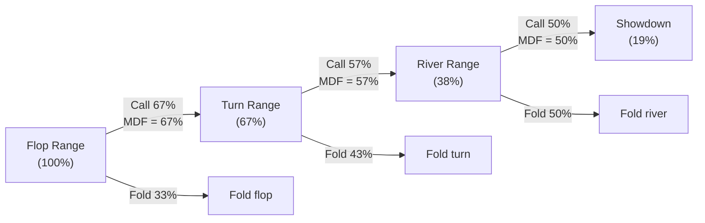

# Minimum Defense Frequency — Theory

## The Question MDF Answers

Every time your opponent bets, you face a choice: call or fold. If you fold too often, your opponent can profitably bluff with *any two cards* — hands with zero equity win the pot simply because you give up. MDF is the minimum fraction of your range you must *continue with* (call or raise) to prevent this from happening.

---

## Deriving MDF from First Principles

Let the **pot** before the bet be $P$ and the **bet size** be $B$.

A pure bluff (0 equity) wins $P$ when you fold and loses $B$ when you call. Let $f$ denote the fraction of the time you fold. The EV of the bluff is:

$$\text{EV}_{\text{bluff}} = f \cdot P - (1 - f) \cdot B$$

For the bluff to break even, $\text{EV}_{\text{bluff}} \geq 0$:

$$f \cdot P \geq (1 - f) \cdot B$$

$$fP \geq B - fB$$

$$f(P + B) \geq B$$

$$f \geq \frac{B}{P + B}$$

So the **maximum fold frequency** you can afford while remaining unexploitable is:

$$\alpha = \frac{B}{P + B}$$

This is called **alpha** — the break-even bluff frequency, first introduced in the EV module (module 05). If you fold exactly $\alpha$ of your range, bluffs break even. If you fold *more*, bluffs become profitable and you are being exploited.

Therefore, you must **call (or raise) at least**:

$$\boxed{\text{MDF} = 1 - \alpha = \frac{P}{P + B}}$$

This is the **Minimum Defense Frequency**. It is the minimum fraction of your range that must *continue* against a bet of size $B$ into pot $P$.

---

## MDF by Common Bet Sizes

| Bet size (fraction of pot) | $B$ relative to $P$ | MDF | Max fold ($\alpha$) |
|---|---|---|---|
| 25% pot | $B = 0.25P$ | 80% | 20% |
| 33% pot | $B = 0.33P$ | 75% | 25% |
| 50% pot | $B = 0.50P$ | 67% | 33% |
| 75% pot | $B = 0.75P$ | 57% | 43% |
| Pot-sized | $B = P$ | 50% | 50% |
| 2× pot (overbet) | $B = 2P$ | 33% | 67% |

**Key insight:** as bet size increases, MDF decreases. A larger bet buys more fold equity — the defender's required defense frequency drops, and the defender must call with a *narrower* but *stronger* range.

---

## Alpha and MDF Are Two Sides of the Same Coin

From the **bettor's perspective**: alpha ($\alpha = B/(P+B)$) is the fraction of the time the *defender* must fold for a bluff to break even. If the bettor constructs their bluffing frequency correctly, bluffs have zero EV regardless of whether the defender calls or folds.

From the **defender's perspective**: MDF ($= P/(P+B) = 1 - \alpha$) is the minimum call frequency. If the defender calls exactly at MDF, bluffs have zero EV regardless of their equity.

Both players are solving the same equation. Alpha and MDF are mathematically dual.

---

## Constructing a Balanced Betting Range

MDF tells the *defender* how often to call. But it also constrains the *bettor*'s range construction. If your betting range contains too many bluffs, the defender can exploit you by always calling. If it contains too few bluffs, the defender can exploit you by always folding.

At GTO equilibrium, the fraction of your betting range that should be **bluffs** equals the pot odds you lay the caller:

$$\frac{\text{bluffs}}{\text{bluffs} + \text{value combos}} = \frac{B}{P + 2B}$$

This is a *different* number from $\alpha$. The handy quantity that *does* equal $\alpha$ is the **bluff-to-value ratio**:

$$\frac{\text{bluffs}}{\text{value combos}} = \frac{B}{P + B} = \alpha \quad\Longrightarrow\quad \text{bluffs} = \text{value} \times \alpha$$

### Example: Half-pot bet ($B = 0.5P$)

$$\alpha = \frac{0.5P}{P + 0.5P} = \frac{1}{3} \quad\Rightarrow\quad \text{bluffs} = \text{value} \times \tfrac{1}{3}$$

So **1 bluff for every 3 value combos** — a 3:1 value-to-bluff ratio. The bluff share of the betting range is $B/(P+2B) = 0.5/2 = 25\%$.

### Example: Pot-sized bet ($B = P$)

$$\alpha = \frac{P}{P + P} = \frac{1}{2} \quad\Rightarrow\quad \text{bluffs} = \text{value} \times \tfrac{1}{2}$$

**1 bluff for every 2 value combos** — a 2:1 value-to-bluff ratio. The bluff share of the betting range is $B/(P+2B) = 1/3 \approx 33\%$.

### Counting Combos

In practice you count hand combinations (covered in module 07 on range theory). Suppose on the river you have 15 value combos (sets, straights, flushes). For a half-pot bet, you may include at most $15 \times \frac{1}{3} = 5$ bluff combos. Adding more bluffs makes calling profitable for the defender; adding fewer means the defender should always fold.

---

## Why Polarised Ranges Use Large Bets

A **polarised range** contains mostly nutted hands and pure bluffs, with few medium-strength hands. This construction pairs naturally with large bets:

- Large bets generate high fold equity (low MDF → defender can fold many hands)
- Bluff-to-value ratio allows more bluffs relative to value (alpha is high)
- Nutted hands extract maximum value when called

A **merged (linear) range** — all medium-strength hands — cannot use large bets effectively: the defender will fold the exact hands you beat and call with the ones that beat you. Small bets give merged ranges the wider calling range they need to extract value.

---

## Three-Street MDF: Compounding Across Streets

On each successive street, the defender applies MDF independently to the portion of their range that *survived* the previous street. The total fraction that reaches showdown after calling all three streets is the **product** of MDFs:

$$\text{showdown fraction} = \text{MDF}_{\text{flop}} \times \text{MDF}_{\text{turn}} \times \text{MDF}_{\text{river}}$$

### Example

| Street | Bet size | MDF |
|---|---|---|
| Flop | 50% pot | 67% |
| Turn | 75% pot | 57% |
| River | Pot-sized | 50% |

$$\text{showdown fraction} = 0.67 \times 0.57 \times 0.50 \approx 19\%$$

Only about **1 in 5 hands** from the flop range reaches showdown after calling down all three streets. This is why triple-barrel bluffs work: the bettor only needs the defender to fold any one of the three streets to profit.

---

## Quick-Reference Formulas

| Concept | Formula |
|---|---|
| Alpha (max fold %) | $\alpha = \dfrac{B}{P + B}$ |
| MDF (min call %) | $\text{MDF} = \dfrac{P}{P + B} = 1 - \alpha$ |
| Bluff fraction of betting range | $= \dfrac{B}{P + 2B}$ (the pot odds you lay the caller) |
| Value fraction of betting range | $= \dfrac{P + B}{P + 2B}$ |
| Bluff-to-value ratio | $= \dfrac{B}{P + B} = \alpha$ |
| Bluff combos given $V$ value combos | $= V \times \alpha = V \times \dfrac{B}{P + B}$ |
| Three-street showdown fraction | $= \text{MDF}_1 \times \text{MDF}_2 \times \text{MDF}_3$ |

---

## Recap

- **MDF = P / (P + B)**: the minimum fraction of your range you must continue with to prevent bluffs from being immediately profitable.
- **Alpha = B / (P + B)**: the break-even fold frequency — equivalently, the bluff-to-value *ratio* (bluffs per value combo). The bluff *fraction* of the whole betting range is the smaller $B/(P+2B)$.
- MDF and alpha are duals: $\text{MDF} + \alpha = 1$.
- Larger bets → lower MDF → more fold equity for the bettor and a tighter defense requirement for the defender.
- Balanced betting ranges contain $\alpha$ bluffs per value combo — one bluff per $(P+B)/B$ value combos (2 value combos per bluff for a pot-sized bet).
- Multi-street MDF compounds: the fraction of your range that calls down three streets equals the product of all three MDFs.

**Next:** Module 12 drills MDF and alpha calculations on randomised numbers; Module 13 then builds on these frequencies to explain how to *choose* the right bet size — when to use 33% pot versus pot-sized versus an overbet — and how geometric sizing allows you to build towards a commitment point across multiple streets.
