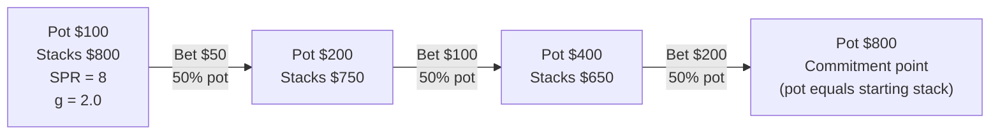
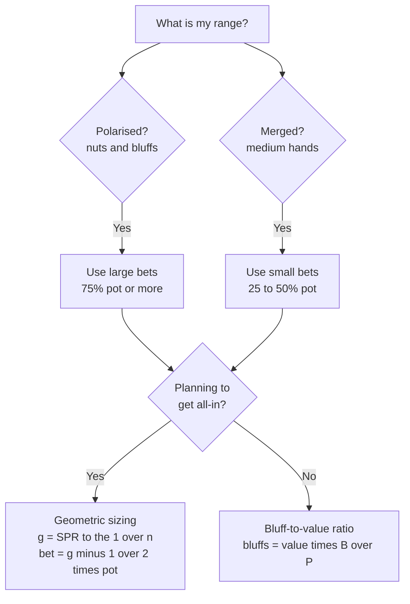

# Bet Sizing Theory

You now know *how often* to bet and call — MDF tells you that. The next question is: *how much*? Bet sizing is not arbitrary. The optimal size depends on your range composition, your position, and whether you plan to bet on future streets.

This module answers three interconnected questions:

1. **What size fits my range?** Polarised ranges demand different sizes than merged ranges.
2. **How do I build toward an all-in across multiple streets?** Geometric sizing ensures every street's bet is proportional to the stack-to-pot ratio.
3. **When and why do overbets appear in a GTO strategy?** Large bets have uses beyond aggression — they exploit specific range advantages.

By the end you will be able to calculate the geometric bet size for any stack-depth and street count, and explain why each size choice follows from the structure of the betting range.

---

## 1. Why Bet Size Matters

Every bet size creates a different pay-off matrix:

- **Larger bets** generate more fold equity (villain must fold at a low MDF) and extract more value per call — but also risk more and require a higher bluff ratio in your range.
- **Smaller bets** charge less and get called by a wider portion of villain's range — useful when you want hands you beat to call, but weak fold equity against draws you want to fold.

The fundamental insight is that **bet size must match range composition**. A size that is optimal for a polarised range is actively harmful for a merged range, and vice versa. Getting this wrong costs EV in both directions — either you are over-bluffing (exploitable by calls) or under-bluffing (exploitable by folds).

---

## 2. Polarised vs Merged Sizing

### Polarised Range

A **polarised range** is bimodal: it contains strong hands (near-nuts) and pure bluffs, but few medium-strength hands. This structure arises naturally on the river when you have been checking your medium hands and betting your best and worst.

**Polarised ranges use large bets (75%–150% pot).** The reasoning:

1. Your strong hands extract maximum value from every call — the larger the bet, the more you win when you are right.
2. Your bluffs maximise fold equity. A large bet forces villain to a low MDF, which means they must fold a high proportion of their range, making bluffs profitable even when they have some equity.
3. Your medium hands are absent, so you do not pay the cost of betting a medium hand into a range that beats you.

### Merged (Linear) Range

A **merged range** contains many medium-strength hands — top pair, strong two-pair, over-pairs — arranged on a roughly linear value continuum without a sharp bimodal split.

**Merged ranges use small bets (25%–50% pot).** The reasoning:

1. A small bet is called by a wide portion of villain's range, including hands you beat — exactly the hands you want to extract value from.
2. A large bet causes villain to fold the weak hands you beat and call only with strong hands that beat you. You lose value.
3. Small bets also allow a wider bluff range ($\alpha$ is small, meaning fewer bluffs per value combo), which is consistent with the small-bet linear strategy.

### Side-by-Side Comparison

| Range type | Bet size | MDF for villain | Why it fits |
|---|---|---|---|
| Polarised (nuts + bluffs) | 75%–150% pot | 40%–57% | Folds medium hands; extracts from strong calls |
| Merged (medium hands) | 25%–50% pot | 67%–80% | Calls from weaker hands provide value |

> **Rule of thumb:** when villain calls with a strong hand, ask whether you still likely have the best hand. If yes, you are merged — bet small. If you are crushed, you are polarised — bet large.

---

## 3. Geometric Bet Sizing

When you intend to build the pot up to a stack-sized commitment point by a specific street, you want each bet to grow the pot by the same *multiplicative factor* $g$. This is **geometric sizing**, and it ensures no single street's bet is implausibly large or trivially small.

### The Formula

Let:
- $P_0$ = pot before betting on this street
- $S$ = effective stacks (chips behind)
- $n$ = number of streets remaining, including this one

For the pot to grow by factor $g$ on each street, each bet of size $B_i$ satisfies:

$$P_{i+1} = P_i + 2B_i = g \cdot P_i \implies B_i = \frac{g-1}{2} \cdot P_i$$

After $n$ streets the pot equals $g^n \cdot P_0$. The standard target is to bring the pot up to the effective stack size $S$ — the *commitment point* where the next pot-sized bet would shove. Setting $g^n \cdot P_0 = S$ in terms of the **stack-to-pot ratio** (SPR $= S/P_0$):

$$\boxed{g = \left(\frac{S}{P_0}\right)^{1/n} = \text{SPR}^{1/n}, \qquad \text{bet each street} = \frac{g - 1}{2} \times P_{\text{current}}}$$

### Worked Example

**Setup:** Pot = \$100, effective stacks = \$800 (SPR = 8), 3 streets remaining.

$$g = 8^{1/3} = 2.0$$

$$\text{Bet each street} = \frac{2.0 - 1}{2} \times P = 0.5 \times P \quad \text{(50\% of current pot)}$$

| Street | Current pot | Geometric bet | New pot after call |
|---|---|---|---|
| Flop | \$100 | $0.5 \times 100 = \$50$ | \$200 |
| Turn | \$200 | $0.5 \times 200 = \$100$ | \$400 |
| River | \$400 | $0.5 \times 400 = \$200$ | \$800 |

Each bet is 50% of the current pot — perfectly proportional because $8^{1/3} = 2$ is a round number. After the river bet the pot is \$800, which equals one starting stack: each player has wagered \$350 of their \$800 and the remaining \$450 is exactly a pot-sized river shove away. When SPR is not a perfect root, the fraction will not be round, but the principle is identical.

### Geometric Sizing Reference Table

| SPR | Streets ($n$) | $g$ | Bet as % of pot |
|---|---|---|---|
| 2 | 2 | $\sqrt{2} \approx 1.41$ | ~21% |
| 4 | 2 | $\sqrt{4} = 2.00$ | 50% |
| 8 | 3 | $8^{1/3} = 2.00$ | 50% |
| 9 | 2 | $\sqrt{9} = 3.00$ | 100% (pot-sized) |
| 27 | 3 | $27^{1/3} = 3.00$ | 100% (pot-sized) |
| 16 | 2 | $\sqrt{16} = 4.00$ | 150% (overbet) |

**Key takeaway:** deep stacks (high SPR) require either more streets or larger bets to reach the commitment point geometrically. Low-SPR spots permit small bets across every remaining street.

---

## 4. Overbets

An **overbet** is a bet exceeding 100% of the pot. Against a 2× pot overbet:

$$\text{MDF} = \frac{P}{P + 2P} = \frac{1}{3} \approx 33\%$$

Villain must call only 33% of their range. This sounds like a gift to the defender, but the bettor's construction is equally constrained:

$$\alpha = \frac{2P}{3P} = 67\%$$

Two-thirds of your overbet range must be bluffs to remain unexploitable. That is a demanding requirement. Overbets only make sense when your range can actually supply that many strong bluff candidates.

**When to overbet:**

1. **Nut-heavy river range.** When you have significantly more nutted combos than villain, you can bet large and force a very low MDF. Every call extracts enormous value; every fold profits your bluffs.
2. **Range advantage on a specific texture.** If the board connects almost entirely with your range (you hold all the flushes; villain cannot), you can exploit the asymmetry with an overbet.
3. **Setting up a river overbet.** A small turn bet denies equity cheaply; then when draws miss, the river overbet leverages a suddenly nut-heavy range.

**When not to overbet:** when your range is balanced or merged, or when villain's range contains many nutted hands too. Overbetting into a strong calling range is simply expensive.

---

## 5. Protection Bets

A **protection bet** is a small bet made primarily to deny equity to drawing hands — not for immediate value extraction and not for high fold equity.

**Example:** You hold $K\clubsuit Q\clubsuit$ on a $K\heartsuit 8\heartsuit 5\spadesuit$ board. You have top pair but the board is wet with flush draws and open-ended straight draws. Checking gives villain a free card to improve. A 25–33% pot bet charges the draw to continue.

Protection bets are common:
- On early streets with a vulnerable top-pair or over-pair hand
- Out of position, where you cannot control the price villain gets on future streets
- On boards where a single turn or river card dramatically changes who is ahead

**Caveat:** at pure GTO equilibrium, equity denial happens through correct range-wide betting frequencies — not by targeting draws specifically. Protection bets are best understood as an **exploitative adjustment** against opponents who check back draws and take free cards when you check. In practice they have positive EV against most opponents, but you should not confuse them with a GTO concept.

---

## 6. IP vs OOP Sizing

**In position (IP):** the bettor acts last, so they control the price of information on future streets. IP players can use larger sizes more freely:
- They see villain's action before committing chips
- They can bet any size on later streets without fearing an immediate raise
- Range advantages are easier to leverage when you have the informational edge

**Out of position (OOP):** the bettor acts first, giving villain the option to raise. OOP players default to smaller sizes:
- A large OOP bet leaves the bettor vulnerable to a raise, forcing them to commit or fold at a disadvantage
- Balancing large OOP bets across all board textures is difficult without a solver — the ranges required are narrow
- Smaller OOP bets limit the maximum check-raise damage

**Practical defaults:** OOP, default to 33–50% pot unless you have a specific, strong reason to deviate. IP, larger sizes (75%+) become viable on boards where you have a clear range advantage.

---

## Recap

- **Polarised ranges** (nuts + bluffs) → large bets (75%–150% pot) to maximise fold equity and extract maximum value from calls.
- **Merged ranges** (medium hands) → small bets (25%–50% pot) to get called by hands you beat without folding them out.
- **Geometric sizing** $g = (S/P_0)^{1/n}$: bet $(g-1)/2 \times P_{\text{current}}$ on each of $n$ streets to grow the pot evenly up to the commitment point (pot = one stack). SPR 8 over 3 streets → $g = 2$ → 50% pot every street.
- **Overbets** (>100% pot) exploit nut-heavy range advantages on the river; require $\geq 67\%$ bluffs in your range for a 2× pot bet — only viable when your range can supply them.
- **Protection bets** are small, early-street bets to deny equity cheaply; they are an exploitative adjustment, not a pure GTO construct.
- **IP vs OOP**: in position can use larger sizes more freely; out of position should default to 33–50% pot.

**Next:** [Module 14 — Bet Sizing Quiz](../14-bet-sizing-quiz/) drills geometric sizing, MDF-by-bet-size, and polarised-versus-merged sizing decisions on randomised numbers; then [Module 15 — Board Texture Analysis](../15-board-texture-analysis/) applies these sizing principles to specific board types — how wet, dry, connected, and paired boards change which ranges and sizes are appropriate on each street.
