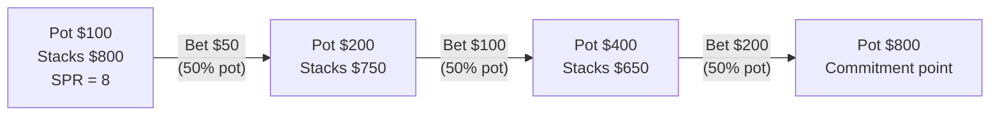
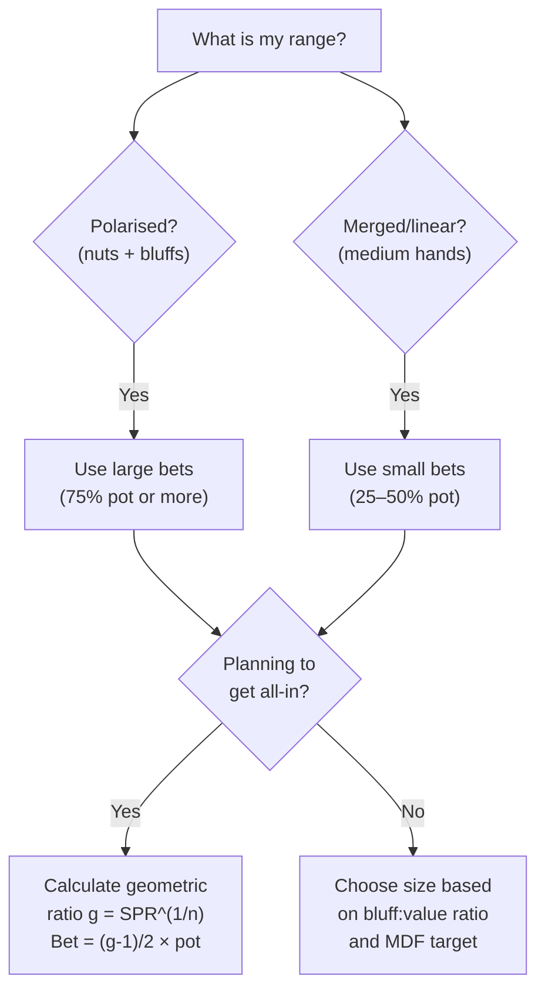

# Bet Sizing Theory

## Why Bet Size Matters

Every bet size creates a different trade-off:

| Bet size | Fold equity | When called | Required bluff ratio |
|---|---|---|---|
| Small (25–33% pot) | Low | More calls from weaker hands | Many bluffs relative to value |
| Medium (50–75% pot) | Moderate | Moderate call range | Moderate bluff ratio |
| Large (pot or more) | High | Fewer, stronger calls | Fewer bluffs per value combo |

Neither extreme is inherently better. The right size depends on what your range *is*.

---

## Polarised vs Merged Ranges

### Polarised Range

A **polarised range** is bimodal: it contains strong hands (the nuts or near-nuts) and bluffs, but few medium-strength hands. Examples:

- A river betting range after a checked turn: you held back your medium hands but bet your best and worst
- A river overbet range: only your strongest combos can sustain the bluff-to-value ratio

**Polarised ranges use large bets.** Here is why:

1. Your strong hands extract maximum value against the portion of villain's range that calls
2. Your bluffs maximise fold equity — villain must fold at a low MDF when facing a large bet
3. Your medium hands are not in the range, so you do not pay the cost of betting them and getting called by better

Because MDF drops with bet size, a polarised range *benefits* from the defender having to fold more often. At the equilibrium, the defender calls their best MDF-fraction and folds the rest — exactly the situation where your strong hands extract max and your bluffs win the pot.

### Merged (Linear) Range

A **merged range** contains many medium-strength hands — top pair, strong two-pair, over pairs — without a sharp bimodal distribution. Examples:

- Continuation betting a flop where you have top-pair-top-kicker and many similar holdings
- Betting the turn with a range full of one-pair hands

**Merged ranges use small bets.** Here is why:

1. A small bet gets called by a wide portion of villain's range, including hands you beat
2. A large bet would force villain to fold all the hands you beat and call only with hands that beat you
3. Small bets also allow a wider bluff range (alpha is smaller, so fewer bluffs per value combo)

> **Rule of thumb:** Ask yourself "what happens when villain calls with a strong hand?" If you are crushed, you are polarised — use large bets. If you often still have the best hand, you are merged — use small bets.

---

## Geometric Bet Sizing

When you intend to build the pot up to a stack-sized commitment by a specific street, you want each bet to be proportional so that:

- No single bet is so small that it cannot grow the pot enough to reach the commitment point
- No single bet is so large that subsequent streets become trivially small or implausible

**Geometric sizing** solves this by making the pot grow by the same *factor* $g$ on each street.

### Deriving the Geometric Ratio

Let:
- $P_0$ = current pot before betting
- $S$ = effective stacks (amount each player has behind)
- $n$ = number of streets remaining (including this one)

If each bet of size $B_i$ grows the pot from $P_i$ to $P_i + 2B_i = g \cdot P_i$, then:

$$B_i = \frac{g - 1}{2} \cdot P_i$$

After $n$ streets of geometric betting, the pot equals $g^n \cdot P_0$. The standard target is to bring the pot up to one starting stack $S$ — the *commitment point* where the next pot-sized bet would shove. Setting $g^n \cdot P_0 = S$:

$$g^n = \frac{S}{P_0} \implies g = \left(\frac{S}{P_0}\right)^{1/n}$$

Equivalently, using the **stack-to-pot ratio** (SPR) $= S / P_0$:

$$\boxed{g = \text{SPR}^{1/n}, \qquad \text{bet each street} = \frac{g-1}{2} \times P_{\text{current}}}$$

(For an exact all-in over $n$ streets the rigorous formula is $g = ((P_0 + 2S)/P_0)^{1/n}$, which is slightly larger. The simplified $g = \text{SPR}^{1/n}$ is the convention used throughout this course because it produces clean numbers and a natural "commitment point" target — the final street's bet then closes out the all-in.)

### Worked Example

**Setup:** Pot = \$100, effective stacks = \$800 (SPR = 8), 3 streets remaining (flop, turn, river).

$$g = 8^{1/3} = 2.0$$

| Street | Current pot | Bet = $(g-1)/2 \times P$ | New pot after call |
|---|---|---|---|
| Flop | \$100 | $(2-1)/2 \times 100 = \$50$ (50% pot) | \$200 |
| Turn | \$200 | $(2-1)/2 \times 200 = \$100$ (50% pot) | \$400 |
| River | \$400 | $(2-1)/2 \times 400 = \$200$ (50% pot) | \$800 |

When SPR is a perfect cube, every street uses the same fraction of the current pot. After three 50%-pot bets the pot equals one starting stack (\$800), reaching the commitment point — each player has wagered \$350 of \$800 and the remaining \$450 is exactly one pot-sized shove from all-in. In general, $g$ will not be a round number, so the fraction varies — but the principle is identical.

### Common SPR and Street Configurations

| SPR | Streets | $g$ | Bet as % of pot |
|---|---|---|---|
| 4 | 2 | 2.00 | 50% |
| 8 | 3 | 2.00 | 50% |
| 4 | 3 | 1.59 | 29% |
| 9 | 2 | 3.00 | 100% (pot-sized) |
| 27 | 3 | 3.00 | 100% (pot-sized) |
| 16 | 2 | 4.00 | 150% (overbet) |

**Key takeaway:** deep stacks (high SPR) require either many streets or large bet sizes to get all-in geometrically. Shallow stacks (low SPR) permit smaller bets per street.

---

## Overbets

An **overbet** is a bet exceeding 100% of the pot. Overbets are not reckless — they are a specific tool for specific situations.

**When to overbet:**

1. **Nut-heavy river range:** when your range has many more nutted hands than your opponent's, you can bet large and force them to a very low MDF. They must call with a tiny fraction of their range, but you extract enormous value from every call.

2. **Blocking the turn to set up a river overbet:** sometimes you use a small turn bet to deny equity cheaply, then overbet the river when draws missed.

3. **Range advantage:** if the board texture connects better with your range than opponent's (e.g. you have all the flushes, they have none), you can size up to exploit the asymmetry.

**MDF against an overbet:**

$$\text{MDF} = \frac{P}{P + 2P} = \frac{1}{3} \approx 33\%$$

Against a 2× pot overbet, the defender must call only 33% of their range. This sounds generous to the defender — but you must construct your overbet range correctly, including exactly 67% bluffs by alpha ($\alpha = 2P / 3P = 67\%$). If you cannot find enough strong bluffs, overbetting backfires.

---

## Protection Bets

A **protection bet** is a small bet made not primarily for value or fold equity, but to deny equity to drawing hands at a low price.

**Example:** You hold top pair on a wet board (e.g. $K\heartsuit 8\heartsuit 5\spadesuit$ with $K\clubsuit Q\clubsuit$). Villain's range contains flush draws, straight draws, and combo draws. If you check, they get a free card to improve. A small bet (25–33% pot) makes it unprofitable for their draws to continue — or charges them to do so.

Protection bets are common in:
- Early streets with a merged range (you have top pair, not the nuts)
- Boards where your hand is vulnerable to many turns/rivers
- Out of position, where you cannot control the price villain gets to see cards

**Critical caveat:** protection bets are not pure GTO tools — they are closer to exploitative adjustments against opponents who check back draws aggressively. At pure GTO, pot equity is "protected" through correct betting frequencies, not by charging draws specifically. But in practice, protection bets have positive EV against most opponents.

---

## IP vs OOP Sizing

**In position (IP):** The bettor acts last, so they have more information and more flexibility. IP players can use larger sizes more freely because:
- They see the opponent's action before deciding
- They can bet river after opponent checks without fear of a check-raise
- Their range advantages are easier to leverage

**Out of position (OOP):** The bettor acts first, giving the opponent the option to raise. OOP players generally bet smaller because:
- A large OOP bet followed by a call leaves the OOP player to bet again on the next street under the same positional disadvantage
- Balancing large OOP bets across all board textures is difficult without a solver
- Smaller OOP bets limit the max loss to a check-raise

In practice: if you are OOP, default to 33–50% pot bets unless you have a specific, strong reason to deviate. IP, you can explore larger sizes on boards where you have a significant range advantage.

---

## Choosing the Right Bet Size: Decision Framework

---

## Quick-Reference Formulas

| Concept | Formula |
|---|---|
| Geometric ratio | $g = \left(\dfrac{S}{P}\right)^{1/n}$ |
| Bet size each street | $B = \dfrac{g - 1}{2} \times P_{\text{current}}$ |
| MDF at overbet (2× pot) | $\dfrac{P}{3P} = 33\%$ |
| Bluff fraction for overbet | $\alpha = \dfrac{2P}{3P} = 67\%$ |

---

## Recap

- **Polarised ranges** (strong hands + bluffs) → large bets to maximise fold equity and extract value
- **Merged ranges** (medium hands) → small bets to get called by hands you beat
- **Geometric sizing**: $g = \text{SPR}^{1/n}$; bet $(g-1)/2 \times$ current pot on each street to reach all-in evenly across $n$ streets
- **Overbets** exploit nut-heavy range advantages on the river; require high alpha in your range (≥67% bluffs for 2× pot)
- **Protection bets** are small bets that deny equity to draws cheaply; closer to exploitative than pure GTO
- **IP vs OOP**: in position can use larger sizes more freely; out of position should default to smaller bets

**Next:** Module 14 drills these sizing calculations on randomised numbers; Module 15 then applies the principles to specific board textures — how the cards on the board change which sizes and which ranges are appropriate.
