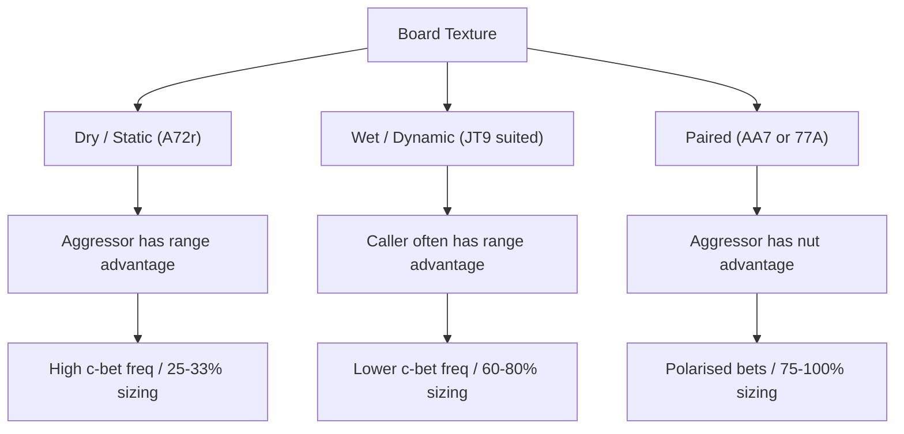

# Board Texture Analysis

When a flop is dealt, your hole cards don't change — but the *relative strength* of your entire range versus your opponent's range can shift dramatically based on which three cards appeared. This is board texture analysis: a systematic way to assess range advantage, nut advantage, and board dynamics, then translate that assessment into the right c-bet frequency and size.

## The Central Question: Who Connected Better?

Before deciding whether to bet — and for how much — ask two questions:

1. **Range advantage**: Which player's range contains more hands that connected with this board overall?
2. **Nut advantage**: Which player's range contains more of the *strongest possible hands* (the nuts and near-nuts)?

The player with range advantage earns the right to bet frequently. The player with nut advantage earns the right to bet *large* with a polarised strategy. These two properties can point in different directions, and the board type determines which matters more.

## Dry Boards: The Pre-Flop Aggressor's Domain

A **dry board** like $A\heartsuit 7\clubsuit 2\diamondsuit$ (no flush draw, no straight draw, no connected middle cards) strongly favours the pre-flop aggressor.

Consider a UTG open-raise versus a big blind call. The UTG range contains many $Ax$ hands ($AK$, $AQ$, $AJ$, $AT$, $A9s$), pocket pairs including $77$ and $22$, and overpairs ($KK$, $QQ$, $JJ$) that remain strong on a low board. The big blind calling range contains fewer $Ax$ combos (many are 3-bet pre-flop), almost no $77$ or $22$ (small pairs frequently fold to a UTG raise), and is overall less polarised toward the top of the strength ladder on this board.

**Strategic implication:** The pre-flop aggressor can **range-bet** — bet a small size (25–33% pot) with nearly their entire range. Two properties make this correct: (a) the range advantage is so large that most hands benefit from the bet, and (b) the board is *static*, meaning the turn card is unlikely to shift range dynamics substantially. The small size extracts thin value across the entire range without over-bluffing. Betting with everything also prevents the caller from raise-bluffing freely, since the aggressor holds so many strong hands.

## Wet Boards: The Caller's Advantage

A **wet board** like $J\spadesuit T\spadesuit 9\heartsuit$ (connected, with a flush draw) shifts the range advantage toward the pre-flop *caller*.

The caller's range typically contains many suited connectors ($T\spadesuit 9\spadesuit$, $8\heartsuit 7\heartsuit$, $9\diamondsuit 8\diamondsuit$), broadways ($QJ$, $KQ$, $KT$, $QT$), and suited broadways ($Q\spadesuit J\spadesuit$, $K\spadesuit Q\spadesuit$) — exactly the hands that make straights, flush draws, two pair, and top pair on $J\spadesuit T\spadesuit 9\heartsuit$. The pre-flop aggressor's range, especially from early position, contains more offsuit high cards that miss this board.

**Strategic implication:** The aggressor should **bet less frequently** (40–60%) and use **larger sizes** (60–80% pot) when they do bet. The larger size charges flush and straight draws their full equity price and makes bluffs more credible — a small bet into a coordinated board has limited fold equity and builds the pot in a spot where the aggressor's range is weak.

## Paired Boards: Nut Advantage in Extremis

A **paired board** like $A\spadesuit A\clubsuit 7\diamondsuit$ creates an extreme nut advantage for the pre-flop aggressor. A 3-bet or open-raise range contains $AA$ — all $\binom{4}{2} = 6$ combinations. The caller's range almost never contains $AA$: it re-raises pre-flop nearly universally, so it is absent from the calling range. The caller cannot credibly represent trip aces; the aggressor can.

**Strategic implication:** **Large polarised bets** (75–100% pot) are appropriate. The aggressor bets large with nut hands and bluffs; checks with medium-strength holdings to keep the pot small when the nuts are absent. For lower paired boards (e.g. $7\spadesuit 7\clubsuit 2\diamondsuit$), the dynamic is more symmetric — both players can have $7x$ — but the aggressor still tends to hold $77$ at higher frequency and retains a range advantage.

## Monotone Boards: All the Suits Match

A **monotone board** (e.g. $K\spadesuit 9\spadesuit 4\spadesuit$) is a wet board where all three cards share a suit. Key characteristics:

- All strong made hands (top pair, two pair, sets) are facing a potential flush on every future street
- The player who more frequently holds flush draws — and especially the $A\spadesuit$ for the nut flush — has the nut advantage
- Bet sizing should be large (60–75% pot) to protect made hands and charge flush draws

On a monotone board, even a set is a vulnerable hand. This often justifies checking more frequently to avoid building a large pot with an exposed holding.

## Board Type Reference

| Board Type | Example | C-bet Frequency | Sizing | Key Driver |
|---|---|---|---|---|
| Dry / Static | A♥7♣2♦ | High (75–100%) | Small (25–33%) | Aggressor range advantage; static board |
| Wet / Dynamic | J♠T♠9♥ | Lower (40–60%) | Large (60–80%) | Caller range advantage; many draws |
| Paired (high card) | A♠A♣7♦ | High (70–85%) | Large (75–100%) | Aggressor nut advantage (has AA) |
| Paired (low card) | 7♠7♣2♦ | High (70–90%) | Small–Medium (33–50%) | Mostly static; both sides can have 7x |
| Monotone | K♠9♠4♠ | Medium (50–65%) | Large (60–75%) | Flush draw protection critical |
| Connected (two-tone) | T♥9♦8♣ | Low (35–50%) | Large (60–80%) | Caller range connects strongly |

## Texture Decision Framework

## Static vs. Dynamic: The Turn Dimension

A critical property of board texture is how much it *changes* on the turn:

- A **static board** like $A\heartsuit 7\clubsuit 2\diamondsuit$ changes little when a $3\clubsuit$ arrives. The range dynamics that made the flop good for the aggressor remain intact on most turns.
- A **dynamic board** like $J\spadesuit T\spadesuit 9\heartsuit$ can shift dramatically. A turn $Q\diamondsuit$ completes Broadway straights for the caller's range; an $8\spadesuit$ brings a straight flush possibility and overhauls the nut landscape entirely.

Dynamic boards justify lower c-bet frequencies precisely because the aggressor's range advantage can evaporate on unfavourable turns. By checking more on the flop, the aggressor preserves equity for turns that improve their hands and avoids building a pot on a board that may soon favour the opponent.

## Draws and the Protection Trade-Off

On boards with flush or straight draws, the aggressor faces a genuine trade-off with their strong hands:

- **Bet for protection**: Charge the draw a fee. If the caller holds a 35% equity flush draw, betting 60% pot makes calling a marginal decision — they need approximately 38% equity to call a 60% pot bet profitably, and they fall just short.
- **Check for balance**: A checking range that contains some strong hands prevents the caller from automatically raising when the aggressor checks. Without strong hands in the checking range, check-raises become auto-profitable for the caller.

GTO solutions on wet boards resolve this by betting some strong hands and checking others — the mix prevents exploitation in either direction. The proportion of strong hands checked is larger on wetter boards precisely because balance demands it.

## Recap

- The **central question** is range advantage plus nut advantage: which player's range connects more, and more powerfully, with this board?
- **Dry boards** → high c-bet frequency, small size (range betting across the entire range).
- **Wet boards** → lower c-bet frequency, large size (polarised value and bluffs).
- **Paired boards** where the aggressor holds the nuts → large polarised bets exploiting nut credibility.
- **Static boards** invite high c-bet frequencies because the advantage is durable; **dynamic boards** demand selectivity because turns can reverse the advantage.
- Strong hands are sometimes checked even on favourable boards, to keep the checking range balanced against check-raises.

**Next:** [Module 16 — Position and Initiative](../16-position-and-initiative/) — how your seat at the table amplifies every range-advantage concept you've just learned.
