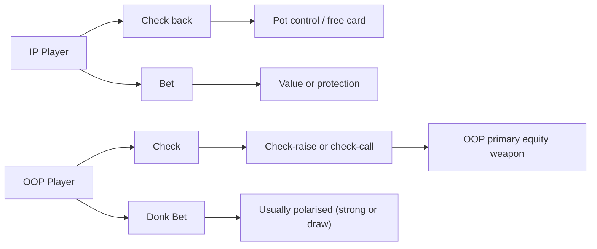

# Position and Initiative

Every action in poker takes place *somewhere*. Before cards are dealt, before ranges are formed, there is a fundamental structural asymmetry built into the game: **position**. Acting last gives you information; acting first denies it to you. This asymmetry compounds across every post-flop street, making position one of the most powerful edges in no-limit hold'em.

## In Position: Three Concrete Advantages

When you are **in position (IP)** — acting after your opponent on every post-flop street — you have three concrete advantages:

**1. Information.** You see your opponent's action before making your decision. When they check, you learn they are weak (or have chosen not to bet). When they bet, you see the size, which narrows their range. The IP player always has more information at each decision point than the OOP player had when they acted.

**2. Equity realization.** When you hold a speculative hand (a flush draw, a weak pair), acting last lets you take a free card when your opponent checks. OOP players cannot do this — if they check a draw, the IP player can still bet and charge them. This asymmetry means IP players realize more of their theoretical equity. A hand with 40% raw equity may realise close to 40% when IP; OOP the same hand may realise only 30–35% after paying for draws and losing initiative.

**3. Pot control.** When IP, you can check back any street to keep the pot small with medium-strength hands. An OOP player who wants to pot-control must check and then hope the IP player doesn't bet — they have no guarantee. IP pot control is unilateral; OOP pot control requires cooperation from the opponent.

## Out of Position: The Structural Disadvantages

The **out-of-position (OOP)** player must act first on every post-flop street without knowing what the IP player will do. The three corresponding disadvantages are:

1. **Range capping.** When OOP checks the flop, the action signals weakness. Over time, an unchecked checking range becomes capped — only medium and weak hands check consistently — and the IP player attacks with high-frequency bets knowing the OOP range rarely contains the nuts. The OOP player must actively include strong hands in the checking range (via check-raising or delayed aggression) to prevent this.

2. **Equity denial.** OOP draws cannot take free cards; they must check-call, check-fold, or donk bet. The IP player decides whether to give a free card — and rationally, they give one when it benefits them (weak draws that can't call a bet) and charge when it doesn't.

3. **Forced pot-building.** If the OOP player holds a strong hand and bets, the IP player can call with speculative hands that have implied odds, building the pot when the IP player has equity. The OOP player cannot check-raise on the river (no action follows), limiting late-street trapping.

## Equity Realization: A Quantitative Lens

**Equity realization (ER)** is the fraction of theoretical hand equity you actually capture over the distribution of run-outs and actions:

$$\text{EV}(\text{hand}) = \text{Equity} \times \text{ER} \times \text{Pot}$$

Typical ER estimates by situation:

| Situation | Typical ER |
|---|---|
| IP with initiative (pre-flop aggressor) | 95–110% |
| IP without initiative | 85–100% |
| OOP with initiative | 80–95% |
| OOP without initiative | 65–80% |

ER above 100% is possible when hands build bigger pots while ahead and smaller pots while behind — extracting more than their raw equity would predict. This is why IP players can profitably call pre-flop with a wider range: even a hand with 48% raw equity can have ER near 100% when IP, making the call solidly profitable.

## Initiative: The Continuation Advantage

**Initiative** is held by the pre-flop aggressor — the player who made the last aggressive action before the flop (raise or 3-bet). Initiative provides a **range expectation advantage**: the pre-flop aggressor's range is generally stronger, giving them the statistical right to continue aggression on most boards.

Initiative is frequently misunderstood. It does **not** mean:
- "I should always c-bet because I raised pre-flop."
- "My range is stronger on every possible board."
- "I should bet regardless of texture."

Initiative **does** mean:
- On many boards, my range has a statistical advantage that justifies some continuation betting.
- I can bet a meaningful frequency with my entire range without being systematically exploited.
- On boards that strongly favour the caller's range (wet, connected), I still bet a portion of my range — just not the entire range.

Think of initiative as a *prior*: absent board-texture information, the aggressor is more likely to have the stronger range. Board texture then updates that prior — sometimes dramatically (a JT9 board can reverse the advantage entirely).

## The Check-Raise: OOP's Primary Weapon

The OOP player's most powerful tool is the **check-raise**. By checking and then raising after the IP player bets, the OOP player:

1. Traps the IP player's betting range (they bet into a check-raise rather than getting to see a free showdown)
2. Builds the pot with the strongest hands while IP's medium hands face a difficult decision
3. Applies maximum pressure on the IP player's thin value bets and bluffs

For a check-raise to be credible and unexploitable, it must be **polarised**: a mix of nut hands (sets, straights, two pair) and draws (flush draws, open-ended straight draws). Check-raising medium hands — top pair with a medium kicker, second pair — is generally incorrect because those hands benefit more from pot control than from pressure. They win at showdown but lose large pots to a re-raise.

The ratio of bluffs to value hands in the check-raising range must satisfy the MDF condition for the IP player facing the raise — the same algebra from Module 11 applies here.

## Donk Betting: OOP Leads Into the Pre-Flop Aggressor

A **donk bet** is when the OOP player bets into the pre-flop aggressor rather than checking to give the aggressor the c-bet opportunity. In most GTO solutions, donk betting is uncommon but present. When it occurs, it is usually polarised:

- **Strong value** (sets, two pair) betting to build the pot when the board is wet and a free card would be dangerous
- **Strong draws** betting to generate fold equity against overpairs
- Almost never medium-strength hands, which are better served by check-calling or check-folding

Recreational players often donk bet with hands that don't benefit from the lead — too weak to extract value, too marginal to bluff effectively. Recognising a polarised vs. non-polarised donk range tells you how to respond.

## Post-Flop Decision Map

## Practical Implications

Understanding position leads to several actionable principles:

1. **Widen IP calling ranges.** Call slightly wider pre-flop from the button than from the big blind (where you are OOP on every post-flop street), because superior equity realization makes marginal hands profitable IP that would be losing OOP.

2. **Protect IP checking ranges.** When IP, include some strong hands in your checking range (sets, two pair) to prevent the OOP player from auto-check-raising your checks. A checking range that contains only weak hands is trivially exploitable.

3. **OOP: check-raise draws, don't flat.** With flush draws and open-enders OOP, a check-raise is often better than a flat call. It denies the IP player a free card, builds equity into the pot with aggression, and prevents the pot from bloating with passive calls on multiple streets.

4. **Size up when OOP bets.** OOP bets have less natural credibility because the caller has already seen the aggressor's action (or inaction). OOP value bets should be sized to extract maximum value: a 75% pot lead OOP defends the range better than a small probe.

## Recap

- **IP advantages**: information, equity realization, pot control. IP hands realize more of their theoretical equity than the same hands would OOP.
- **OOP disadvantages**: range capping, equity denial, forced pot-building. Compensation comes through check-raises and aggressive betting when strong.
- **Initiative** is a prior advantage for the pre-flop aggressor — it justifies frequent continuation betting on many boards, but board texture modifies how often and at what size.
- The **check-raise** is OOP's most important tool: polarised (nuts and bluffs), used to reclaim equity and build pots with strong hands.
- **Donk betting** is rare and typically polarised; it's the OOP exception to the "check and let the aggressor lead" default.

**Next:** [Module 17 — Multi-Street Planning](../17-multi-street-planning/) — how position dynamics interact across flop, turn, and river to form complete, coherent hand plans.
