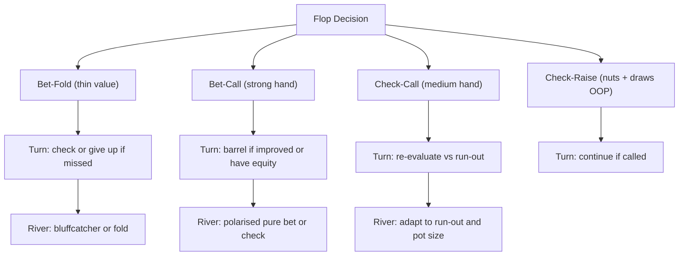

# Multi-Street Planning

Expert poker players make their decisions one step ahead. Before acting on the flop, they have already projected what they will do on the turn and river given different run-outs. This is **multi-street planning**: constructing complete hand trees before committing to a line, so that each street's action is consistent with the previous ones and coherent as a whole strategy.

## Why Planning Matters

Without a plan, each street becomes an isolated decision: "Should I bet the turn?" feels like a new question disconnected from the flop action. With a plan, the question becomes: "Does betting the turn fit the line I began on the flop?" This continuity matters because:

- **Sizing consistency**: The geometric growth of bets across streets (established in Module 13) only works if the flop bet anticipates the turn and river bets. Betting 33% pot on the flop and then needing a 150% pot shove on the river reveals that the flop sizing was too small — the lines were inconsistent.
- **Range coherence**: If you bet the flop with a wide range (many hands), your turn bet must be narrower — only hands that benefit from continued aggression. A plan determines which hands graduate to the next street.
- **Implied odds calibration**: Speculative hands (draws) are worth calling pre-flop and on the flop only if the future streets will deliver payoff. Planning the turn and river lines determines whether those implied odds are real or imaginary.

## Flop Categories: The Four Hand Buckets

When the flop is dealt, every hand in your range falls into one of four categories:

**1. Bet-Fold** — bet the flop, fold to a raise. These are thin-value hands (second pair with decent kicker, weak top pair on a wet board) or low-equity bluffs. They benefit from immediate fold equity but cannot withstand a raise. Size small (25–40% pot) to keep the risk modest. Plan: if called and the turn does not improve the hand, reassess whether to fire again.

**2. Bet-Call** — bet the flop, call a raise. These are strong enough to commit: sets, two pair, top pair top kicker on many boards, strong flush draws. Size for value (50–75% pot typically). Plan: if called on the flop, continue on most turns that maintain or improve the hand's strength.

**3. Check-Call** — check the flop, call a bet. These are medium-strength hands (top pair with medium kicker, second pair with good kicker) that prefer pot control. They win at showdown often enough but are too vulnerable to over-bluff protection when OOP or too thin to build pots when IP. Plan: if checked through, re-evaluate on the turn.

**4. Check-Raise** — check the flop, raise when bet. Used primarily by the OOP player: strong hands (sets, straights, two pair) combined with strong draws (flush draws, open-ended straight draws). The polarised composition makes the check-raise credible and difficult to exploit. Plan: if called, barrel the turn on most cards that maintain equity or nut advantage.

## Double-Barrel Strategy: Continuing to the Turn

A **double-barrel** is a flop c-bet followed by a turn bet. Not every flop bettor should double-barrel. The decision depends on how the turn card interacts with both ranges:

**Continue with the barrel when:**
- You improved (flopped a flush draw, turned the flush; flopped overcards, turned top pair)
- You retain significant equity (an open-ended straight draw with 8 outs still has approximately 17% river equity — enough to justify aggression)
- The turn card gave you nut advantage (you hold $K\heartsuit Q\heartsuit$ and the turn is $K\spadesuit$ — top pair plus a backdoor flush draw)
- A blank turn arrived that improves your range more than the caller's range

**Give up the turn when:**
- You were bluffing with total air — no draws, no backdoor equity, no blockers
- The turn card improves the caller's range significantly (a straight or flush completing card when the caller's pre-flop range contains many draws)
- Your range at the turn betting frequency is already full of bluffs relative to value

A well-calibrated double-barrel frequency prevents the caller from auto-folding (fold equity disappears) or auto-calling (calling becomes profitable). The mathematical calibration comes from the MDF formula: the aggressor's bluffing frequency must not exceed $\alpha = b/(P+b)$ at each bet size.

## Triple-Barrel Bluffs: High Risk, Specific Conditions

A **triple-barrel bluff** bets all three streets as a bluff. This is the highest-commitment line in poker: the opponent has called twice already, so their range is weighted toward strong hands. Conditions for a credible triple-barrel:

- **Equity throughout**: The best triple-barrel candidates have real equity even approaching the river. A missed flush draw on the river has 0% equity but had 9 outs on the flop and 9 outs on the turn — it is still a better bluffing candidate than total air because it blocks some of the opponent's strong hands.
- **Backdoor draws**: A hand like $9\heartsuit 8\heartsuit$ on $A\spadesuit 5\clubsuit 2\diamondsuit$ has backdoor straight and flush possibilities. If the turn brings $7\heartsuit$, a genuine draw develops; if the river brings the heart, the hand makes a flush. These backdoor sequences justify bluffing through multiple streets because the hand has legitimate equity trajectories.
- **Board story coherence**: The triple-barrel is most credible when the board run-out is consistent with the aggressor's range. Three streets of betting on $A\clubsuit K\spadesuit 2\heartsuit$ / $J\heartsuit$ / $3\diamondsuit$ tells a believable story for $AK$, $KK$, $AA$ — hands in the aggressor's range. Three streets on a board that heavily favours the caller's range tells no coherent story.

Total-air bluffs (no equity, no draws, no backdoors) should not triple-barrel. They cannot represent a credible range and the EV is negative against any reasonable calling frequency.

## Delayed C-Bets: The Float

A **float** (or delayed c-bet) is checking the flop and then betting the turn after the opponent checks the turn back. Two primary uses:

1. **IP on wet boards**: When IP and the flop is dynamic, checking the flop controls pot size and avoids betting into a caller's range that connects better. When a blank turn arrives, betting attacks the opponent's checking range — now revealed as weak by their check-back.
2. **OOP to balance the checking range**: By checking the flop with some strong hands (as discussed in Modules 15 and 16), the OOP player builds a checking range containing both medium and strong hands. Betting the turn with those strong hands then applies credible pressure.

A float must have a plan attached: if you check the flop with the intention of betting the turn, execute the bet on the relevant turns. Checking the flop and then checking the turn is a passive line that rarely leads to value extraction.

## River Play: The Convergence Point

By the river, ranges have been compressed. Every card is known, every action has filtered which hands remain. The river is the **convergence point** where bluffs and value hands must be separated cleanly:

- **Bet or check — rarely mixed at the individual hand level**: While earlier streets benefit from mixed strategies (check some strong hands, bet some medium hands), river decisions tend toward purer execution. The pot is large, there are no future streets to compensate for errors, and each bet is a commitment to a fully completed line.
- **River sizing is critical**: Unlike the flop, there is no turn to correct an underpriced flop bet. The river bet size must be calibrated precisely — sizing up to extract maximum value or to maximise fold equity, depending on whether the hand is a value bet or a bluff.
- **Blocking considerations**: The best river bluff candidates are hands that block the nut holdings the opponent might call with. Bluffing with a hand that contains the $A\spadesuit$ on a flush-completing board removes some of the opponent's nut flush combinations, making their calling range slightly thinner.

## Implied Odds Across Streets

**Implied odds** are the future bets expected when completing a speculative hand. They justify calling on earlier streets with less-than-direct-odds equity:

$$\text{EV}(\text{call with draw}) = P(\text{hit}) \times (P_{\text{pot}} + I) - \text{call cost}$$

where $I$ is the expected additional amount won when hitting (the implied winnings). The draw is worth calling when the full expression is positive — which requires that implied odds $I$ are real and collectible.

**Planning connects to implied odds**: the quality of implied odds depends on whether you have a clear betting plan for when you hit. An unclear plan on completing the draw means implied odds are overestimated. A specific plan ("bet 80% pot on the river when the flush completes; opponent calls with top two pair") makes implied odds real.

## The Multi-Street Decision Tree

## Recap

- **Plan all three streets before acting on the flop.** Sizing, range, and implied odds all depend on a coherent multi-street line.
- **Bet-fold** hands bet small and give up to raises; **bet-call** hands bet for value and stack off; **check-call** hands pot-control; **check-raise** hands polarise aggressively.
- **Double-barrel** when you improved, have equity, or have nut advantage on the turn card. Give up when bluffing with no equity and the turn improves the caller's range.
- **Triple-barrel** only when you have sustained equity or a coherent board story; avoid with total air and no draws.
- **Implied odds** justify speculative calls when the plan for extracting payment on later streets is specific and realistic.

**Next:** [Module 18 — ICM and Tournament Theory](../18-icm-and-tournament-theory/) — a parallel branch of the course exploring how chip values change in tournament settings, and how that alters every decision we've been analysing. After Module 18 and its quiz (Module 19), [Module 20 — Putting It All Together](../20-putting-it-together/) closes the course by synthesising every concept into a practical study and improvement framework.
