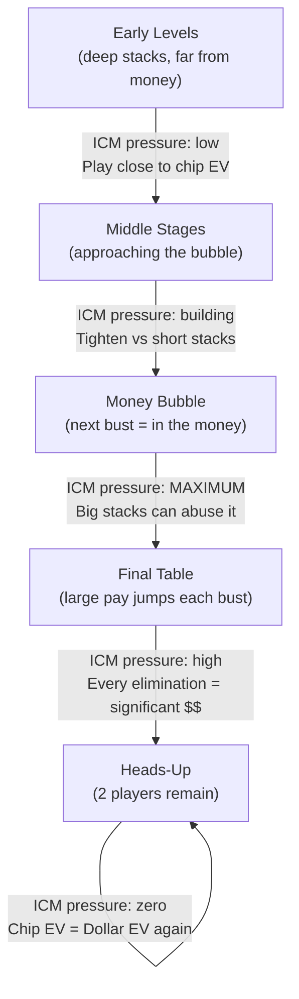

# ICM & Tournament Theory

Every module up to now has assumed a cash-game context: chips are dollars, and the EV calculations from Modules 03–17 translate directly into long-run profit. Tournaments break that assumption. This module takes a parallel branch from the EV foundation in Module 05 to ask what happens when chips and dollars are *not* the same thing.

In a cash game, the relationship between chips and money is direct: 1 chip = $1 (or whatever the denomination). Every decision can be evaluated with chip expected value — and chip EV *is* dollar EV.

In a tournament, this relationship breaks down. The **Independent Chip Model (ICM)** is the mathematical framework that explains *why* your chips are not worth their face value, and *how much* they are actually worth given the payout structure and current stack sizes.

Understanding ICM explains phenomena that confuse cash game players who move to tournaments: why big stacks pass up apparently profitable chip flips, why the player who just busted from the money bubble is heartbroken despite losing a "small" number of chips, and why short stacks push with ranges that look loose from a pure-equity standpoint.

---

## Cash Game vs. Tournament EV

In a **cash game**, chip EV = dollar EV:

- Your stack is worth exactly its chip value in dollars.
- Winning chips is always good; losing chips is always bad.
- A +cEV decision is always a +$EV decision.

$$\text{Cash game: } \$\text{EV} = \text{cEV (always)}$$

In a **tournament**, the payout structure creates a non-linear relationship between chips and dollars. You receive prizes based on your *finishing position*, not your chip count. This produces two critical asymmetries:

1. **Doubling your stack does not double your $EV** — you cannot "cash out" extra chips.
2. **Losing all your chips eliminates you** — the loss of your last chip costs you all remaining prize equity, which can be substantial even if you were not the chip leader.

These two asymmetries mean that **the dollar value of the chips you risk is greater than the dollar value of the chips you stand to gain** in any all-in confrontation.

---

## The Independent Chip Model

ICM converts a chip stack to dollar prize equity by summing over all finishing positions:

$$\text{ICM equity} = \sum_{p=1}^{n} P(\text{finish in position } p) \times \text{Prize}(p)$$

The finish-position probabilities are approximated by the **Malmuth-Harville formula**:

$$P(\text{player } j \text{ finishes 1st}) = \frac{c_j}{T}$$

$$P(\text{player } j \text{ finishes } k\text{th}) = \sum_{i \neq j} P\!\left(i \text{ finishes } (k{-}1)\text{th}\right) \times \frac{c_j}{T - c_i}$$

where $c_j$ is player $j$'s chip count and $T$ is the total chips in play.

In words: the probability of finishing in each position is approximated by your share of chips among all players still competing for that spot. This is an industry-standard approximation — it ignores skill differences and stack-geometry subtleties, but it is the foundation for every practical ICM calculation.

---

## Worked Example: 3-Player ICM

**Setup:** 3 players, $1,000 prize pool, payouts: 1st $500, 2nd $300, 3rd $200.

| Player | Chips | Chip % | Chip-Proportional $EV |
|--------|-------|--------|----------------------|
| P1 | 4,000 | 40% | $400 |
| P2 | 4,000 | 40% | $400 |
| P3 | 2,000 | 20% | $200 |
| **Total** | **10,000** | **100%** | **$1,000** |

**Step 1 — First-place probabilities:**

$$P_1(\text{1st}) = \frac{4000}{10000} = 40\% \qquad P_2(\text{1st}) = 40\% \qquad P_3(\text{1st}) = 20\%$$

**Step 2 — Second-place probabilities (Malmuth-Harville):**

$$P_1(\text{2nd}) = P_2(\text{1st}) \times \frac{4000}{10000 - 4000} + P_3(\text{1st}) \times \frac{4000}{10000 - 2000}$$
$$= 0.40 \times \frac{4000}{6000} + 0.20 \times \frac{4000}{8000} = 0.267 + 0.100 = 36.7\%$$

By symmetry, $P_2(\text{2nd}) = 36.7\%$.

$$P_3(\text{2nd}) = P_1(\text{1st}) \times \frac{2000}{6000} + P_2(\text{1st}) \times \frac{2000}{6000} = 0.133 + 0.133 = 26.6\%$$

**Step 3 — Third-place probabilities (remainder):**

$$P_1(\text{3rd}) = 1 - 40\% - 36.7\% = 23.3\% \qquad P_2(\text{3rd}) = 23.3\% \qquad P_3(\text{3rd}) = 53.4\%$$

**Step 4 — ICM equity:**

$$\text{ICM}(P_1) = 0.400 \times 500 + 0.367 \times 300 + 0.233 \times 200 = 200 + 110 + 46.6 = \$356.6$$

$$\text{ICM}(P_2) = \$356.6 \quad \text{(symmetric with P1)}$$

$$\text{ICM}(P_3) = 0.200 \times 500 + 0.266 \times 300 + 0.534 \times 200 = 100 + 79.8 + 106.8 = \$286.6$$

**What the numbers reveal:**

- P3 holds 20% of chips but $287 in equity — **43% more** than the chip-proportional $200. The short stack's chips are worth *more* per unit.
- P1 and P2 each hold 40% of chips but only $357 in equity — **11% less** than the chip-proportional $400. The large stacks' chips are worth *less* per unit.

This non-linearity is the heart of ICM. The chip leader does not hold the lion's share of the prize pool — they hold chips whose marginal value is diminishing.

### The Chip-Flip: Why Chip-Neutral Can Mean Dollar-Negative

Suppose P1 and P2 go all-in against each other in an even 50/50 flip. The chips are neutral — but what happens to dollar equity?

**If P1 wins** (P1 → 8,000 chips; P2 busts and earns 3rd-place $200):

$$\text{ICM}(P1) = 0.80 \times 500 + 0.20 \times 300 = \$460$$
$$\text{ICM}(P3) = 0.20 \times 500 + 0.80 \times 300 = \$340$$

**If P2 wins** (symmetric): P1 earns $200, P2 = $460, P3 = $340.

**P1's $EV from the flip:**

$$\$\text{EV}_{P1} = 0.50 \times \$460 + 0.50 \times \$200 = \$230 + \$100 = \$330$$

P1 and P2 each had **$357 in ICM equity** before the flip. After a chip-neutral flip, both expect only **$330** — a loss of **$27 each**. Meanwhile P3 gains $54 in prize equity *without playing a hand*.

This is the ICM paradox: a chip-neutral confrontation can be dollar-negative for both participants. Busting costs your entire remaining prize equity; doubling up merely adds chips whose marginal dollar value is lower at the larger stack size.

---

## Chip EV vs. Dollar EV

The **chip EV** of an all-in is the familiar cash-game calculation:

$$\text{cEV(shove)} = q \times \text{chips won} - (1-q) \times \text{chips lost}$$

The **dollar EV** accounts for the non-linear prize structure:

$$\$\text{EV(shove)} = q \times \text{ICM(stack if win)} + (1-q) \times \text{Prize(bust position)} - \text{ICM(current stack)}$$

The $EV calculation requires evaluating ICM at multiple possible stack sizes — which is why tournament decisions are typically supported by ICM calculators or pre-computed charts.

**The fundamental ICM rule:**

> The chips you might lose in a tournament are worth *more* in dollar terms than the chips you stand to gain.

This asymmetry grows with three factors:
1. **Size of pay jumps** — larger prize differences between adjacent positions amplify ICM pressure.
2. **Stack depth** — chip leaders have lower marginal chip value and therefore more to lose relative to what they gain.
3. **Short stack presence** — a short stack about to bust guarantees a pay jump for all survivors, raising the cost of being eliminated.

---

## Push-Fold Mathematics

When a short stack faces a decision, the correct framework is almost always **push or fold** — not a standard raise-call line — because any raise commits a large fraction of the stack and sacrifices fold equity.

**Why push-fold?**

- An all-in shove applies maximum pressure: the opponent must risk the full amount to continue.
- Fold equity — the value of opponents folding — is a significant component of a short stack's total EV.
- Limping or min-raising sacrifices this fold equity without gaining commensurate value.

### Break-Even Call Equity (Ignoring ICM)

From the caller's perspective, a basic pot-odds calculation establishes the floor:

$$\text{Break-even equity} = \frac{\text{call size}}{\text{total pot after calling}}$$

For example, if a player shoves 12bb and you face a call of 11bb into a total pot of 25bb:

$$\text{Break-even equity} = \frac{11}{25} = 44\%$$

### The ICM Penalty for Callers

ICM adds an **additional equity requirement** on top of simple pot odds. The caller risks elimination (and the loss of all remaining prize equity), while the short stack can only double up (gaining chips with lower marginal dollar value). This creates:

$$\text{ICM-adjusted break-even equity} > \text{chip-EV break-even equity}$$

Near the money bubble, the ICM penalty can add **5–15 percentage points** to the caller's required equity. A hand that is a routine call in a cash game — say, calling with 38% equity against pot odds of 35% — may be a clear fold in an ICM context.

### Nash Push-Fold Ranges

Optimal push ranges are derived from Nash equilibrium push-fold charts, which balance:

- Stack depth in big blinds (shorter stacks push wider)
- Position (button pushes wider than UTG)
- Number of opponents who can act behind
- ICM adjustments near the bubble and final table

A useful simplified heuristic: **push any two cards with ≤ 8–10bb from the button** in a typical tournament structure (a standard Nash result for the no-ICM case). Add ICM conservatism as pay jumps become significant.

---

## Final Table Dynamics

At the final table every bust is a pay jump, creating several ICM-driven adjustments:

**1. Short stack tightening.** Players near the bottom of the chip counts should push tighter than a neutral Nash chart suggests. Staying alive to ladder up the payout structure is worth more than winning a marginal chip flip.

**2. Big stack exploitation.** A large stack can shove wide into medium stacks who cannot call without risking elimination. The big stack's ICM pressure when calling is low (they survive losing a hand easily); the medium stack's ICM pressure is high. This is the mathematical basis for "big stack bullying."

**3. Pay jump awareness and stalling.** When one short stack is close to blinding out, every other player's ICM equity increases by waiting. Folding marginal spots — even slightly +cEV ones — to avoid being eliminated while the short stack is still alive is often the correct ICM play.

**4. Heads-up collapse.** When only two players remain, ICM is irrelevant. There are two payout positions and two players: more chips = more expected money proportionally. Chip EV = $EV in heads-up.

---

## When ICM Matters Most

| Tournament Stage | ICM Pressure | Key Strategic Adjustment |
|---|---|---|
| Early levels (avg > 50bb) | Very Low | Play close to chip EV; build stack |
| Middle stages (avg 20–50bb) | Low–Moderate | Slight caution near short stacks |
| Near the money bubble | **Very High** | Fold many +cEV spots; big stack can bully |
| Final table (with large pay jumps) | **High** | Every hand can shift equity by hundreds of dollars |
| Heads-up | Zero | Pure chip EV — go for the win |

---

## Recap

- **ICM converts chips to dollar equity** using finish-position probabilities weighted by payouts.
- **The Malmuth-Harville formula** approximates finish probabilities from chip counts (industry standard).
- **Chip EV ≠ dollar EV in tournaments**: the chips you risk are worth more in dollar terms than the chips you gain because busting costs all remaining prize equity.
- **The chip-flip paradox**: even a 50/50 chip-neutral confrontation can be −$EV for both participants when a third player benefits from their elimination risk.
- **Push-fold** is the correct short-stack framework; ICM adds equity requirements on top of basic pot odds for callers near the bubble.
- **Big stacks exploit ICM pressure** against medium stacks; small stacks tighten to ladder up pay jumps.

**Next:** [Module 19 — ICM Quiz](../19-icm-quiz/) drills break-even equity, the ICM penalty, and push-fold calling decisions on randomised numbers; then [Module 20 — Putting It All Together](../20-putting-it-together/) synthesises every concept in this course — cash-game and tournament — into a single practical study framework.
