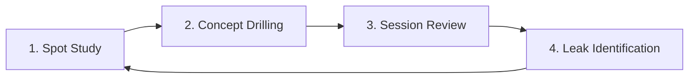

# Putting It All Together

You now have the complete toolkit. From Module 1's raw probability through Module 17's multi-street planning, every concept has been a piece of a single picture: **maximising expected value in a game of incomplete information**. This capstone module assembles those pieces into a practical framework for study, decision-making at the table, and continuous improvement.

## The Core Framework in One Sentence

Every decision in poker reduces to: *estimate equity, calculate EV, compare to pot odds or MDF threshold, and act accordingly.* The mathematics is not complex — the skill is in the estimation.

For any decision point, the full process is:

1. **Construct both ranges** — yours and your opponent's, given the pre-flop action, position, and post-flop history so far
2. **Assess board interaction** — who has range advantage? nut advantage? is the board static or dynamic?
3. **Calculate or approximate EV** for each available action
4. **Compare to the threshold** — pot odds for calls, MDF for defences, EV comparison for bets vs checks
5. **Choose the highest-EV action** — or the mixed strategy that prevents exploitation

Every module in this course is a tool for one of these five steps. Combinatorics (Modules 1–2) feeds step 1. Pot odds and equity (Modules 3–4) power step 4. EV (Modules 5–6) is the criterion in step 5. Range theory (Modules 7–8) formalises step 1. GTO (Modules 9–10) shows what unexploitable execution of steps 3–5 looks like. MDF (Modules 11–12) is the defender's version of step 4. Bet sizing (Modules 13–14) optimises step 5 across multiple streets. Board texture (Module 15), position (Module 16), and multi-street planning (Module 17) contextualise steps 1–3 in real scenarios.

## GTO as a Baseline, Exploitative as the Ceiling

**GTO (Game Theory Optimal)** play is a strategy that cannot be exploited by any opponent. Against an unknown opponent, it provides a safe default: you will never be systematically beaten, and your EV floor is guaranteed by the equilibrium.

But GTO is not the ceiling. Against opponents who deviate predictably, **exploitative adjustments** extract additional EV beyond what GTO provides:

| Opponent Tendency | Exploitative Adjustment |
|---|---|
| Folds too often to c-bets | Increase c-bet frequency with entire range |
| Calls too wide pre-flop | Value bet thinner; bluff less frequently |
| Over-3-bets from position | Widen 4-bet range; tighten flatting range |
| Never folds top pair post-flop | Stop river bluffing; value bet relentlessly |
| Folds too often on the river | Increase river bluff frequency |

The risk of exploitative play is that it's exploitable in return. If you bluff every river because the opponent folds too much, a thinking player who adjusts their calling frequency will punish you. GTO provides the stable equilibrium to return to when reads are unreliable or the opponent adapts.

**Framework:** Start with GTO assumptions. Once you identify a clear, reliable deviation in the opponent's strategy, shift exploitatively in the direction that extracts the most EV from that deviation. Revert to GTO when the opponent adapts or when the read is uncertain.

## Mixed Strategies in Practice

Solvers produce **mixed strategies** — frequencies at which to take each action. For example, a solver might say: "With $K\heartsuit T\heartsuit$ on $K\spadesuit 8\clubsuit 3\heartsuit$, bet 75% pot at 55% frequency and check at 45% frequency."

For human players, memorising and executing mixed strategies at precise frequencies is impractical. A workable approach:

1. **Identify the pure strategy approximation.** When the EV difference between "always bet" and "always check" is small, pick one and apply it consistently. Consistency prevents timing tells and simplifies execution. With $KT$ on $K83$, the EV of "always bet" is close to "always check" — the mixing exists to prevent exploitation, not because one action is dramatically better.

2. **Mix at the category level, not the hand level.** Instead of mixing one specific hand at a precise frequency, apply the mix to the full category: "top pair, strong kicker bets 80% and checks 20% on this board type." This approximates the GTO equilibrium without requiring precise individual-hand tracking.

3. **Use a default simple strategy, deviate exploitatively.** Your default is a simplified pure strategy. Deviate when you identify a specific exploit opportunity. This hybrid maximises EV in practice: consistent against unknowns, adaptive against reads.

## How to Use a Solver

Solvers (GTO Wizard, PioSolver, Simple GTO Trainer) compute GTO equilibria for specific poker scenarios. They are indispensable study tools when used correctly.

**What solvers tell you:**
- Equilibrium frequencies for each action (bet, check, call, fold, raise) with each hand in the range
- The EV of each action compared to the equilibrium EV — showing the cost of deviating
- Which hands benefit most from betting vs checking (the EV delta across actions)
- How the opponent should respond to maintain equilibrium on their side

**What solvers don't tell you:**
- How to exploit a specific opponent's tendencies
- How to adjust for live timing patterns, bet-sizing tells, or table dynamics
- How to handle ICM situations in tournaments (Module 18 covers this special case)
- What the population in your specific player pool does on average

**Correct study workflow with a solver:** Choose a specific, common spot — for example, c-betting as the pre-flop raiser on $K\heartsuit 7\diamondsuit 2\clubsuit$ 100BB deep in a single-raised pot. Run it. Study which hands bet, which check, and *why*. Focus on the EV differentials: which decisions have high EV cost if you deviate? Those are the spots where precision matters most. Don't memorise frequencies; understand the logic. Understanding transfers to new situations; memorised frequencies do not.

## The Four-Part Study Loop

A repeatable, compounding study framework:

**1. Spot Study**: Identify a specific spot that arises frequently in your game. Solve it in a solver or look up the equilibrium in a training tool. Understand the equilibrium, the key hands and why they take each action, and the critical decisions where the EV cost of errors is highest.

**2. Concept Drilling**: Use quiz modules (like those throughout this course) to drill formulas — MDF, pot odds, EV calculations — until they are instant. Mathematical fluency eliminates fumbling at the table. A player who needs 30 seconds to calculate pot odds is a player who won't calculate them when the clock runs.

**3. Session Review**: After each session, review 2–3 hands where you were uncertain or made a decision you want to validate. Run the spot in a solver or calculate the EV by hand. Build the habit of reviewing *close* decisions — not just obvious mistakes — because that is where the most learning occurs.

**4. Leak Identification**: Periodically ask: what do opponents consistently exploit in *me*? If you notice opponents over-c-betting without resistance, you fold too much to c-bets. If river bets consistently extract more value from you than expected, your calling frequency is too wide. The identified leak becomes the next spot-study priority, completing the loop.

## The Honest Ceiling

GTO theory is the map; live reads, bet timing, and population tendencies are the territory. The goal of theory is to provide a **principled starting point** from which to deviate *intelligently* — not to play robotically according to a fixed formula.

Two important caveats:

**GTO assumes a fixed game structure.** Solver solutions are computed for a specific stack-to-pot ratio, specific position, and two players. Real games have stack depth variation, multi-way pots, unusual histories, and opponent-specific tendencies that the solver doesn't model. Use solver output as a reference point, not a script.

**Population tendencies are real, exploitable edges.** In most player pools below a certain stakes threshold, opponents make systematic errors: folding too much to c-bets, calling too wide pre-flop, over-valuing top pair on all run-outs. A player who is 95% GTO and 5% exploitative against population tendencies outperforms a 100% GTO player against the same pool — because GTO is designed to be unexploitable, not to extract maximum EV from predictable mistakes.

## Closing Thought

The concepts in this course — from combinatorics to GTO to ICM — are connected by one idea: **maximising expected value in a game of incomplete information.**

Every fold, call, raise, and bluff is a probability calculation. The player who estimates those probabilities most accurately — who has the best mental models of range construction, board texture, and opponent tendencies — wins over the long run. Theory gives you the language and the framework. Practice gives you the speed. Review gives you the accuracy.

The goal was never to play robotically. It was to play *principled* poker — to have a rigorous reason for every decision, and to know when the evidence justifies deviating from the principle.

---

## Course Complete

You have covered the full arc of poker theory from first principles to synthesis:

| Modules | Concept | Key Insight |
|---|---|---|
| 01–02 | Probability & Combinatorics | How many ways can this situation arise? |
| 03–04 | Pot Odds & Equity | Are you getting the right price to continue? |
| 05–06 | Expected Value | What is the average outcome of this action? |
| 07–08 | Range Theory | What hands do both players hold given all prior actions? |
| 09–10 | Game Theory Optimal | What strategy cannot be exploited by any opponent? |
| 11–12 | Minimum Defense Frequency | How often must the defender continue to prevent auto-profitable bluffs? |
| 13–14 | Bet Sizing | What size maximises EV across multiple streets? |
| 15 | Board Texture Analysis | Which player's range connects better with this board? |
| 16 | Position & Initiative | How does acting last compound every range advantage? |
| 17 | Multi-Street Planning | How do flop, turn, and river form a single coherent plan? |
| 18–19 | ICM & Tournament Theory | How do chip EV and prize-money EV diverge in tournament play? |
| 20 | Putting It All Together | How do you study, adapt, and apply the full framework continuously? |

---

## Review: The Theoretical Pillars

These modules are the foundational pillars of the course — worth revisiting as your game deepens and your questions become more specific:

- [**Module 01 — Probability Foundations**](../01-probability-foundations/) — the combinatorial basis for all range construction and equity calculations
- [**Module 05 — Expected Value**](../05-expected-value/) — the universal decision criterion that every other concept in this course serves
- [**Module 09 — Game Theory Optimal**](../09-game-theory-optimal/) — the equilibrium concept that defines what "correct" means in poker
- [**Module 11 — Minimum Defense Frequency**](../11-minimum-defense-frequency/) — the tool for calibrating defences against any bet size at any stack depth
- [**Module 13 — Bet Sizing Theory**](../13-bet-sizing-theory/) — how size choices translate range advantage into maximum extracted EV across streets
