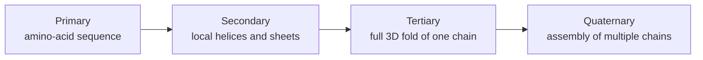

## Four levels of structure

A protein's shape is described at four nested levels, each emerging from the
one below. This vocabulary is so embedded in the field that every paper on
structure prediction assumes you know it.



We'll walk through each, then look at how they're stored on disk and what
"structure prediction" actually means.

## Primary structure: the sequence

The **primary structure** is just the amino-acid sequence. The chain of
peptide-bonded residues, written `N` → `C` terminus (the convention is to
start at the end with the free amino group, called the N-terminus, and read
toward the end with the free carboxyl, the C-terminus).

```text
N-terminus ── M G L S D G E W Q L V L N V W G K V E A D I ──→ C-terminus
```

This is what AlphaFold2 and ESMFold take as input. **Everything else** —
the helices, the fold, the assembly — is supposed to be implied by the
sequence under the right physical conditions. That is the *protein folding
problem*.

## Secondary structure: helices and sheets

The **secondary structure** is the local 3D pattern of the backbone. Two
patterns dominate, and a third "everything else" category fills the gaps:

- **α-helix (alpha-helix)** — the backbone coils into a right-handed spring.
  Each turn of the helix is ≈ 3.6 residues. Hydrogen bonds form between the
  carbonyl oxygen of residue *i* and the amide hydrogen of residue *i + 4*.
  Sequences rich in `A`, `L`, `M`, `Q`, `E` tend to form helices.
- **β-sheet (beta-sheet)** — multiple stretched-out strands of backbone sit
  side-by-side and hydrogen-bond to each other, forming a pleated sheet.
  The strands can run in the same direction (parallel) or opposite
  directions (antiparallel). Sequences rich in `V`, `I`, `T`, `F`, `Y` tend
  to form sheets.
- **Loops, turns, and "coil"** — everything that isn't a helix or a sheet.
  This is where the chain changes direction. Glycine and proline show up
  here a lot.

These three patterns ($\alpha$, $\beta$, coil) are the targets of classical
"secondary-structure prediction" models (which are now almost obsolete
because modern PLMs predict full 3D structure directly). Most proteins are
about 30 % helix, 20 % sheet, 50 % loop, give or take.


*An alpha helix as an actual local fold in a protein chain. Image from
Wikimedia Commons, CC BY-SA 3.0.*


*An antiparallel beta sheet: neighboring strands run in opposite directions
and hydrogen-bond across the sheet. Image from Wikimedia Commons,
Fvasconcellos, public domain.*

## Tertiary structure: the fold of one chain

The **tertiary structure** is the complete 3D arrangement of *one* polypeptide
chain. It includes:

- All the helices and sheets from the secondary structure.
- How those secondary-structure elements pack against each other.
- Where every atom of every side chain ends up in space.
- The disulfide bridges (Cys–Cys) and salt bridges (charged side-chain pairs)
  that pin the fold together.

When someone says "the structure of myoglobin", they usually mean its
tertiary structure: a roughly globular bundle of eight α-helices wrapped
around a heme group, with hydrophobic side chains pointing inward and polar
side chains pointing outward (remember the hydrophobicity rule from module 1).


*A single myoglobin chain: mostly alpha-helical tertiary structure wrapped
around a heme group. Structure image from PDBe/RCSB PDB, PDB ID `1MBN`.*

## Quaternary structure: multiple chains together

Many proteins only function as **assemblies of several chains**. The
arrangement of those chains relative to each other is the **quaternary
structure**.

The canonical example is **hemoglobin**, the red oxygen carrier in your
blood. It's made of *four* separate polypeptide chains (two `α` and two `β`,
where the Greek letters here refer to two different protein subunits, not to
secondary structure) that pack together to form the working oxygen carrier.
Each chain on its own looks a lot like myoglobin, but only the four-chain
assembly has the cooperative oxygen-binding behaviour that makes hemoglobin
useful.


*Hemoglobin is quaternary structure in the literal sense: four related
protein chains packed into one oxygen-carrying assembly. Structure image from
PDBe/RCSB PDB, PDB ID `4HHB`.*

AlphaFold2's original release predicted single-chain (tertiary) structures.
AlphaFold-Multimer and AlphaFold3 added multi-chain (quaternary) prediction,
which is dramatically harder because the model has to reason about how the
chains find each other.

## The PDB file

The standard file format for storing a protein structure is **PDB** (Protein
Data Bank). Each line is one atom, with its 3D coordinates in Ångströms
($1\ \text{Å} = 10^{-10}\ \text{m}$):

```text
ATOM      1  N   MET A   1      24.277  8.374 -9.854  1.00 38.41  N
ATOM      2  CA  MET A   1      24.404  9.859 -9.939  1.00 37.59  C
ATOM      3  C   MET A   1      25.814 10.249 -10.359 1.00 35.99  C
ATOM      4  O   MET A   1      26.748  9.450 -10.286 1.00 36.31  O
ATOM      5  CB  MET A   1      24.070 10.495 -8.596  1.00 41.07  C
...
```

The columns are: atom serial number, atom name (`N` = nitrogen,
`CA` = alpha carbon, `C` = carbonyl carbon, etc.), residue name (`MET`),
chain identifier (`A`), residue number (`1`), then the three Cartesian
coordinates, plus occupancy and B-factor.

For machine learning, the most-used view of a PDB file is just the
**alpha-carbon trace**: the `(x, y, z)` of every `CA` atom in order. That
gives you a polyline through space — enough to compute most structural
similarity metrics, even though all the side-chain detail is thrown away.

There's also a newer format, **mmCIF**, which is the official PDB archive
format these days, but PDB-format files are still everywhere and most tools
read both transparently.

## Distance maps: structure as an image

A useful trick: instead of storing 3D coordinates, you can store the
**pairwise distance matrix** between alpha carbons. For a protein of length
$L$, that's an $L \times L$ matrix where entry $(i, j)$ is the distance in
Ångströms between the alpha carbon of residue $i$ and the alpha carbon of
residue $j$:

$$D_{ij} = \lVert \mathbf{r}_i^{\text{CA}} - \mathbf{r}_j^{\text{CA}} \rVert$$

This matrix is the **distance map**. A thresholded version (typically at
8 Å) is the **contact map**:

$$C_{ij} = \mathbb{1}\!\left[ D_{ij} < 8\ \text{Å} \right]$$

Why does this matter? AlphaFold2 doesn't directly predict 3D coordinates —
it predicts a *pair representation* that, at its heart, is doing
residue-pair distance / contact prediction. The fold is then reconstructed
from those pairwise distances. We'll see exactly how in modules 15–16.

A distance map is also conveniently a 2D image — you can literally `plt.imshow`
it. Contacts within helices show up as a thin diagonal band; contacts
within sheets show up as off-diagonal stripes; contacts between far-apart
parts of the chain (long-range contacts) are the rare but critical bright
spots that nail down the global fold.


*Crambin is tiny, which makes it a useful mental model for alpha-carbon traces,
distance maps, and contact maps. Structure image from PDBe/RCSB PDB, PDB ID
`1CRN`.*

## Why the hierarchy matters for ML

The level-by-level decomposition isn't just biology jargon — it maps directly
onto how modern protein ML works:

| Level | What you predict | Typical tool |
|---|---|---|
| Primary | (input — given) | — |
| Secondary | helix / sheet / coil per residue | small CNN or PLM head |
| Tertiary | full 3D fold of one chain | AlphaFold2, ESMFold |
| Quaternary | how chains assemble | AlphaFold-Multimer, AlphaFold3 |

A PLM like ESM-2 is trained only on primary structure (just sequence) but
ends up implicitly encoding signal about all the higher levels. That is the
whole reason ESMFold can predict tertiary structure from a sequence alone,
with no MSA — a story we'll get to in modules 11–17.

## Recap

- Four levels: **primary** (sequence), **secondary** (helix / sheet / coil),
  **tertiary** (full single-chain fold), **quaternary** (multi-chain
  assembly).
- Each level is supposed to be implied by the one below under physiological
  conditions.
- The PDB file format stores every atom's `(x, y, z)`; the alpha-carbon
  trace is enough for most ML purposes.
- The **distance map** $D_{ij}$ between alpha carbons is a compact image-like
  representation of tertiary structure and is what AlphaFold2 effectively
  predicts.

Next module: *how* a chain finds its fold — the thermodynamics of folding.
