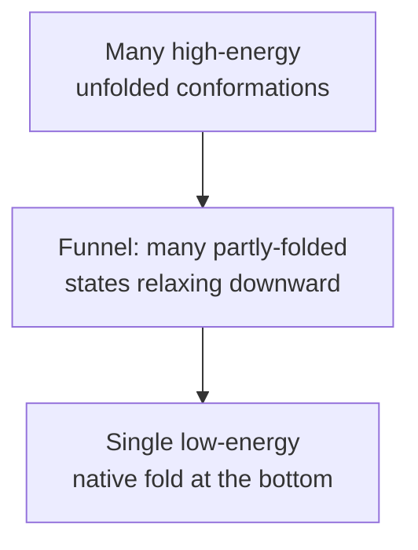

## Why does a protein fold at all?

A freshly translated polypeptide leaves the ribosome as an extended,
floppy chain. Within milliseconds to seconds, it spontaneously collapses
into a specific 3D fold and starts doing its job. No external machinery
is required for most small proteins — the same sequence, alone in a test
tube of water, will fold into the same shape every time.

This is **Anfinsen's dogma** (Christian Anfinsen, Nobel Prize 1972):

> *The amino-acid sequence of a protein contains all the information
> necessary for it to fold into its functional 3D structure under the
> right physiological conditions.*

Anfinsen showed this experimentally by **denaturing** ribonuclease (a small
enzyme) — unfolding it completely by adding chemicals that break its
disulfide bonds and disrupt its hydrogen-bonding network — then removing
those chemicals and watching it spontaneously refold into the active enzyme.

This is the single most important reason structure prediction from sequence
is *possible at all*. If folding required external machinery that varied by
context, no sequence-only model could work. AlphaFold2, ESMFold, ESM3 — every
one of them implicitly bets on Anfinsen's dogma.

(There are caveats — some proteins do require **chaperones** to fold
correctly, and intrinsically disordered proteins don't have a single fold —
but for the vast majority of soluble globular proteins, Anfinsen's dogma
holds well enough to predict structure from sequence with high accuracy.)

## Free energy minimisation

Folding is driven by **free energy minimisation**. A protein settles into
the conformation that minimises its Gibbs free energy:

$$\Delta G = \Delta H - T \Delta S$$

where:

- $\Delta H$ — change in enthalpy, roughly "how strong the bonds are".
  More favourable hydrogen bonds, salt bridges, and van der Waals contacts
  make $\Delta H$ more negative.
- $T$ — absolute temperature in Kelvin.
- $\Delta S$ — change in entropy, "how disordered the system is".
  A folded chain is *more* ordered than an unfolded one, so the chain's
  conformational entropy decreases (unfavourable). But the *water around it*
  becomes much more disordered when hydrophobic side chains stop disrupting
  the water structure, so the total entropy of (chain + water) usually
  *increases* on folding.

The native fold is whichever conformation has the most negative $\Delta G$
relative to the unfolded ensemble. Importantly, $\Delta G$ for folding is
typically only a few tens of kJ/mol — proteins are **marginally stable**,
which is why a single mutation can sometimes destabilise the whole fold.

## The hydrophobic effect: the dominant driver

We said in module 1 that "water hates grease". Here's the quantitative
version.

Water molecules at room temperature are highly hydrogen-bonded. When a
hydrophobic side chain sits in water, the surrounding water molecules can't
form their usual networks — they have to form an ordered "cage" around the
side chain. This cage costs entropy.

When two hydrophobic side chains come together and shield each other from
water, the water released from the cage gets to be disordered again. The
result: hiding hydrophobic surface from water is **entropically favoured**.

For a typical protein, the **buried hydrophobic surface area** correlates
beautifully with stability. A rough rule of thumb:

$$\Delta G_{\text{folding}} \approx -\left(25\ \frac{\text{cal/mol}}{\text{Å}^2}\right) \cdot A_{\text{buried}}$$

So burying $1000\ \text{Å}^2$ of hydrophobic surface — totally normal for a
small folded protein — contributes about $-25\ \text{kcal/mol}$ to
stability. Hydrogen bonds, electrostatics, and packing add or subtract a
few kcal/mol on top of this dominant term.

This is why **the core of a folded protein is almost entirely
hydrophobic** and why mutating a core residue to a polar one is one of the
fastest ways to destabilise a fold. Protein language models implicitly
learn this — if you mask a core leucine in a known protein, the model will
overwhelmingly predict another hydrophobic residue.

## The folding funnel

If you plot the free energy of every possible conformation of a polypeptide
on a 2D landscape, with energy on the vertical axis and "conformational
distance from native" on the horizontal axes, you get a shape called the
**folding funnel**:

The wide rim is the huge ensemble of unfolded conformations. The narrow
point at the bottom is the single native fold (sometimes with a few nearby
sub-states). Any starting point on the rim has *some* downhill path to the
native fold, which is why folding is fast despite the absurd number of
total conformations (Levinthal's paradox from module 2).

Importantly, the funnel isn't perfectly smooth. There are **local minima** —
partly-folded "kinetic traps" where the chain gets stuck on its way down.
**Chaperones** (the GroEL/GroES system in bacteria, Hsp70 in eukaryotes) are
proteins whose job is to grab misfolded clients, unfold them, and give them
another shot at folding correctly. **Misfolding** is a real problem — many
diseases (Alzheimer's, Parkinson's, prion diseases) are caused by proteins
that misfold and aggregate.

For ML structure prediction, we usually assume "perfect folding" — that the
chain reaches the native minimum. This is a good approximation for most
small globular proteins. It's a worse approximation for very large
multi-domain proteins and for proteins that genuinely live in multiple
conformations.

## What does the model actually predict?

Given Anfinsen's dogma, the structure prediction problem becomes:

> **Find the $(x, y, z)$ for every atom that minimises $\Delta G$ for this
> sequence in water at body temperature.**

In principle, you could try to simulate this with molecular dynamics:
solve Newton's equations of motion for every atom on a microsecond
timescale until the chain folds. People do this (it's the field of MD
simulation), and you need a supercomputer and weeks of wall-clock time for
a single small protein.

ML structure prediction sidesteps the simulation. Instead, it takes the
sequence, runs it through a neural network, and outputs the folded
coordinates directly. The network has implicitly learned the free-energy
landscape from millions of known folded structures, without ever doing
explicit physics. AlphaFold2 wins this game so spectacularly that it
arguably "solved" the structure prediction problem for most natural
single-domain proteins.

## Anfinsen's dogma as the inductive bias

Every ML protein structure tool — AlphaFold2, ESMFold, ESM3, RoseTTAFold,
all the rest — bakes Anfinsen's dogma in as its core inductive bias. The
input is a sequence, the output is a structure, and the implicit
assumption is that the sequence *contains enough information* to determine
the structure under standard physiological conditions.

When this assumption breaks (intrinsically disordered regions, multi-state
proteins, proteins that require obligate chaperones), the models break too
— usually by outputting a low-confidence "structure" with very low pLDDT
scores. The pLDDT metric we'll meet in module 19 is, in effect, the model's
own estimate of how much it trusts Anfinsen's dogma for the input you gave
it.

## Recap

- **Anfinsen's dogma**: sequence determines structure for typical small
  globular proteins. This is the inductive bias of every ML folding tool.
- Folding is driven by **free energy minimisation** ($\Delta G = \Delta H -
  T \Delta S$). For most proteins the dominant favourable term is the
  **hydrophobic effect**: burying greasy side chains releases ordered water.
- The chain finds its fold through a **folding funnel** that biases it
  toward partly-correct intermediates instead of a random search
  (Levinthal's paradox).
- Proteins are **marginally stable** — typical $\Delta G_{\text{folding}}$
  is only $-5$ to $-15\ \text{kcal/mol}$, easily disturbed by single mutations.

Next module: the history of the folding problem and how AlphaFold2 came to
"solve" it.
