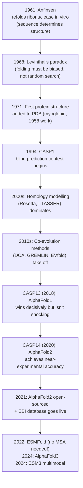

## The problem statement

> **Given an amino-acid sequence, predict the 3D structure of the folded
> protein.**

That's the protein folding problem. One sentence to state, fifty years to
solve. From Anfinsen's 1961 ribonuclease experiment to AlphaFold2's 2020
CASP14 results, this was *the* grand challenge of computational biology.

Why is it so important?

- **A protein's function follows from its structure.** Knowing the structure
  tells you which residues are surface-accessible, what the active site
  looks like, where drugs might bind.
- **Experimental structure determination is slow and expensive.** A typical
  crystal structure takes months of work and tens of thousands of dollars.
  We have ~$250{,}000$ experimentally-solved structures in the PDB after
  five decades of intense effort.
- **There are hundreds of millions of known protein sequences.** UniProt
  has $\sim 250\ \text{million}$ entries. Until 2021, the structure was
  known for less than 0.1 % of them.
- **Drug design needs structures.** Most modern drug discovery starts with
  the 3D structure of a disease-causing protein. No structure → no
  rational drug design.

The economic and scientific payoff for a fast, accurate sequence-to-
structure model was clear for decades. The actual model just took a while
to arrive.

*Ribonuclease A is the molecule behind Anfinsen's classic folding experiment:
sequence plus the right conditions can be enough to recover a stable structure.
Structure image from PDBe/RCSB PDB, PDB ID `7RSA`.*

## A short timeline

## CASP: the blind benchmark

The reason we can confidently say AlphaFold2 "solved" the folding problem
is the **Critical Assessment of Structure Prediction (CASP)** experiment.
CASP is a community-run blind contest that has happened every two years
since 1994.

The protocol:

1. CASP organisers collect amino-acid sequences whose 3D structures have
   *just* been determined experimentally but **not yet released publicly**.
2. Predictor groups have a few weeks to submit their predicted structures.
3. The experimental structures are then released, and predictions are
   scored against them.

This setup eliminates the "trained on the test set" problem. Predictions
must be made from sequence alone, with no peeking. The main scoring
metric is **GDT_TS** (Global Distance Test, Total Score), which roughly
measures the fraction of residues whose alpha carbons are within a few
Ångströms of the true position after optimal alignment. A score of 100
means perfect; ≥ 90 means "experimental-quality"; ≤ 50 means "topology
mostly wrong".

## The pre-AlphaFold era

Through CASP1 (1994) to CASP12 (2016), no method came close to consistent
high-quality prediction. The best methods at the time fell into a few
families:

**Homology modelling** — if a sequence has a known structural homolog
(another protein with similar sequence whose structure is in the PDB),
copy the homolog's fold and adjust the side chains. Works very well when
the homolog is close (sequence identity > 40 %), badly when it isn't.
Dominant tools: **Modeller**, **I-TASSER**.

**Fragment assembly** — chop the sequence into short windows (~9 residues),
find PDB structures whose sequences match those windows, glue the
fragments together by sampling backbone angles. **Rosetta** (David Baker's
lab) is the canonical example.

**Co-evolution methods** — for a sequence with many evolutionary homologs,
build an MSA and infer which residue pairs co-evolve. Co-evolving pairs
are likely to be in physical contact. Then use those contact predictions
to guide a fold. **GREMLIN**, **EVfold**, **PSICOV**, **DCA** were the
main methods. These were the first ML-ish methods to work, and they
provided much of the conceptual foundation that AlphaFold2 builds on.

The best of these methods, on hard CASP targets (no obvious homolog), got
GDT_TS scores around 30-40. Useful but not solving the problem.

## CASP14, 2020: the moment everything changed

At CASP14, AlphaFold2 (a transformer-based model from DeepMind) scored a
median GDT_TS of **92.4** across all targets. The next-best group scored
**~75**. The previous CASP best was around 50.

This isn't a normal benchmark improvement. **GDT_TS > 90 means the
prediction is comparable in accuracy to an experimentally-determined
structure**. The community's reaction was something between "the problem
is solved" and "the problem is solved enough to retire". The lead CASP
organiser, John Moult, was quoted in *Nature*: "In some sense the problem
is solved."

AlphaFold2 won the **Nobel Prize in Chemistry in 2024** for its lead
authors (Demis Hassabis and John Jumper, with David Baker sharing it for
his decades of Rosetta work and later RoseTTAFold contributions).

## What AlphaFold2 actually does

A one-paragraph summary, because we'll spend modules 15–16 on the details:

> AlphaFold2 takes a sequence, builds a **multiple sequence alignment
> (MSA)** of evolutionarily-related proteins by searching huge databases,
> and feeds both the sequence and the MSA through a transformer-based
> network called the **Evoformer**. The Evoformer's job is to compute a
> "pair representation" — an $L \times L$ tensor that effectively predicts
> the pairwise distance / contact relationship between every pair of
> residues. A separate **structure module** then turns the pair
> representation into actual 3D coordinates by iterative refinement.

The MSA is doing most of the work. It encodes evolutionary signal: which
residue pairs co-evolve (and are therefore likely in contact), which
positions are conserved (and therefore structurally critical). The
Evoformer is the machinery that distills that signal into structural
predictions. The structure module is "just" the final geometry step.

The catch: the MSA has to come from somewhere. Building a good MSA means
searching billions-of-sequences databases (UniRef, BFD, MGnify) and
running alignment algorithms. This is **slow** — typically minutes per
protein, sometimes hours.

## ESMFold, 2022: replacing the MSA with a language model

If a transformer language model could *implicitly* encode the same
evolutionary signal in its weights, you wouldn't need to do MSA search at
inference time. The 2022 paper introducing **ESMFold** showed that a
sufficiently large pretrained protein language model (ESM-2, 15B parameters)
can do exactly that.

ESMFold's structure prediction accuracy is somewhat below AlphaFold2 on
proteins with deep MSAs, but it's *much* faster — a single forward pass
through a transformer instead of a multi-stage pipeline with database
searches — and it can even *exceed* AlphaFold2 on proteins with shallow
MSAs (no good evolutionary signal available).

This is the conceptual shift that modules 11–17 explore in depth.

## ESM3 and beyond, 2024

The latest twist, also in 2024: **ESM3** (from EvolutionaryScale, the
Meta spin-out) integrates **sequence, structure, and function** into a
single multimodal transformer. Instead of just "sequence → structure",
ESM3 lets you condition on any combination of partial sequence, partial
structure, and desired function, and generate the rest.

The flashy demo: ESM3 designed a fully novel **fluorescent protein**
(`esmGFP`) whose sequence is only 58 % identical to any natural GFP, and
which fluoresces brightly when expressed in the lab. The model essentially
invented a new protein family in silico. Module 14 covers ESM3 in detail.

## Significance

Why does the structure-prediction breakthrough matter so much?

- The **AlphaFold Protein Structure Database** (released 2021, expanded
  2022) now contains predicted structures for **over 200 million
  proteins** — essentially all known protein sequences in UniProt.
  Before 2021, ~$200{,}000$ structures had been solved experimentally
  *ever*.
- **Drug discovery** workflows can now start with a high-quality predicted
  structure for *any* target, including the ones nobody has crystallised.
- **Function annotation** becomes much faster: an unstructured "this gene
  is unknown" entry can become "this looks like a kinase with the
  following predicted active site" in seconds.
- **Protein design** (the topic of Part 5) leans heavily on accurate
  structure prediction as the "scoring step" — if you design a new
  sequence and the structure predictor says it folds into the shape you
  wanted, that's strong evidence it will actually work.

The whole rest of this course is about understanding the machinery behind
these breakthroughs and learning to use them yourself.

## Recap

- The **protein folding problem** is "predict 3D structure from amino-acid
  sequence". Stated in the 1960s, "solved enough to publish" in 2020.
- **CASP** is the blind biennial benchmark that proved AlphaFold2's win
  is real (not a training-set artefact).
- Pre-AlphaFold methods (homology modelling, fragment assembly,
  co-evolution) plateaued around GDT_TS ~50.
- **AlphaFold2** uses MSAs + transformers + an iterative structure module
  to hit GDT_TS ~92 — comparable to experimental quality.
- **ESMFold** replaces the MSA with a pretrained protein language model,
  trading some accuracy for speed and the ability to handle MSA-poor
  sequences.
- **ESM3** goes multimodal: sequence + structure + function in one model.

We've now done all the biology background we'll need. From here on the
course gets hands-on — starting with Biopython in module 5.
