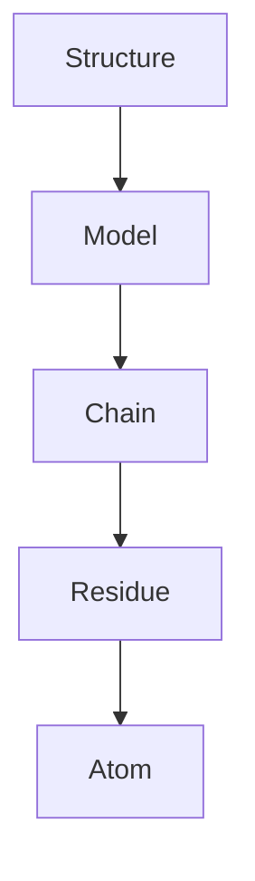

## The PDB file format

The Protein Data Bank's flat-text format is older than most readers of
this course. It dates to 1976 and was designed for 80-column punched
cards. Every line is exactly 80 characters wide, and fields are
positional — not delimited.

The two record types you'll see most often:

| Record | Meaning |
|---|---|
| `ATOM` | One atom of a standard residue |
| `HETATM` | One atom of a non-standard residue (waters, ligands, modified residues) |

The full column layout of an `ATOM` line is:

| Cols | Field | Example |
|---|---|---|
| 1-6 | Record type | `ATOM  ` |
| 7-11 | Atom serial number | `    1` |
| 13-16 | Atom name | ` CA ` |
| 17 | Alt-loc indicator | (blank) |
| 18-20 | Residue name | `MET` |
| 22 | Chain ID | `A` |
| 23-26 | Residue sequence number | `   1` |
| 27 | Insertion code | (blank) |
| 31-38 | X coordinate (Å, .3f) | `  27.340` |
| 39-46 | Y coordinate | `  24.430` |
| 47-54 | Z coordinate | `   2.614` |
| 55-60 | Occupancy | `  1.00` |
| 61-66 | Temperature factor | `  9.67` |
| 77-78 | Element symbol | ` C` |

The little quirks that bite you:

- **Atom names are right-justified in cols 13-14 only when the element
  symbol is a single letter.** `CA` (carbon-alpha) goes in cols 14-15
  with col 13 blank. `CB` (carbon-beta) goes in cols 14-15. `1HG2` (a
  hydrogen tagged as part of an HG2 group) goes in cols 13-16 with the
  digit at col 13. Most parsers handle this for you; raw string
  manipulation does not.
- **Alt-loc indicators** appear when an experiment's electron density
  shows two side-chain conformations. You usually want only the
  highest-occupancy one. Biopython's default is to keep both; you can
  filter on `atom.altloc`.
- **Insertion codes** let two residues share a sequence number with an
  appended letter (`100`, `100A`, `100B`). Common in immunoglobulin
  numbering.

## Biopython's hierarchy

`Bio.PDB.PDBParser` returns a `Structure` object. The hierarchy is:



- A `Structure` is one parsed file. Most files have one model, but NMR
  ensembles can have dozens.
- A `Model` is indexed by integer (typically 0).
- A `Chain` is indexed by single-character chain ID (`"A"`, `"B"`, etc.).
- A `Residue` has a triple ID `(hetflag, resseq, icode)`. Standard
  amino acids have `hetflag == " "`; waters have `hetflag == "W"`;
  HETATM ligands have `hetflag == "H_<resname>"`.
- An `Atom` has `.coord` (a `numpy` 3-vector), `.element`, `.bfactor`,
  `.occupancy`, `.altloc`.

The most useful idiom for ML is a flat list of CA coordinates from a
single chain:

```python
chain = structure[0]["A"]
ca = np.array([res["CA"].coord for res in chain
               if res.id[0] == " " and "CA" in res])
```

This skips:

- HETATM residues (waters, ligands).
- Disordered residues missing their CA — rare in well-resolved
  crystal structures, common in low-resolution cryo-EM maps.

## Distance matrices and contact maps

Given $N$ residues with CA coordinates $\mathbf{r}_1, \dots, \mathbf{r}_N \in \mathbb{R}^3$, the **distance matrix** is the $N \times N$ matrix

$$D_{ij} = \lVert \mathbf{r}_i - \mathbf{r}_j \rVert_2$$

It's symmetric ($D_{ij} = D_{ji}$) and zero on the diagonal. In NumPy:

```python
diffs = coords[:, None, :] - coords[None, :, :]   # (N, N, 3)
D = np.linalg.norm(diffs, axis=-1)                # (N, N)
```

The **contact map** at a given threshold $\tau$ is the binary matrix

$$C_{ij}(\tau) = \mathbb{1}\!\left[D_{ij} < \tau\right]$$

Standard thresholds are 8 Å (CA-CA, used in CASP) or 6 Å (heavy-atom
minimum-distance, used by some other tools). 8 Å is roughly the
distance at which two side chains can plausibly touch through their
non-CA atoms.

When you visualise a contact map as an image:

- **Helices** show up as a thin diagonal band — every residue $i$
  contacts $i\pm 3, i\pm 4$ within the helix.
- **Sheets** show up as off-diagonal stripes — strands are anti-parallel
  if the stripe runs perpendicular to the diagonal, parallel if it runs
  parallel.
- **Long-range contacts** are isolated bright spots far from the
  diagonal and are the hardest to predict.

## Excluding sequence-local pairs

In every contact-prediction paper you'll read, "contacts" exclude pairs
with $|i - j| < 6$ or $|i - j| < 12$, depending on the analysis. The
reasoning: residues close along the backbone are *trivially* close in
3D too, so counting them inflates accuracy. The signal that matters
for fold prediction is the **long-range** contacts — these are what
nail down the global topology.

For our toy exercise we use the gentle exclusion $|i - j| \ge 2$,
which only filters out the immediate backbone neighbours. The number
you'd compare against modern contact-prediction benchmarks is
"long-range precision at $L$" — fraction of the top $L$ predicted
contacts (by confidence) that are real, restricted to $|i - j| \ge 24$.

## PDB vs mmCIF

The PDB format is showing its age. Limitations:

- **80-column lines** can't fit large structures (the Ribosome —
  PDB id 4UG0 — has > 100,000 atoms; the chain ID field is one
  character so you literally can't have more than 62 chains in a
  single PDB file).
- **No proper metadata schema.** Each variant of a header field is
  stored differently and is hard to parse robustly.

The official replacement is **mmCIF** (macromolecular CIF), based on
the chemistry community's CIF format. It's a key-value text format
without column constraints. Biopython's `Bio.PDB.MMCIFParser` is the
drop-in replacement. Most modern tools accept both.

For the rest of this course we'll stick with PDB-format files because
they're still ubiquitous and AlphaFold2 / ESMFold both *output* PDB by
default. Just be aware that for any structure newer than ~2020, the
authoritative format is mmCIF.

## Beyond Biopython

Three alternative parsers worth knowing:

- **`biotite`** ([https://www.biotite-python.org/](https://www.biotite-python.org/)) — modern Pythonic library
  with a NumPy-native data structure. Faster and cleaner than Biopython
  for ML pipelines.
- **`prody`** — focused on dynamics analysis (normal modes,
  PCA on conformational ensembles).
- **`pymol`** / **`chimerax`** — full visualisation packages with
  Python APIs. Use these when you actually need to *see* the structure.
