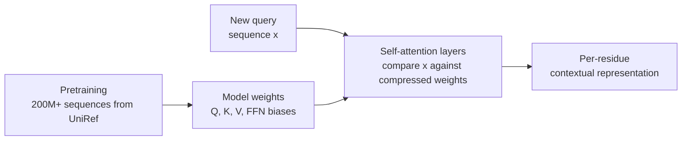
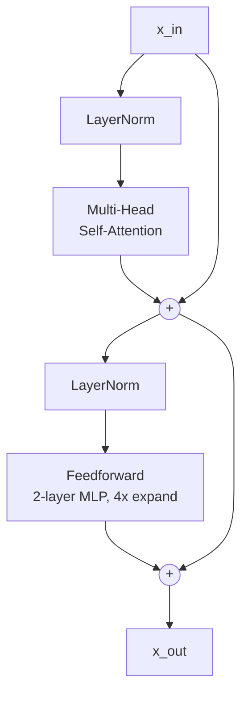

## The conceptual move

Modules 5, 6, and 7 built up a chain: amino-acid sequences → pairwise
alignment under BLOSUM62 → multiple sequence alignments → conservation
scores. Each step asked the same underlying question: **given a query
sequence and a database of related sequences, which positions
correspond, and how confident are we?**

Module 10 makes the conceptual leap to encoder transformers. The
single most useful thing to internalise:

> **An encoder transformer is a continuous, learned, parameterised
> version of a fuzzy string matching algorithm. Attention is the
> matching step; the model's weights are the compressed pattern
> database it matches against.**

This framing is due to Chris Hayduk's PLM primer. It is, in the
author's view, the single most useful mental model for protein
language models. Once you have it, ESM-2's behaviour — including all
its surprising successes and surprising failures — follows almost
trivially.

## A quick refresher: edit distance as DP

Edit distance is the simplest possible "alignment" algorithm. Given
two strings $s$ (length $m$) and $t$ (length $n$), the **edit
distance** $D[i, j]$ — the minimum number of single-character
insertions, deletions, or substitutions to turn $s_{1..i}$ into
$t_{1..j}$ — satisfies:

$$
D[i, j] = \min \begin{cases}
D[i-1, j] + 1 & \text{(delete } s_i\text{)} \\
D[i, j-1] + 1 & \text{(insert } t_j\text{)} \\
D[i-1, j-1] + \mathbb{1}[s_i \ne t_j] & \text{(match or substitute)}
\end{cases}
$$

with base cases $D[0, j] = j$ and $D[i, 0] = i$. The recurrence runs
in $O(mn)$ time and gives an optimal alignment via standard DP
backtracking.

**The substitution score is hard-coded:** $0$ if the letters match,
$1$ otherwise. Every mismatch is penalised the same.

## BLOSUM62 alignment: the first soft step

Module 6's pairwise alignment under BLOSUM62 generalises the
recurrence by replacing the hard-coded mismatch cost with a
**substitution score** $S(a, b)$ from a $20 \times 20$ table:

$$
\text{score}[i, j] = \max \begin{cases}
\text{score}[i-1, j-1] + S(s_i, t_j) \\
\text{score}[i-1, j] - g \\
\text{score}[i, j-1] - g
\end{cases}
$$

with affine gap penalty $g$ and a base case of $0$ for global alignment.

The substitution score $S(a, b)$ is no longer "right or wrong" — it's
a real number that says *how chemically similar* $a$ and $b$ are.
$S(L, I) = +2$ (similar hydrophobics). $S(K, D) = -1$ (charge
opposites). $S(C, C) = +9$ (cysteines stand alone — disulfide
relevance).

Two things have happened:

1. **The matching is now soft.** A pair of similar residues counts as
   evidence for alignment, not just an exact match.
2. **The substitution scores are *empirical*.** BLOSUM62 was estimated
   from frequencies of aligned residue pairs in real, trusted protein
   alignments. It encodes a small piece of the prior structure of the
   protein universe.

Hold onto this idea — empirical similarity scores derived from data —
because attention is going to do the same thing on steroids.

## Attention as soft similarity lookup

Self-attention takes a sequence of $L$ vectors $\mathbf{x}_1, \dots, \mathbf{x}_L \in \mathbb{R}^d$ and produces a sequence of $L$ output vectors $\mathbf{y}_1, \dots, \mathbf{y}_L$ via the formula

$$\mathbf{y}_i = \sum_{j=1}^{L} \alpha_{ij}\, \mathbf{V} \mathbf{x}_j$$

where the attention weights $\alpha_{ij}$ are computed from learned
linear projections $\mathbf{Q}, \mathbf{K} \in \mathbb{R}^{d \times d_k}$:

$$\alpha_{ij} = \frac{\exp\left(\frac{(\mathbf{Q}\mathbf{x}_i)^\top (\mathbf{K}\mathbf{x}_j)}{\sqrt{d_k}}\right)}{\sum_{j'=1}^{L} \exp\left(\frac{(\mathbf{Q}\mathbf{x}_i)^\top (\mathbf{K}\mathbf{x}_{j'})}{\sqrt{d_k}}\right)}$$

Stripping the notation, attention does exactly three things:

1. Compute a **query** $\mathbf{q}_i = \mathbf{Q}\mathbf{x}_i$, a **key**
   $\mathbf{k}_j = \mathbf{K}\mathbf{x}_j$, and a **value**
   $\mathbf{v}_j = \mathbf{V}\mathbf{x}_j$ for every position.
2. Score the similarity of position $i$'s query against every
   position's key: $s_{ij} = \mathbf{q}_i^\top \mathbf{k}_j / \sqrt{d_k}$.
3. Softmax-normalise the row of scores into a probability distribution
   $\alpha_{ij}$, then take the weighted average of the values.

Compare this to BLOSUM62 alignment. The substitution score $S(s_i, t_j)$
is the analogue of the dot product $\mathbf{q}_i^\top \mathbf{k}_j / \sqrt{d_k}$, except:

- BLOSUM62 is a $20 \times 20$ fixed table; attention is a
  $d_k$-dimensional **dot product** that's real-valued and learned.
- BLOSUM62 was estimated from a curated alignment dataset; attention's
  $\mathbf{Q}, \mathbf{K}$ matrices are estimated by gradient descent
  on a much bigger, much messier dataset (UniRef, BFD, MGnify — hundreds
  of millions of sequences).
- BLOSUM62 has the same score for every alignment task; attention's
  weights are layer-specific and head-specific, so different layers
  and heads can specialise (one head looks at near neighbours, another
  at far long-range structural pairs, etc.).

The softmax step plays the role of the "argmax over alignments" in
edit distance — it picks out the best match — but does it *softly*, so
gradients flow through it.

## The compressed-database view

Where does the "database" come from? In classical alignment, the
database is the explicit MSA — a stack of homologous sequences you
search against at inference time. In a transformer, **the database is
compressed into the model's weights**.

During pretraining, the masked-language-model objective (module 11)
forces the network to absorb statistical patterns — conservation,
co-evolution, secondary-structure preferences, motif occurrence — into
the parameters of every layer. At inference, each attention layer's
$\mathbf{Q}, \mathbf{K}, \mathbf{V}$ matrices act as a **compressed,
learned reference database** that the new query is matched against.

The match happens at every position simultaneously. Position $i$'s
representation gets updated by mixing information from all other
positions, weighted by how relevant they are *to that specific query*.
What you get out is no longer a single residue's letter — it's a
high-dimensional summary of "this residue, in the context of every
other residue in this sequence, interpreted through the lens of every
pattern this model has ever seen during training".

## Multi-head attention

A single attention head can only learn one similarity function at a
time. Multi-head attention runs $h$ separate heads in parallel,
splitting the embedding into $h$ chunks of dimension $d/h$:

$$\text{MultiHead}(\mathbf{X}) = \text{Concat}(\text{head}_1, \dots, \text{head}_h) \mathbf{W}^O$$

$$\text{head}_k = \text{Attention}(\mathbf{X} \mathbf{W}_k^Q,\, \mathbf{X} \mathbf{W}_k^K,\, \mathbf{X} \mathbf{W}_k^V)$$

Different heads specialise. Empirical work on protein transformers
(Vig et al, Rao et al) shows distinct heads that learn:

- A "look at residues 4 ahead" head — captures alpha-helix structure
  ($i, i+4$ contacts).
- A "look at far-distant residues with similar secondary structure"
  head — captures beta-sheet pairing.
- A "broadcast to <CLS>" head — useful for whole-sequence summary.
- Heads that effectively encode the BLOSUM62 substitution structure.

Multi-head attention is, in this analogy, *multiple* substitution
matrices working in parallel — each looking for a different type of
pattern.

## The full encoder block

A single transformer encoder block is multi-head attention + a
**feedforward network (FFN)** + residual connections + layer norm:

The FFN is

$$\text{FFN}(\mathbf{x}) = \mathbf{W}_2 \, \sigma(\mathbf{W}_1 \mathbf{x} + \mathbf{b}_1) + \mathbf{b}_2$$

with $\mathbf{W}_1 \in \mathbb{R}^{4d \times d}$, $\mathbf{W}_2 \in \mathbb{R}^{d \times 4d}$, and a non-linearity $\sigma$ (typically GELU). The 4x widening is a convention from the original
*Attention Is All You Need* paper that has stuck.

The FFN's role in the fuzzy-matching analogy: it's a per-position
transformation that **stores patterns**. Recent mechanistic
interpretability work treats FFN layers as a sparse key-value memory:
the input pattern from attention selects a small number of "memory
slots", and the FFN reads the corresponding values out. Combined with
attention (which mixes information across positions), the FFN gives
the model a place to *memorise* and *retrieve* learned motifs.

A full encoder stacks $N$ of these blocks. Information flows up the
stack: early layers handle shallow patterns (local syntax,
near-residue similarity), late layers handle deep ones (global fold,
function annotation).

## Why this analogy keeps paying off

Three concrete predictions the analogy makes:

### 1. PLMs implicitly know about MSAs

If attention is fuzzy alignment over a compressed database, and the
database is built from millions of sequences — many of which are
homologs of each other — then the attention scores for a new query
should look like its **MSA-derived** statistics, even though we never
showed the model an MSA at inference. This is exactly what Lin et al
(2023) used to motivate ESMFold (module 17).

### 2. Bigger compressed database = better matching

A model with more parameters can compress more patterns into its
weights and produce sharper, more discriminating attention scores. The
$8M \to 15B$ scaling sweep of ESM-2 (module 13) is the empirical
realisation.

### 3. The model's weakness is anywhere the database is sparse

If your query is from a tiny, undersampled protein family, the
compressed weights have less signal to draw on, attention scores get
fuzzier, and predictions degrade. This is why ESMFold underperforms
AlphaFold2 on proteins with deep MSAs but matches or exceeds it on
proteins with shallow MSAs — the relative weight of "what the model
memorised" vs "what an MSA would have shown you" tips one way or the
other.

## Recap

- **Edit distance** is hard alignment. Mismatch cost is 1.
- **BLOSUM62 alignment** is soft alignment with empirical, real-valued
  substitution scores from a $20 \times 20$ table.
- **Attention** is *learned* soft alignment with a real-valued
  similarity function $\mathbf{q}^\top \mathbf{k} / \sqrt{d_k}$ — a
  continuous, parameterised generalisation of a substitution matrix.
- **Multi-head attention** runs many alignment-similarity functions in
  parallel, each looking for a different type of pattern.
- **The transformer's weights are a compressed, learned database** of
  the patterns in the pretraining corpus. Self-attention compares each
  query position against this compressed database and pulls in
  relevant evidence.
- **The FFN** is per-position pattern memory that complements attention.
- **Pretraining with masked-language-modelling** (module 11) is what
  forces the weights to compress the right patterns.

Now we're ready to actually run this machinery. Module 11 loads
ESM-2, masks a residue, and watches the transformer fill in the gap.
