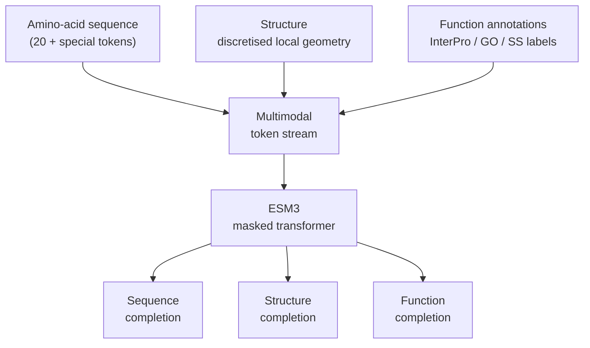

## The von Neumann ceiling

In 1948 John von Neumann gave a series of lectures on self-replicating
machines. One of his core observations: any self-reproducing system
needs a **separate, generic instruction tape** that describes how the
machine should be built — what we'd today call DNA. Without that, the
machine has to *be* its own description, which is a contradiction.

Hayduk's framing of why pure-sequence PLMs hit a ceiling adapts this
argument to protein modelling:

> **DNA is the instruction tape, but the instructions are not
> universal.** They specify what amino acids to chain in what order;
> they say nothing directly about *what shape* or *what function* the
> protein should have. To learn function or shape from sequence alone,
> a model has to invert biology — recover the structure / function
> implied by the sequence — without ever being told what those things
> are.

ESM-2 (modules 11-13) is exactly this kind of model. Its training
data is sequence-only; everything it knows about structure and
function is implicit, downstream of the MLM objective. This works
remarkably well, but it's a **lossy compression** of biology:

- Two sequences with very different sequence patterns might fold to
  the same shape (homology beyond the twilight zone).
- Two sequences with very similar patterns might do completely
  different things in different organisms.
- Function annotations (active sites, post-translational modifications,
  ligand binding) are encoded in patterns the MLM objective only
  sometimes recovers.

The fix: train on **all three modalities at once** — sequence,
structure, and function — and let the model learn the joint
distribution.

## ESM3's idea, in one sentence

ESM3 is the flagship model from **EvolutionaryScale** — the company
Alex Rives and most of the rest of the original Meta FAIR protein
team founded after leaving Meta in 2023. Its central idea:

> **Tokenise structure and function into discrete sequences, stuff them
> through the same transformer that consumes amino-acid tokens, and
> apply a unified masked-language-model objective across all three
> modalities.**

At inference, you can mask **any subset** of the three streams and
ask the model to fill in the rest. Concrete examples:

- Mask all of structure and function, give it the sequence → "predict
  what this protein looks like and does" (similar to ESMFold +
  function-prediction in one model).
- Mask all of sequence and function, give it a structure → "design a
  sequence that folds into this shape" (the *inverse folding*
  problem; module 21 covers a focused tool, ProteinMPNN, for this).
- Mask sequence and structure, give it function → "design a protein
  that does this thing" (the holy grail of de novo design).
- Mask **most** of all three → free-form generation.

## Tokenising structure

You can't feed raw 3D coordinates into a token-based transformer
directly. ESM3's solution: train a separate **VQ-VAE** (vector-quantised
variational autoencoder) on local 3D neighbourhoods of every residue.

For each residue $i$:

1. Collect the local geometric context — the relative positions of
   the nearest $k$ residues, their backbone angles, distances, etc.
2. Encode this into a continuous vector with a small encoder network.
3. Quantise the vector to the **nearest codebook entry** out of a
   discrete codebook of size 4096 (or so).
4. The codebook index becomes the **structure token** for residue $i$.

The result: a structure is now a sequence of integer tokens, exactly
the same shape as the amino-acid sequence. A 200-residue protein is
200 sequence tokens + 200 structure tokens. The transformer doesn't
know they're "different kinds of input" — it just sees a longer
sequence with a wider vocabulary.

The codebook is learned. After training, codebook entry 1742 might
correspond to "residue is in an alpha-helix at position $i+4$ from the
start of the helix"; codebook entry 893 might be "residue is at a
beta-turn with $i+1$ pointing into the page". The model effectively
learns its own structural alphabet.

## Tokenising function

Function tokens are easier: they're just discrete labels lifted from
existing biological databases. ESM3 uses (roughly):

- **Secondary structure** at each residue (helix / sheet / loop, from
  DSSP).
- **Solvent accessibility** at each residue (buried / exposed).
- **InterPro / Pfam domain labels** at the residue and protein level.
- **GO function annotations** at the protein level.
- **Active-site / binding-site / disulfide-bond** flags.

Each of these is a token in its own vocabulary. A residue's "function"
column is a sparse multi-label slot — the model is trained to predict
these labels from sequence/structure context, and conversely to
condition on them when generating.

In practice the function tokens form a long-tail distribution: the
top few hundred Pfam domains cover most of biology, and the rare ones
provide the tail of specialty knowledge.

## The unified MLM objective

Training looks roughly like:

1. For every protein in the training set (UniRef + PDB + AFDB +
   InterPro), produce the three streams: sequence, structure, function.
2. **Randomly mask** a fraction of tokens *across all three streams*.
   The masking strategy varies the proportion: sometimes mostly
   sequence is masked, sometimes mostly structure, sometimes a
   roughly even mix.
3. Train the transformer to predict the masked tokens, with a
   per-token cross-entropy loss summed over all three modalities.

The model learns to reason across modalities. To predict a masked
amino-acid token, it can attend to *both* nearby amino-acid tokens
(sequence context) *and* the corresponding structure tokens
(structural context). Same in reverse for predicting structure tokens.

## The esmGFP case study

EvolutionaryScale's ESM3 paper showcased the model's design power
with **esmGFP**, a generated fluorescent protein.

The setup:

- **Function prompt:** "this is a green fluorescent protein with
  the standard chromophore at residues 65-67".
- **Structure prompt:** the canonical GFP $\beta$-barrel fold, given
  as structure tokens.
- **Sequence:** mostly masked.

The model fills in the sequence to satisfy both prompts.

The headline result: **esmGFP has only 58 % sequence identity to the
nearest natural fluorescent protein**, yet it folds into the
expected $\beta$-barrel and **fluoresces green when expressed in the
lab**. That 58 % is far into evolutionary "twilight zone" territory —
between any two natural GFPs you'd expect 70-90 % identity. Using the
natural diversification rate of GFPs as a clock, EvolutionaryScale
estimate this divergence is equivalent to **roughly 500 million years
of natural evolution** — hence the title of the release paper,
"*Simulating 500 million years of evolution with a language model*".

In von Neumann's framing: the model has compressed enough of biology's
joint distribution to design a *new* member of an existing protein
family, even though the family is sparse in its training data.

## Why this is a big deal

Three downstream consequences:

1. **Lead optimisation gains a new substrate.** The Cradle pipeline
   from Magnus Ross's blog (module 22) currently uses sequence-only
   PLM fine-tuning. A multimodal model lets you condition on
   structural constraints (active-site geometry, binding-pocket shape)
   directly, instead of trying to bake them into the sequence-only
   objective.
2. **Function design becomes possible.** Pure-sequence PLMs are
   frustratingly bad at "give me a sequence that does X" because X
   isn't in the training data. ESM3 has a dedicated channel for
   function tokens, so generating *de novo* protein binders for a
   target — once you can express the target as a function token — is
   a single inference call.
3. **Structure prediction has a co-equal partner.** ESMFold (module
   17) goes sequence → structure with a structure decoder bolted on
   top of ESM-2. ESM3 can go either direction at any depth.

## Limitations

ESM3 isn't magic. Some honest caveats:

- The structure tokenisation is **lossy**. A 4096-entry codebook
  can't capture every nuance of side-chain rotamer placement; the
  model emits a tokenised approximation that is then refined by a
  decoder. Coordinate accuracy is comparable to ESMFold but not
  better.
- The function vocabulary is **biased toward what's in InterPro and
  GO**. Anything experimentally novel — e.g. a recently-discovered
  enzyme family — can't be requested as a function token until the
  databases are updated and the model is retrained.
- Like ESM-2, ESM3's behaviour on rare protein families remains
  weaker than on well-sampled ones. The compressed-database analogy
  from module 10 still applies.
- esmGFP is a beautiful demo, but designing a *novel-function*
  protein (rather than a known-function variant) is much harder. The
  field is moving in that direction; we are not there yet.

### Sibling release: ESM Cambrian (December 2024)

EvolutionaryScale shipped **ESM Cambrian (ESMC)** alongside ESM3 as the
representation-focused sibling: three sizes (300 M and 600 M open,
6 B gated via Forge / SageMaker), same Cambrian Non-Commercial License,
explicitly aimed at embedding and transfer tasks rather than generation.
ESMC 300 M matches ESM-2 650 M quality at half the parameter count,
which makes it the practical default for new representation work. ESM3
remains the choice when you actually need multimodal conditioning;
ESMC is what you reach for when you just want better embeddings.
Module 23 covers the wider 2024-2026 PLM landscape.

## Recap

- **Pure-sequence PLMs hit a ceiling** because they have to recover
  structure and function as side-effects of the MLM loss.
- **ESM3 trains on three modalities at once** — sequence, structure,
  function — by tokenising all of them into the same transformer.
- **Structure is tokenised via a VQ-VAE** on local geometric
  neighbourhoods, producing a discrete structural alphabet.
- **Function is tokenised by lifting existing biological labels**
  (DSSP, InterPro, GO) into per-residue / per-protein vocabularies.
- **The unified MLM objective** lets the model condition on any
  subset of the three streams at inference time — sequence-to-structure,
  structure-to-sequence, function-conditioned generation.
- **esmGFP** demonstrates the regime: a novel sequence (58 % identity
  to the nearest natural fluorescent protein, ~500 million years of
  natural evolutionary distance) that nonetheless folds and fluoresces
  green in the wet lab.

This is the end of Part 3 (protein language models). In the next two
modules we go deep on the AlphaFold2 architecture — the precursor
model that ESM3 partly mimics, with explicit MSA inputs and the
Evoformer block. Module 15 covers row-column attention; module 16
covers the outer-product-mean operation that bridges sequence space
to pair space.
