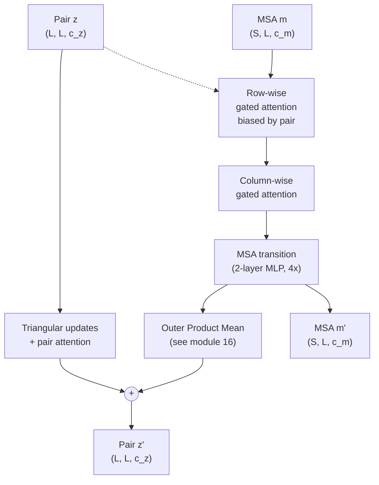

## What goes into AlphaFold2

AlphaFold2 (Jumper et al, 2021) takes three inputs:

1. **The query sequence** — a single protein sequence of length $L$.
2. **A multiple sequence alignment (MSA)** — typically thousands of
   homologous sequences aligned to the query, sharing the same length
   $L$ (with gaps).
3. **Templates** (optional) — a handful of similar PDB structures the
   network can use as starting hypotheses.

The MSA is the load-bearing input. Without it, AlphaFold2's accuracy
collapses (this is what motivates ESMFold; see module 17). With a deep
MSA, the network has access to **co-evolutionary signal**: which
residue pairs co-vary across evolutionary history.

The output of the Evoformer is two tensors:

- A **single representation** $\mathbf{s} \in \mathbb{R}^{L \times c_s}$ — the per-residue feature for the query sequence.
- A **pair representation** $\mathbf{z} \in \mathbb{R}^{L \times L \times c_z}$ — features for every pair of residues; effectively a learned distance map / contact map / orientation map.

The structure module (downstream of the Evoformer) takes these and
produces 3-D coordinates. We focus on the Evoformer in this module
and the next.

## The two key tensor shapes

Let:

- $S$ = number of sequences in the MSA (often ~512 for a deep input).
- $L$ = number of residue columns.
- $c_m$ = MSA channel dimension (256 by default).
- $c_z$ = pair channel dimension (128 by default).

Then:

- The **MSA representation** $\mathbf{m} \in \mathbb{R}^{S \times L \times c_m}$ — one feature vector per sequence per column.
- The **pair representation** $\mathbf{z} \in \mathbb{R}^{L \times L \times c_z}$ — one feature vector per pair of columns, independent of $S$.

The Evoformer block updates both tensors through a sequence of
operations. Module 15 covers row + column attention; module 16 covers
the outer-product-mean operation that injects MSA signal into the pair
representation.

## A single Evoformer block



The block runs both sides in parallel and exchanges information through
the **outer product mean** (module 16) and the **pair-derived bias**
in row attention. AlphaFold2 stacks 48 of these blocks.

## Row-wise gated self-attention with pair bias

The MSA representation is a 3-D tensor $\mathbf{m} \in \mathbb{R}^{S \times L \times c_m}$. Row attention treats each row $k \in \{1, \dots, S\}$ as a sequence of length $L$ and runs self-attention along that row. Same as a normal sequence transformer, but with two modifications.

### The vanilla part

For each row $k$, project to queries / keys / values:

$$\mathbf{q}_{k, i} = \mathbf{W}^Q \mathbf{m}_{k, i}, \quad \mathbf{k}_{k, i} = \mathbf{W}^K \mathbf{m}_{k, i}, \quad \mathbf{v}_{k, i} = \mathbf{W}^V \mathbf{m}_{k, i}$$

Compute attention weights:

$$\alpha_{k, ij} = \text{softmax}_j\!\left(\frac{\mathbf{q}_{k, i}^\top \mathbf{k}_{k, j}}{\sqrt{c_h}} + b_{ij}\right)$$

The output at position $(k, i)$ is

$$\mathbf{m}'_{k, i} = \mathbf{g}_{k, i} \odot \sum_{j=1}^{L} \alpha_{k, ij}\, \mathbf{v}_{k, j}$$

### The two AlphaFold2 modifications

**Modification 1: pair-derived bias $b_{ij}$.**

The attention bias $b_{ij} = \mathbf{w}_b^\top \mathbf{z}_{ij}$ is a
learned linear projection of the **pair representation** at
positions $(i, j)$. This is the channel through which the pair
representation influences the MSA representation:

> "If the pair representation says positions $i$ and $j$ are likely
> in contact, increase the attention from $i$ to $j$ within every
> row."

The bias is row-shared: every sequence $k$ uses the same $b_{ij}$,
which is a function only of pair channels.

**Modification 2: gating $\mathbf{g}_{k, i}$.**

Before mixing the attention output back into the residual stream, it
is gated element-wise by

$$\mathbf{g}_{k, i} = \text{sigmoid}\!\left(\mathbf{W}^G \mathbf{m}_{k, i}\right)$$

This is a sigmoid-gated bottleneck. The gate is a learned function of
the input and lets the network decide *how much* of the attention
output to actually pass through. AlphaFold2's authors found gating to
help convergence; it's now a standard component in many subsequent
models including ESMFold's structure module.

### The shape walk-through

| Operation | Input shape | Output shape |
|---|---|---|
| Input MSA | $(S, L, c_m)$ | — |
| QKV projections | — | $(S, L, c_h)$ each |
| Per-row attention scores | — | $(S, L, L)$ |
| Add pair bias $b_{ij}$ | — | $(S, L, L)$ |
| Softmax over $j$ axis | — | $(S, L, L)$ |
| Apply to values | — | $(S, L, c_h)$ |
| Concatenate heads, project, gate | — | $(S, L, c_m)$ |

The compute cost of row attention is dominated by the $(S, L, L)$
attention scores: $O(S L^2 c_h)$ FLOPs.

## Column-wise gated self-attention

Now turn the MSA on its side. For each column $i \in \{1, \dots, L\}$,
treat $\mathbf{m}_{1, i}, \dots, \mathbf{m}_{S, i}$ as a sequence of
length $S$ and run self-attention down that column.

This time **there is no pair bias** — the pair representation is
defined per column-pair, so it doesn't naturally bias an attention
that operates *within* a column. Otherwise the formula is the same:

$$\mathbf{q}_{i, k} = \mathbf{W}^Q \mathbf{m}_{k, i}, \quad \mathbf{k}_{i, k}, \mathbf{v}_{i, k} \text{ analogously}$$

$$\alpha_{i, kk'} = \text{softmax}_{k'}\!\left(\frac{\mathbf{q}_{i, k}^\top \mathbf{k}_{i, k'}}{\sqrt{c_h}}\right)$$

$$\mathbf{m}'_{k, i} = \mathbf{g}_{k, i} \odot \sum_{k'=1}^{S} \alpha_{i, kk'}\, \mathbf{v}_{i, k'}$$

The compute cost is $O(L S^2 c_h)$ — the dominant term flips to $S^2$
because we're now attending across the $S$ axis at each column.

### Why column attention?

This is where **co-evolution** explicitly enters the architecture.

Think about what column attention does: at column $i$, sequence $k$'s
representation is updated by attending to all other sequences at the
same column. If sequences $k$ and $k'$ have the same residue at
column $i$, their attention will tend to be high. If column $i$ is
highly conserved across the MSA, *all* the column-$i$ attention
distributions pile up on the same residue identity, creating a
coherent representation.

Conversely, if column $i$ is variable but **co-varies** with column
$j$ (the "co-evolution" idea from module 7), the row attention
(modification 1 above) and column attention together carry the
co-variation signal across the rest of the network.

## MSA transition

After both attention operations, each row of the MSA representation
passes through a small two-layer feedforward network:

$$\mathbf{m}'_{k, i} = \mathbf{W}_2\, \sigma(\mathbf{W}_1 \mathbf{m}_{k, i})$$

with $\mathbf{W}_1 \in \mathbb{R}^{4 c_m \times c_m}$ (the standard
4× expansion) and a non-linearity $\sigma$ (ReLU in AlphaFold2). This
plays the same role as the FFN in module 10's vanilla transformer
— per-position pattern memorisation.

## The full block, step by step

Pseudocode for one Evoformer block, MSA side:

```text
m_in:  shape (S, L, c_m)
z_in:  shape (L, L, c_z)

# Row attention with pair bias
b = LinearProjection(z_in)         # (L, L) bias
m = m_in + GatedRowAttn(m_in, bias=b)

# Column attention
m = m + GatedColAttn(m)

# Transition
m = m + FFN(m)

# (See module 16: m and z are coupled via outer-product-mean)
m_out = m
```

In each addition step, we apply LayerNorm before the attention/FFN
(pre-norm convention). Skipped here for clarity.

## Tensor shapes summary

| Symbol | Shape | Meaning |
|---|---|---|
| $\mathbf{m}$ | $(S, L, c_m)$ | MSA representation |
| $\mathbf{z}$ | $(L, L, c_z)$ | Pair representation |
| $\mathbf{q}, \mathbf{k}, \mathbf{v}$ (row) | $(S, L, c_h)$ | Per-row attention projections |
| $\alpha$ (row) | $(S, L, L)$ | Per-row attention weights |
| $\alpha$ (col) | $(L, S, S)$ | Per-column attention weights |
| $b$ | $(L, L)$ | Pair-derived row attention bias |

Defaults: $S \approx 512$, $L$ varies (typically 100-1000), $c_m = 256$, $c_z = 128$, 8 attention heads with $c_h = 32$.

## Why two attention directions matter

Single-axis attention can't capture both within-sequence and
across-sequence dependencies in one pass. AlphaFold2's design splits
the MSA representation update into two complementary axes:

- **Row attention with pair bias** — *within a single sequence*,
  every position attends to every other position, biased by
  structural priors. This propagates structural signal back into
  sequence features.
- **Column attention** — *across sequences*, every sequence attends
  to all the others at the same column. This propagates evolutionary
  conservation signal directly.

Module 16 introduces the third leg — outer product mean — which
takes the just-updated MSA representation and projects column-pair
co-variation into updates of the pair representation. The three
operations together form one full circuit through which structure
and evolution iterate refinement.

### What replaced this

AlphaFold3 (2024) keeps the pair representation as the core data
structure but simplifies the Evoformer into the **Pairformer**: column
attention is removed, sequences are processed independently, and the
MSA stack is shallower. More compute is spent on pair-side operations
because the downstream module — now a diffusion model over atom
coordinates rather than an SE(3)-equivariant structure module — places
heavier demands on the pair representation. The row attention + pair
bias machinery you learn here remains the conceptual core. Module 24
covers AF3 and its open AF3-class siblings (Boltz-2, Chai-1) in more
detail.

## Recap

- AlphaFold2's Evoformer maintains two tensors: an **MSA
  representation** $\mathbf{m} \in \mathbb{R}^{S \times L \times c_m}$
  and a **pair representation** $\mathbf{z} \in \mathbb{R}^{L \times L \times c_z}$.
- **Row attention with pair bias** updates each MSA row using
  within-sequence attention biased by the pair representation. The
  pair → MSA channel.
- **Column attention** updates each MSA column using across-sequence
  attention. The co-evolution channel.
- **Gating** modulates how much of each attention output is mixed
  back in.
- **MSA transition** is a per-position 4×-expanded FFN.

Next module: the outer product mean, which is how the freshly-updated
MSA representation injects co-evolutionary signal into the pair
representation.
