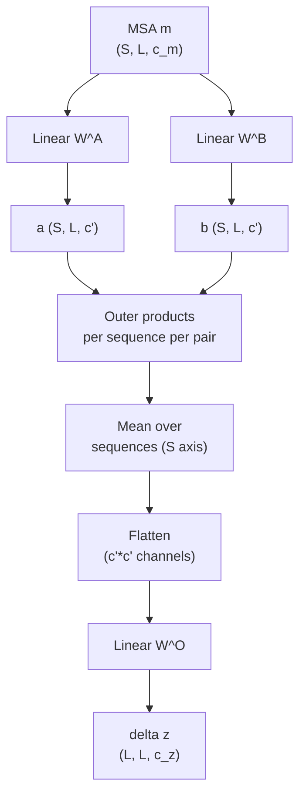

## Where module 15 left off

The Evoformer maintains two tensors:

- MSA representation $\mathbf{m} \in \mathbb{R}^{S \times L \times c_m}$
- Pair representation $\mathbf{z} \in \mathbb{R}^{L \times L \times c_z}$

Module 15 explained how the pair representation feeds back into the
MSA via row attention's pair bias. This module unpacks the reverse
channel: **how the MSA representation updates the pair representation**.

The mechanism is a single operation called the **outer product mean
(OPM)**. It is, in the author's view, the most beautiful piece of the
AlphaFold2 architecture — a clean mathematical realisation of "use
column-pair co-evolution to update structural hypotheses".

## The operation, in one formula

Let $\mathbf{m}_{k, i} \in \mathbb{R}^{c_m}$ be the MSA representation
for sequence $k$ at column $i$. The outer product mean defines an
update to the pair representation $\mathbf{z}_{ij}$ as follows.

1. **Two linear projections** of the MSA:

   $$\mathbf{a}_{k, i} = \mathbf{W}^A \mathbf{m}_{k, i}, \quad \mathbf{b}_{k, i} = \mathbf{W}^B \mathbf{m}_{k, i}$$

   with $\mathbf{a}_{k, i}, \mathbf{b}_{k, i} \in \mathbb{R}^{c'}$
   (a smaller channel dimension, typically $c' = 32$).

2. **Outer product** for every $(k, i, j)$ triple:

   $$\mathbf{O}_{k, ij} = \mathbf{a}_{k, i} \otimes \mathbf{b}_{k, j} \in \mathbb{R}^{c' \times c'}$$

3. **Mean over sequences:**

   $$\bar{\mathbf{O}}_{ij} = \frac{1}{S} \sum_{k=1}^{S} \mathbf{O}_{k, ij}$$

4. **Flatten + linear projection** to produce a pair-representation
   update:

   $$\Delta \mathbf{z}_{ij} = \mathbf{W}^O \, \text{flatten}(\bar{\mathbf{O}}_{ij}) \in \mathbb{R}^{c_z}$$

5. **Add to the pair representation:** $\mathbf{z}_{ij} \mathrel{+}= \Delta \mathbf{z}_{ij}$.

In compact form:

$$\boxed{\;\Delta \mathbf{z}_{ij} = \mathbf{W}^O\,\text{flatten}\!\left( \frac{1}{S} \sum_{k=1}^{S} \mathbf{a}_{k, i} \otimes \mathbf{b}_{k, j} \right)\;}$$

That's the whole operation.

## Why the outer product captures co-evolution

This is the key intuition. Suppose the MSA has thousands of
sequences, and at columns $i$ and $j$ we observe the following pattern:

- 30 % of sequences have $A$ at column $i$ and $B$ at column $j$.
- 30 % of sequences have $C$ at column $i$ and $D$ at column $j$.
- 40 % of sequences have other combinations.

This is **co-variation**: when column $i$ is $A$, column $j$ tends to
be $B$; when $i$ is $C$, $j$ tends to be $D$. Pairs that co-vary like
this are usually in physical contact in the folded structure (residue
$j$ "compensates" for mutations at residue $i$).

How does the OPM detect this?

- The encoder $\mathbf{W}^A$ produces a vector $\mathbf{a}_{k, i}$
  that depends on what residue $k$ has at column $i$. Sequences with
  $A$ at $i$ get one direction, sequences with $C$ at $i$ get another.
- Similarly $\mathbf{W}^B$ gives $\mathbf{b}_{k, j}$ a direction
  depending on what residue $k$ has at column $j$.
- The outer product $\mathbf{a}_{k, i} \otimes \mathbf{b}_{k, j}$ is
  a $c' \times c'$ matrix that captures the *joint* identity: it's
  one "shape" of matrix when both are $A, B$, a different shape when
  both are $C, D$, and a third when they mismatch.
- **Averaging over sequences** lets the consistent patterns (the
  $A$-$B$ pair, the $C$-$D$ pair) accumulate, while the random
  combinations partially cancel.

Hayduk's framing, paraphrased:

> If residues $i$ and $j$ co-vary across the MSA, the same "shape"
> of outer product appears repeatedly across many sequences and
> survives the averaging. If they vary independently, the outer
> products point in random directions and the average tends to zero.

The final linear projection $\mathbf{W}^O$ reads the surviving
patterns out into pair-representation space.

## Why it's an outer product, not a dot product

A dot product $\mathbf{a}_{k, i}^\top \mathbf{b}_{k, j}$ would
collapse the joint identity to a single scalar. You'd lose all
information about *which* combinations co-vary and only retain "how
much" — e.g. "these positions correlate" versus the much richer "the
positions correlate by alternating between $A$-$B$ and $C$-$D$".

The outer product preserves the full $c' \times c'$ joint space, so
the model can encode multi-pattern co-variation. The flatten + linear
step then projects this back to $c_z$ pair channels, learning which
specific patterns are useful.

## Tensor shapes walk-through

| Operation | Input | Output |
|---|---|---|
| Input MSA | $(S, L, c_m)$ | — |
| Project to $\mathbf{a}$ | $(S, L, c_m)$ | $(S, L, c')$ |
| Project to $\mathbf{b}$ | $(S, L, c_m)$ | $(S, L, c')$ |
| Outer products $\mathbf{a}_{k,i} \otimes \mathbf{b}_{k,j}$ | — | $(S, L, L, c', c')$ |
| Mean over sequences (axis 0) | — | $(L, L, c', c')$ |
| Flatten last two axes | — | $(L, L, c'^2)$ |
| Linear $\mathbf{W}^O$ | — | $(L, L, c_z)$ |

With the typical defaults $c' = 32$, $c'^2 = 1024$. The flattened
tensor is $(L, L, 1024)$ which is then projected to $(L, L, c_z)$
with $c_z = 128$. The linear projection $\mathbf{W}^O$ has shape
$(c_z, c'^2) = (128, 1024)$ — about 130k parameters.

The intermediate $(S, L, L, c'^2)$ tensor is the bottleneck: at
$S = 512$, $L = 200$, $c'^2 = 1024$ it's $\sim 10^{10}$ float
entries. AlphaFold2 fuses operations to avoid materialising it
explicitly; you compute the mean and projection directly in a single
batched einsum.

## How OPM and pair attention interact

Each Evoformer block applies, in order:

1. Row attention with pair bias — pair → MSA channel.
2. Column attention — co-evolution within MSA.
3. MSA transition — per-position MSA refinement.
4. **Outer product mean** — MSA → pair channel (this module).
5. Triangle multiplicative updates and triangle attention — pair-side
   refinement.

Steps 1, 4, and 5 form a complete information loop: pair → MSA →
pair-update → pair-refinement → next-block pair, etc. This loop runs
48 times in a full AlphaFold2 forward pass, with three recycling
iterations on top.

## Connection to module 7's MSA conservation

Module 7 had you compute Shannon entropy per column. The OPM is a
generalisation of that idea to *pairs* of columns:

- Module 7 asked "is column $i$ conserved?" — a 1-D statistic.
- OPM asks "do columns $i$ and $j$ co-vary together?" — a 2-D
  statistic.

The MSA columns AlphaFold2 cares about are the high-entropy ones
(variable but co-varying with other variable columns). Conserved
columns are useful too (they carry the "this position is
structurally critical" signal), but the *pair-prediction* power comes
from co-variation, which OPM is designed to extract.

In pre-AlphaFold methods, this was done explicitly with mutual
information ($I(i, j)$) or direct coupling analysis (DCA). AlphaFold2
replaces that explicit statistical computation with a learned
operation that has the same *form* — outer product, mean, project —
but with parameters trained end-to-end on structure prediction.

## Why this beats explicit DCA

Two reasons.

1. **End-to-end gradients.** The OPM's $\mathbf{W}^A, \mathbf{W}^B,
   \mathbf{W}^O$ are learned via gradient descent on the structure
   prediction loss. Explicit DCA computes its statistic with a fixed
   formula and feeds it to a separate model. The end-to-end
   formulation lets the network shape the projections to maximise
   downstream structure accuracy, not just to maximise a generic
   co-evolution score.
2. **Many parallel views.** The 32-dimensional $\mathbf{a}, \mathbf{b}$
   space lets the network encode multiple co-evolution "channels" at
   once: one for sequence-context-aware co-variation, one for
   secondary-structure-aware co-variation, etc. DCA collapses to a
   single scalar per pair.

Empirically, OPM-based prediction (AlphaFold2) outperformed DCA-based
prediction (EVfold, GREMLIN, etc.) by 30+ GDT_TS points on hard CASP
targets when AlphaFold2 first arrived. The direction is clear: more
expressive parameterisation + end-to-end training wins.

## Connection to ESM-2 and ESMFold

A natural question: does ESMFold also have an outer-product-mean step?

**No, it doesn't.** ESMFold's input is a single sequence, and it
relies on ESM-2's pretrained PLM weights to *implicitly* carry the
co-evolutionary signal. The structure module attached to ESM-2 takes
the per-residue PLM embeddings directly into a pair representation
without going through the MSA + OPM stack.

This is the architectural shift that module 17 explores. ESMFold is
both faster (no MSA search, no $S \times L^2$ row attention) and
slightly less accurate (the implicit signal is weaker than the
explicit one), but it's a vastly simpler pipeline.

## Recap

- The **outer product mean (OPM)** is AlphaFold2's mechanism for
  injecting MSA co-evolution into the pair representation.
- Two MSA projections produce $\mathbf{a}, \mathbf{b}$ vectors.
- The outer product $\mathbf{a}_{k,i} \otimes \mathbf{b}_{k,j}$ is a
  $c' \times c'$ matrix encoding the joint identity at columns $(i,
  j)$ in sequence $k$.
- **Averaging over sequences** preserves consistent co-variation
  patterns and washes out random ones.
- A **linear projection** flattens the averaged outer products into a
  pair-representation update of shape $(L, L, c_z)$.
- This is a learned, end-to-end-trained generalisation of DCA / mutual
  information that powers the bulk of AlphaFold2's structural
  inference.

In the next module we examine ESMFold's alternative — drop the MSA,
drop the OPM, lean entirely on the implicit signal in ESM-2's
weights.
