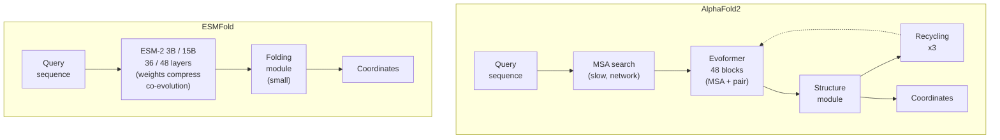

## The big idea

If a pretrained protein language model has implicitly learned
co-evolutionary signal in its weights — the central claim of module 10
— then **the MSA at inference time becomes redundant**. You can fold a
protein from sequence alone in a single forward pass, no database
search, no Evoformer iterations.

This is the core thesis of **ESMFold** (Lin et al, 2023). Stripped
to its essentials:

> Take ESM-2 (15B parameters, MLM-trained on hundreds of millions of
> sequences). Replace the AlphaFold2 MSA + Evoformer pipeline with a
> single ESM-2 forward pass plus a small structure module. Predict
> 3-D coordinates.

The result: structure prediction at sub-second-per-protein speed,
60× faster than AlphaFold2, with a small accuracy trade-off on
proteins with deep MSAs and a *gain* on proteins with shallow MSAs.

> **A note on variants.** The Lin et al paper reports the strongest
> ESMFold results with a 15B-parameter ESM-2 backbone. The publicly
> deployed model — `facebook/esmfold_v1` on HuggingFace, used in
> module 18 — is the 3B-backbone variant (36 ESM-2 layers,
> hidden size 2560). Both share the same architecture and training
> recipe; the 3B model is about 5× smaller and noticeably faster on
> consumer GPUs, with a small additional accuracy hit.

## Side-by-side comparison

| Property | AlphaFold2 | ESMFold |
|---|---|---|
| Inputs | Sequence + MSA (+ optional templates) | Sequence only |
| MSA search | Required, ~minutes | None |
| Co-evolution signal | Explicit, via OPM (module 16) | Implicit, in PLM weights |
| Network depth | 48 Evoformer + 8 structure module + recycling × 3 | 36-layer ESM-2 3B (or 48 for the paper's 15B variant) + small structure module |
| Compute per protein | ~10 minutes / GPU | ~1 second / GPU |
| Memory | $O(SL^2)$ (attention) + structure module | $O(L^2)$ (PLM attention) + structure module |
| Best regime | Deep-MSA proteins | Shallow-MSA proteins, high throughput |
| CASP14 median GDT_TS | ~92 | ~85 |

The ~7-point GDT_TS gap is real but small. For most downstream uses
(rapid screening, MSA-poor sequences, novel protein families), the
60× speed-up dominates the accuracy concern.

## Architectural sketch

The visual difference is striking: ESMFold has no MSA box and no
recycling loop. The information that AlphaFold2 extracts from the
explicit MSA, ESMFold reads out of ESM-2's per-residue embeddings.

## Complexity comparison

For a single $L$-residue protein:

**AlphaFold2:**

- MSA search: $O(\text{database size}) = $ tens of GB scanned, minutes
  of wall-clock time.
- Evoformer per block: $O(SL^2 c_h)$ for row attention, $O(LS^2 c_h)$
  for column attention, $O(SL^2 c'^2)$ for OPM, $O(L^3 c_z)$ for
  triangle updates.
- 48 blocks × 3 recycling = 144 effective passes.
- Structure module: $O(L^2)$ per layer, 8 layers.

**ESMFold:**

- ESM-2 15B per layer: $O(L^2 d)$ attention with $d = 5120$.
- 48 layers, single pass.
- Folding module: $O(L^2)$, very small.

Take a 200-residue protein, $S = 512$:

- AlphaFold2: ~$10^{12}$ FLOPs, plus minutes of MSA search.
- ESMFold: ~$10^{11}$ FLOPs, no search.

The MSA search alone often dominates AlphaFold2's wall-clock time —
removing it is most of the speed-up.

## When does ESMFold win on accuracy?

The empirical result from Lin et al, 2023:

- **Deep-MSA proteins** (>1000 sequences in alignment): AlphaFold2
  wins by ~7 GDT_TS points. The explicit OPM extracts more signal
  than ESM-2's implicit weights.
- **Shallow-MSA proteins** (<32 sequences): ESMFold matches or beats
  AlphaFold2. ESM-2's pretrained weights provide a useful prior even
  when the MSA itself is too thin to fit DCA-style methods.
- **Single-sequence proteins** (orphans with no homologs at all):
  ESMFold has a substantial advantage. AlphaFold2 in this regime
  effectively runs with $S = 1$ and OPM degenerates to a weak
  bilinear function of the single sequence.

This last regime matters more than you'd think: many practically
interesting proteins (engineered designs, recently-discovered
metagenomic sequences, antibodies in early lineages) have shallow or
empty MSAs.

## What the structure module looks like

ESMFold's structure module is a stripped-down version of AlphaFold2's:

- Takes per-residue ESM-2 embeddings ($L \times 2560$ for the 3B
  backbone, $L \times 5120$ for the 15B variant) and a pair
  representation (constructed from a learned function of the
  embeddings).
- Runs Invariant Point Attention (IPA) for ~8 iterations.
- Outputs per-residue affine transforms (rotation + translation).
- Decodes to 3-D atom coordinates.

It's small enough that it doesn't dominate the runtime; the bulk of
the work is in the underlying PLM forward pass.

## How does ESM-2 learn co-evolution implicitly?

This loops back to module 10. The argument:

1. ESM-2's training data is UniRef50 (~50 M sequences, clustered to
   50 % identity). Many of those sequences are evolutionarily related.
2. The MLM objective forces the model to predict each masked residue
   from its sequence context.
3. For positions where the answer depends on co-variation with
   another column, the model has to develop attention patterns that
   pick up the correlation.
4. After billions of gradient steps, the attention layers and
   FFNs encode a *compressed* version of the co-evolutionary signal
   that an explicit MSA + DCA / OPM analysis would have computed.

The Rao et al 2021 paper validated this empirically: the attention
maps of ESM-1 (the predecessor) recovered residue contacts at
MSA-comparable precision *without* any structural training.

ESMFold takes the next step: read out the structural signal from those
implicit representations and turn it into 3-D coordinates.

## Limitations of ESMFold

Three honest limitations:

1. **Memory at long sequence length.** A 1000-residue protein in
   ESM-2 15B with naive attention needs ~32 GB VRAM during inference
   even in FP16. Chunked attention (`model.trunk.set_chunk_size(...)`
   in the HuggingFace port; `model.set_chunk_size(...)` in fair-esm)
   helps but isn't free.
2. **Lower top-end accuracy.** When MSAs are deep, AlphaFold2's
   explicit pipeline still wins by enough margin that for some uses
   (e.g. drug-design active-site geometry) you'd prefer it.
3. **Structure-only output.** ESMFold gives you backbone + side-chain
   coordinates and a pLDDT confidence, but not function predictions
   or multimeric structures. AlphaFold-Multimer / AlphaFold3 cover
   those gaps.

For most ML-on-proteins workflows in 2024-2025, ESMFold is the right
default and AlphaFold3 is the heavyweight option for cases where
quality matters more than throughput.

## Connection to module 10's framing

The compressed-database analogy makes ESMFold inevitable in
hindsight. If

> An encoder transformer is a continuous, learned, parameterised
> version of a fuzzy string matching algorithm. Attention is the
> matching step; the model's weights are the compressed pattern
> database it matches against.

then a sufficiently large model's weights *should* contain enough
co-evolutionary signal to substitute for an explicit database lookup.
Whether the substitution is good enough is an empirical question; for
ESM-2 at 15B parameters, the answer is "yes for most purposes".

## Connection to ESM3

ESM3 (module 14) takes one more step: it adds explicit structure and
function tokens to the input/output streams, so the model can be
asked to *generate* structure or function directly. ESMFold is the
predecessor where structure is output but only as a downstream
attached head; ESM3 makes structure a first-class participant in the
attention loop.

The progression — AlphaFold2 (explicit MSA + structure) → ESMFold
(implicit MSA + structure) → ESM3 (multimodal sequence + structure
+ function) — is the dominant architectural arc of protein ML over
the past few years.

### Modern open SOTA: Boltz-2

For new structure-prediction work in 2026, the practical default is no
longer ESMFold or AlphaFold2 but **Boltz-2** (MIT license, June 2025) —
an open AF3-class model that handles proteins, nucleic acids, ligands,
and metal ions in one pipeline and approaches physics-based FEP
accuracy on binding affinity. ESMFold remains the cleanest pedagogical
example of "PLM as implicit MSA database" and is still the right choice
for very-high-throughput orphan-protein triage, but for production
structure prediction Boltz-2 has superseded it. Module 24 covers the
frontier AF3-class ecosystem in detail.

## Recap

- ESMFold replaces AlphaFold2's MSA search + Evoformer with **a single
  forward pass of ESM-2 + a small structure module**.
- Co-evolutionary signal that AlphaFold2 extracts explicitly via OPM
  comes from ESM-2's implicit pretrained weights instead.
- ESMFold is **~60× faster** than AlphaFold2.
- Accuracy gap is ~7 GDT_TS points on deep-MSA proteins; ESMFold
  matches or beats AlphaFold2 on shallow-MSA proteins.
- The bottleneck is now PLM size — ESMFold needs the 15B ESM-2 to
  match AlphaFold2 quality. Smaller PLMs underperform.

In the next module we actually run ESMFold on a small peptide and see
the pipeline in action.
