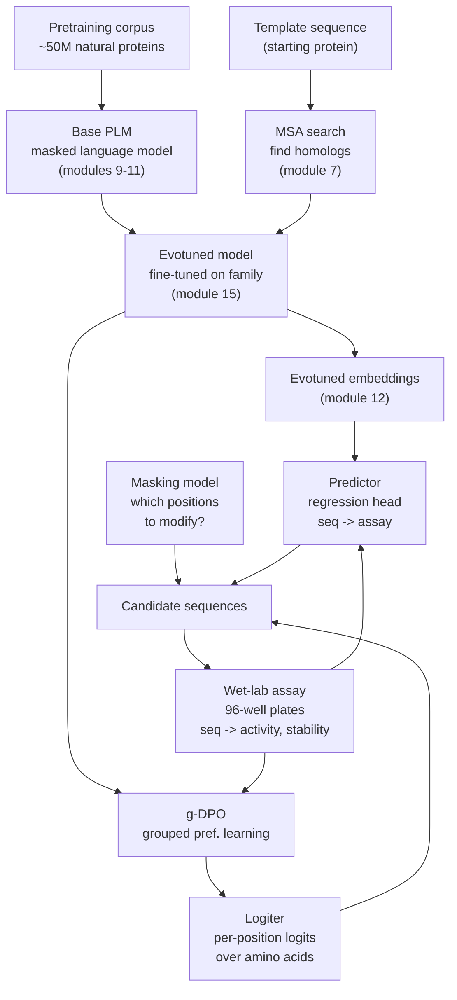

## What this module is

The capstone. We've spent the last 21 modules building up the
individual components of modern ML-based protein design:
representations, transformers, ESM-2, ESMFold, AlphaFold2,
inverse folding, fitness scoring. Each of those is a *piece*. This
module shows the **whole machine** that actually delivers a better
protein at the end of a campaign — Cradle's *Logiter* lead
optimisation pipeline, written up by Magnus Ross in his
"[An idiot's guide to lead optimisation for proteins](https://magnusross.github.io/posts/protein-lead-optimisation-1/)".

We'll walk through the diagram one component at a time, citing
the modules where each piece was introduced.

## The lead optimisation problem

Lead optimisation is the step in drug-style protein design where you
take a molecule that *works a bit* and try to make it *work a lot*.
You start with a template — could be a hit from a previous campaign,
a *de novo* design, or a natural protein — and you propose
**changes** that improve its properties (binding affinity,
expression yield, thermostability, specificity, ...). You test the
candidates in the lab, integrate the results, and iterate.

The classical alternative is **directed evolution**: random
mutations + selection + iterate. It works but is slow. Modern
ML-based pipelines use protein language models to **propose
informed changes** instead of random ones — typically with
substantially fewer wet-lab rounds for the same improvement.

## The Cradle logiter pipeline

Here's the full flow we'll walk through:



The arrow from `Wet-lab assay` back to `g-DPO` and `Predictor` (via
the `LAB` node) closes the loop: every round of wet-lab data
re-trains the logiter and predictor. Generation uses the *current*
versions of these models to propose the next batch of candidates.
The inner cycle runs as long as time and reagents permit.

## Reading the diagram bottom-up

Let's start at the *bottom*, where the actual goal lives:

### Generation — proposing the next 96 sequences

The bottom row is the only row that *makes new molecules*. Three
pieces feed it:

- The **logiter** — a fine-tuned PLM that outputs the next-token
  distribution over amino acids at every position. Module 11's
  ESM-2 + module 7's evotuning + module 20's PLL scoring all
  rolled into one model. We sample from this to propose changes.
- The **predictor** — a regression head trained on the wet-lab
  assay data to estimate function values from sequence. Module
  12's embeddings + a small MLP. We use it to **rank and filter**
  proposals.
- The **masking model** — decides *which* positions to modify
  in each sample. Cradle's pipeline keeps this model deliberately
  conservative early in a campaign (small mutations near the
  active site) and more aggressive later (broader-scope edits).

Generation produces a batch of, say, 96 candidate sequences. The
batch goes to the wet lab.

### The wet lab — the only source of ground truth

Every other model in the pipeline is *learned* from data. The lab
provides the data. Cradle's setup uses 96-well plates, with one
sequence per well and an assay measurement per well. Critical
practical points:

- **Multi-objective.** A single assay measures several properties
  (e.g. activity *and* stability). The pipeline must trade them off.
- **Batch effects.** Plate-position artefacts mean adjacent wells
  are not independent. Edge wells often misbehave. Models must be
  robust to these systematic offsets.
- **Imperfect proxies.** What you can measure in vitro is rarely
  what you ultimately care about (e.g. binding to a purified target
  vs in-cell function). The pipeline optimises the assay, not the
  truth.
- **Throughput.** A single round of wet-lab tests is days to weeks.
  Each iteration is precious; you can't afford to throw experiments
  at noisy proposals. Hence the importance of the predictor's
  filtering step.

The output is a **sequence-measurement table**:

```text
Sequence                          Activity   Stability
─────────────────────────────────────────────────────
M K T A Y G L S E R N ...           0.82       54.1
M K T A Y G L T E R N ...           0.79       53.8
M K S A Y G L S E R N ...           0.91       52.4
M R T A Y G L S E R N ...           0.44       55.0
```

This table feeds back into both the logiter (via g-DPO) and the
predictor (via supervised regression).

### The base PLM — pretrained on UniRef

At the top of the diagram is the **base model**: a transformer-based
masked language model, trained on ~50M natural protein sequences
(UniRef50 is the standard corpus). This is an off-the-shelf
ESM-2 (module 11) or comparable model.

What does pretraining buy us?

- **Knowledge of natural sequence space.** The model has implicitly
  learned that tryptophan-at-conserved-aromatic-positions is good,
  proline-in-the-middle-of-an-alpha-helix is bad, and so on.
- **A free fitness baseline.** Module 20's PLL is a zero-shot
  variant-effect predictor that comes "for free" — we don't even
  need any wet-lab data yet.
- **A representation library.** Module 12's per-residue embeddings
  capture sequence semantics and are a starting point for the
  predictor.

But the base PLM is too general. It knows about proteins; it
doesn't know about *our specific protein family* in detail. That's
where evotuning comes in.

### Evotuning — focusing on the family

Cradle starts evotuning by collecting an MSA for the template
protein:

1. **MSA search** (module 7): find all sequences in a giant database
   (e.g. UniRef50, MGnify) that look evolutionarily related to the
   template. Tools: HHblits, jackhmmer, MMseqs2.
2. **Align** the homologs to a common length. This produces an
   $S \times L$ matrix of conserved + variable positions.
3. **Fine-tune the base PLM** on this MSA. Same MLM objective as
   pretraining, but on a much smaller, family-specific corpus.

After evotuning the model is *biased toward* the natural variation
of the target family. Suggestions are now relevant — they look
like other members of the family — rather than just plausible
proteins in general.

This is exactly the explicit-co-evolution signal that AlphaFold2's
Evoformer (module 15) extracts from the MSA. Evotuning is the
"cheap, single-pass" way to get the same signal without an Evoformer.

### g-DPO — squeezing the assay data into preferences

The evotuned model knows about the *natural* sequence space. The
wet-lab assay tells us which sequences in *our specific assay*
score higher than others. We need to merge the two.

DPO (Direct Preference Optimisation, originally for LLM
alignment) is the standard way to fine-tune a model to prefer one
output over another. The objective is:

$$\mathcal{L}_{\text{DPO}}(x_w, x_l) = -\log \sigma\!\left(\beta \log \frac{p_\theta(x_w)}{p_\text{ref}(x_w)} - \beta \log \frac{p_\theta(x_l)}{p_\text{ref}(x_l)}\right)$$

where $x_w$ is the "winner" (higher-fitness sequence), $x_l$ is the
"loser", $p_\theta$ is the model being optimised, $p_\text{ref}$ is
a frozen reference (typically the model before DPO), $\beta$ is a
temperature, and $\sigma$ is the sigmoid. Done correctly, this
pushes the model to prefer winners without losing the prior
knowledge from pretraining.

In the LLM setting, "winner" and "loser" come from human
preference labels. In Cradle's setting they come from
**thresholded assay measurements**. But the mismatch is awkward:

- LLM responses pair naturally — each prompt has multiple completions.
- Protein assays don't pair naturally — you've got 96 measurements,
  not 96 pairs.

Cradle's solution is **g-DPO** (grouped DPO):

1. **Cluster** sequences by similarity. (BLOSUM-based or embedding-
   based.)
2. **Form pairs within each cluster** — so the winner and loser
   differ only at a few positions, not wholesale.
3. Apply DPO on these "local" pairs, so the model learns
   subtle position-specific preferences instead of overfitting on
   coarse "this whole sequence is good" signal.

The intuition: comparing very different sequences teaches the
model coarse statistics it already knows from pretraining;
comparing similar sequences teaches it the local fitness landscape
that's specific to our assay.

The output of g-DPO is the **logiter**: an evotuned + DPO-aligned
PLM whose per-position softmax gives the model's preference for
each amino acid at each position. The name comes from "outputs
**logit**s, the raw scores before softmax".

### The predictor — supervised regression on embeddings

In parallel with g-DPO, the same wet-lab data trains a **predictor**:
a small regression head on the evotuned model's embeddings.

Architecture:

```
sequence -> evotuned PLM (frozen) -> per-residue embeddings
                                       |
                                       v
                                pool to single vector
                                       |
                                       v
                                 small MLP (~2 layers)
                                       |
                                       v
                                  predicted assay values
```

We freeze the evotuned model's weights and train just the head on
the assay data. This is the cheapest possible supervised model on
top of a learned representation — module 12's embeddings provide
the features, and a few hundred parameters of head map them to
fitness.

Why split logiter (generative) from predictor (discriminative)?

- The **logiter** answers "what's a plausible mutation?" — it
  generates candidates.
- The **predictor** answers "how good is this candidate?" — it
  scores them.

We could in principle merge them into a single model, but the
two-model setup is more flexible: the predictor can use richer
features (multi-objective, structure-aware) than the logiter
naturally outputs, and the logiter can sample creatively without
being limited by the predictor's narrower signal.

### The masking model — what to change

The logiter answers "given that I want to change position $i$,
what amino acid should I put there?" — but it doesn't choose $i$.
That's the **masking model's** job.

Cradle hasn't published full details on the masking model; the
likely options are:

- **Entropy / conservation-based**: don't modify highly conserved
  positions (which the MSA in module 7 identifies). Modify
  variable positions where the model has uncertainty.
- **PLL-based**: positions where the wild-type residue's PLL is
  low (module 20) are candidates for mutation — the model is
  saying "this position isn't optimised already".
- **Predictor-gradient-based**: backpropagate through the
  predictor to find positions whose mutation would most improve
  the assay value.

In practice it's a mix, and the masking strategy can be tuned
adaptively over a campaign. Early rounds: conservative (small,
local edits). Later rounds: bolder (broader-scope explorations).

## How the pieces connect to earlier modules

| Pipeline component | Built on |
|---|---|
| Base PLM | Module 9 (tokenization), Module 10 (transformers), Module 11 (ESM-2) |
| Pretraining objective | Module 11 (MLM), Module 17 (implicit co-evolution) |
| MSA search | Module 7 (conservation, MSA tools) |
| Evotuning | Module 7 + Module 15 (MSA-based co-evolution) |
| Embeddings -> predictor | Module 12 (per-residue embeddings) |
| g-DPO | Module 20 (PLL ranking, scoring sequences) |
| Inverse-folding (alt-generation) | Module 21 (ProteinMPNN) |
| Forward-fold validation | Module 18 (ESMFold), Module 19 (RMSD/TM-score/pLDDT) |

## Why proteins are special: the "no instruction modality" problem

In LLM post-training, RLHF takes a base model that just does
next-token prediction and turns it into a model that *follows
instructions*. The instruction modality — natural language
prompts — is universal. You can ask Claude to "write a poem", or
"translate this", or "summarise that".

For proteins, **there is no equivalent instruction modality**. We
can't say "write me a protein that catalyses ester hydrolysis at
pH 8 with kcat > 100/s". The closest analogue would be ESM3's
function tokens (module 14) — InterPro / GO labels — but those
are coarse and don't cover novel functions.

So Cradle's pipeline replaces "instruction" with "**reference
template + assay data**". The model learns "what should I do?"
implicitly from:

- The starting template (this is what we want to *improve*).
- The assay data (this is what *better* means in our context).

It's narrower than LLMs but more concrete. Module 14 hints at the
direction Cradle and others are heading toward — multi-modal models
that can be steered by structural and functional tokens — but as
of 2026 we're still in the "template + assay" regime for serious
campaigns.

## What Cradle has shown

Cradle's published results across multiple pharma partnerships
(Novo Nordisk, Bayer, J&J) report:

- 5-10× speedup over directed evolution for comparable quality
  hits.
- Successful optimisation campaigns for binding affinity,
  thermostability, expression yield, and substrate specificity.
- Wet-lab cycle time of ~weeks (vs ~months for traditional
  approaches).

The system isn't magic — humans still design assays, choose
starting templates, and curate data. But the pipeline as a whole
is a real validation that ML-based protein engineering is now
production-ready for industrial campaigns.

### Update: CRADLE-1 paper (March 2026)

When this module was first written, the clearest public description of
Cradle's pipeline was Magnus Ross's blog. The Cradle team's own
preprint, **CRADLE-1** (bioRxiv, March 2026), is now available and
reports 90-95 % target-product-profile success rates across dozens of
commercial campaigns, 4-7× faster than rational design measured in
wet-lab rounds, with validations on VHHs, scFvs, IgGs, peptides,
enzymes, CRISPR components, and vaccine antigens. The **g-DPO**
objective also now has its own paper on OpenReview, formalising the
sequence-space cluster construction and showing 1.8-3.7× faster
convergence than vanilla DPO. The pipeline architecture above is
unchanged; the evidence base is stronger. Module 24 covers this
update along with the rest of the 2024-2026 frontier.

## Recap

- Lead optimisation is the iterative wet-lab + ML loop that
  improves a starting template's function.
- Cradle's **logiter** is the resulting fine-tuned PLM that
  proposes mutations; the **predictor** is a regression head that
  scores candidates; the **masking model** decides where to
  mutate.
- The pipeline chains pretraining (modules 9-11) -> evotuning
  (modules 7, 15) -> g-DPO from assay pairs -> generation -> wet
  lab -> back to evotuning. Every component reuses ideas from
  earlier modules.
- Wet-lab data is the only source of ground truth; everything
  else is interpolation. The masking + predictor + logiter triple
  exists to make the most of every plate of measurements.
- The "no universal instruction modality" point connects back to
  module 14 — proteins lack a generic prompt language, so
  Cradle's "template + assay" pattern is the natural substitute.

## Where to next

This is the final reading module of the course. To take what
you've learned further:

1. Read [the Magnus Ross post](https://magnusross.github.io/posts/protein-lead-optimisation-1/) in full,
   plus its forthcoming Part 2 (covering generation in detail).
2. Read the [Cradle whitepaper](https://www.cradle.bio/) for
   the company-side perspective.
3. Build a tiny version yourself: take ESM-2 (module 11), evotune
   it on a small homolog set (module 7), train a predictor head
   (module 12 → MLP), and see if you can predict held-out PLL
   variants (module 20). The toy version captures the architecture
   in maybe 200 lines of code.

Thanks for completing the course. The frontier from here is
multimodal models (ESM3, AlphaFold3), better fine-tuning recipes
(DPO variants, latent flow models), and tighter ML-lab integration
than even Cradle's loop. Plenty more to do.
