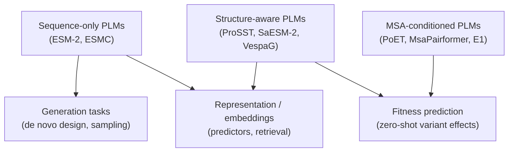

## Why this module exists

Module 13 ended on a clean story: ESM-2 quality improves monotonically
with parameter count from 8 M up to 15 B, and the lesson seemed to be
"if you can afford the VRAM, use the biggest model you can fit". That
was the consensus in 2022-2023. By 2025-2026 the picture is more
complicated. This module is a short tour of what changed.

## The scaling wall

Across multiple PLM families, **fitness-prediction performance plateaus
around ~1 B parameters and then declines past ~5 B**. Pascal Notin's
late-2025 analysis on ProteinGym, corroborated by Alex Rogozhnikov's
February 2026 review, makes the point quantitatively: scaling is not
delivering the "just keep going" returns that the 2022 trend line
suggested. Beyond a billion parameters, sequence-only PLMs trained with
the standard MLM objective on UniRef tend to *lose* transferability on
downstream fitness tasks.

Two more empirical observations sharpen the picture:

- Simple methods that combine MSAs and structural information beat
  billion-parameter sequence-only PLMs on most ProteinGym splits.
- **The models that actually run modern structure prediction and design
  workflows are all sub-billion-parameter:** AlphaFold2/3, Boltz-2, and
  ProteinMPNN are all under 1 B.

In other words, the implicit moral of module 13 — "scale will keep
solving this" — was the consensus of its day but is no longer the
consensus of the field. Bigger sequence-only PLMs still generate
plausible sequences, but for representation learning and fitness
prediction the curve has bent.

## ESM Cambrian (ESMC, December 2024)

EvolutionaryScale's response was **ESM Cambrian (ESMC)**, the
representation-focused sibling to ESM3 (module 14). It shipped in three
sizes: **300 M** and **600 M** with open weights on HuggingFace, and a
**6 B** model gated behind the Forge API and AWS SageMaker. The same
Cambrian Non-Commercial License as ESM3 applies — fine for research, no
commercial use without an explicit agreement with EvolutionaryScale.

The headline result is the one number worth memorising: **ESMC 300 M
matches the quality of ESM-2 650 M**. Same downstream performance, about
half the parameters, faster inference, and a cleaner data + training
recipe behind the scenes. ESMC 600 M and the 6 B model push further but
return diminishing gains compared to the 300 M ↔ 650 M jump.

For new representation work in 2026, ESMC 300 M is the practical
drop-in replacement for ESM-2 650 M. ESM-2 itself stays relevant because
of its MIT license: when you need a permissively-licensed open baseline
or you're shipping a commercial product, ESM-2 is what you reach for.

## Structure-aware PLMs that lead ProteinGym

The current top of the [ProteinGym](https://www.proteingym.org/)
leaderboard is dominated by models that incorporate structure or MSA
context, not by the largest sequence-only PLMs:

- **ProSST** (currently the ProteinGym leader, ~110 M parameters) tokenises
  each residue's local structural neighbourhood — the 40 nearest residues
  — into discrete **structure tokens**, then runs separate attention
  blocks over sequence, structure, and relative position. It is
  pretrained on roughly 19 M AlphaFold DB structures with a masked
  language modelling objective. Notably, ProSST's quality *peaks* at
  110 M and *drops* past that size — the same scaling-wall pattern, just
  at a different number.
- **SaESM-2** and **SaAMPLIFY** add structure information to existing
  sequence PLMs via CLIP-style contrastive alignment between the PLM's
  embeddings and a structure-GNN's embeddings (typically GearNet),
  plus an auxiliary structure-token prediction head.
- **AMPLIFY** is a sequence-only PLM trained on a smaller but
  better-curated UniProt subset (no UniRef-style clustering). It beats
  ESM-2 on perplexity, although downstream transfer is more nuanced
  than the perplexity number suggests.
- **VespaG** is a tiny projection layer on top of frozen ESM-2
  embeddings, trained to mimic MSA-based GEMME fitness scores. It is
  the SOTA among sequence-only methods on ProteinGym and, like the
  rest, peaks at the 650 M ESM-2 backbone.

The common thread: structure or MSA information matters more than raw
parameter count, and useful peaks live in the 100 M – 1 B range.

## MSA-conditioned PLMs

A separate line of work brings the MSA back to the input side. **PoET**
pioneered passing homologous sequences to a regular transformer as
context tokens — essentially an in-context learning approach to MSAs.
Followups include **MsaPairformer** and **Profluent's E1**, which
capped at ~600 M parameters and reports strong fitness-prediction
numbers.

The trade-offs are real:

- You still need an MSA at inference time, which means database search
  and alignment overhead — exactly what ESMFold (module 17) was trying
  to avoid.
- Long, deep MSAs are quadratic in attention cost, so very large MSAs
  are expensive.
- The alignment is implicit (the model attends across the homologs
  freely) rather than explicit (like AlphaFold2's column attention),
  which is more flexible but harder to interpret.

In practice MSA-conditioned PLMs are excellent at zero-shot fitness
prediction when MSAs are available and unnecessary when they aren't.

## What this means for the course

Modules 9-14 are still the right conceptual ladder for getting to grips
with PLMs: tokenisation, attention, masked language modelling,
embeddings, scale, multimodality. What has changed is the practical
default at each rung:

- For **embeddings and representations**, ESMC 300 M is the new ESM-2
  650 M.
- For **fitness prediction**, a structure-aware model like ProSST or an
  ESM-2-based VespaG beats any sequence-only billion-parameter PLM.
- For **generation**, sequence-only PLMs are still useful — that's
  ESM-2's remaining strength, since "fluency under the natural
  distribution" doesn't suffer from the scaling wall in the same way.
- For **multimodal conditioning**, ESM3 (module 14) is still the most
  capable open option, with the caveat that the 6 B size is gated.

Sequence-only billion-parameter models are a research dead-end for
transfer tasks. They remain a sensible base for de novo generation and
the well-trodden 8 M – 650 M region of ESM-2 is still where most
practical work lives.

## Recap

- **The scaling wall is real.** Sequence-only PLM performance on fitness
  prediction plateaus around 1 B parameters and declines past 5 B.
- **ESMC 300 M ≈ ESM-2 650 M.** EvolutionaryScale's representation-
  focused successor matches ESM-2 quality at roughly half the size; the
  6 B version is gated behind Forge / SageMaker.
- **Structure-aware PLMs lead ProteinGym.** ProSST (110 M),
  SaESM-2 / SaAMPLIFY, and VespaG all beat much larger sequence-only
  models on fitness benchmarks by injecting structural signal.
- **MSA-conditioned PLMs (PoET, MsaPairformer, E1)** trade the
  no-database-search advantage of ESMFold for stronger fitness
  prediction.
- The course's framing in modules 9-14 still holds; only the choice of
  which checkpoint to actually run has changed.

The next module continues the 2024-2026 tour, this time on the
structure-prediction and protein-design side: AlphaFold3, Boltz-2,
LigandMPNN, RFdiffusion3, and an update on the Cradle pipeline from
module 22.
