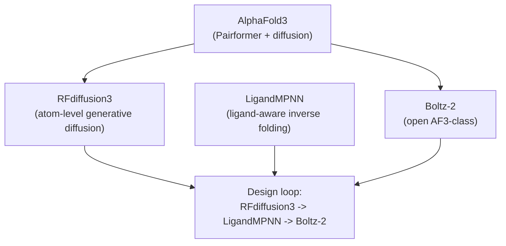

## Why this module exists

Modules 15-22 ended around the AlphaFold2 / ESMFold / ProteinMPNN /
Cradle pipeline as it stood in 2023-2024. Each of those tools has a
successor in the 2024-2026 window. The architectures have not changed
unrecognisably, but the practical defaults have. This module catalogues
what the frontier looks like as of early 2026.

## AlphaFold3 (Nature, May 2024)

AlphaFold3 (Abramson et al, 2024) is the canonical "everything biology"
successor to AlphaFold2. Two architectural changes drove most of its
gains over AF2:

- **Evoformer → Pairformer.** AF2's Evoformer ran row attention, column
  attention, outer-product mean, and triangle updates over a deep MSA
  stack (modules 15-16). The Pairformer drops column attention and
  processes sequences independently, leaving a much shallower MSA stack
  and putting more capacity into the pair representation directly. The
  result is a smaller, simpler trunk that trains faster and generalises
  to more modalities.
- **Structure module → Diffusion module.** AF2's structure module
  produced atom coordinates via SE(3)-equivariant frame updates with
  explicit torsion angles. AF3 replaces this with a **diffusion model**
  over raw atom coordinates, conditioned on the pair representation.
  The diffusion module denoises a Gaussian sample into a structure in
  a few steps; the same mechanism handles amino acids, nucleic acids,
  ligands, ions, and modified residues uniformly.

Together these changes unlock AF3's headline capability: predicting
complexes that include DNA, RNA, small molecules, ions, and PTMs in one
pass, without bolting on chemistry-specific heads. AF3 also drops the
hard distinction between protein-only and protein-complex prediction
modes.

*Modern structure models aim at mixed biological scenes: protein chains,
small molecules, ions, and interfaces in one coordinate system. Structure
image from PDBe/RCSB PDB, PDB ID `6LU7`.*

The code was open-sourced in **November 2024** under a non-commercial
license. **Weights are gated** — you request access via a Google form
and DeepMind typically responds within 2-3 business days. The license
forbids commercial use and explicitly forbids training similar models.
For the rest of this module, when we talk about the "open" AF3-class
ecosystem we mean the models that re-implement AF3 from scratch under
permissive licences.

This deprecates the column-attention machinery that modules 15-16
covered. Those modules are still worth reading for the intuition about
how MSAs and pair representations interact, but the dominant 2026
architecture leaves column attention behind.

## Open AF3-class models

Because the AF3 weights are gated, the open community converged on a
few independent re-implementations:

- **Boltz-2** (MIT license, June 2025). The practical successor and the
  model most teams actually run. Full code and weights are open for
  academic and commercial use. The headline result: Boltz-2 approaches
  **physics-based free-energy-perturbation (FEP) accuracy on binding
  affinity** at roughly 1000× the speed. The current release at the
  time of writing is `boltz` v2.2.1 on PyPI.
- **Chai-1** (Chai Discovery, 2024). Another open AF3-class model with
  a different architecture and license profile. Strong on protein-
  protein complexes.
- **ABCFold**. A wrapper that runs AF3, Boltz-1/2, and Chai-1 behind a
  unified input/output interface — useful if you want to ensemble or
  compare predictions without rewriting parsing code.

For new structure-prediction work in 2026, **Boltz-2 is the default**
unless you have a specific reason to reach for AF3 (license allows it,
need DeepMind's specific architecture) or Chai-1 (a known strength on
your modality). ESMFold (module 18) is now mostly historical — it
remains the cleanest pedagogical example of "PLM as implicit MSA
database" but for production inference it is several steps behind.

## ProteinMPNN successors (Nature Methods, 2025)

Module 21's ProteinMPNN got two important successors from the same
Dauparas / Baker lab, published together in Nature Methods in 2025:

- **LigandMPNN** extends ProteinMPNN with non-protein context: small
  molecules, nucleotides, and metal ions. The sequence-recovery jumps
  are substantial at ligand interfaces — **63 % vs 50 % for small
  molecules, 50 % vs 35 % for nucleotides, and 77 % vs 36 % for
  metals**. LigandMPNN has been used to design over 100 experimentally
  validated binding proteins.
- **SolubleMPNN** is retrained on soluble proteins only. Plain
  ProteinMPNN was trained on the whole PDB, which is biased toward
  membrane proteins with hydrophobic surfaces; SolubleMPNN fixes the
  surface-hydrophobic bias when designing cytosolic proteins.

The practical takeaway for module 21's stub-style inverse folding:
**use LigandMPNN whenever there is a ligand, cofactor, or metal in the
binding site**; use plain ProteinMPNN otherwise; and pick SolubleMPNN
if you specifically need a soluble cytosolic protein.

## RFdiffusion → RFdiffusion3 (December 2025)

RFdiffusion (Watson et al, 2023) was a flagship de novo design tool:
diffuse a backbone from noise conditioned on a target spec, then run
ProteinMPNN to assign a sequence. The 2024-2025 successors are:

- **RFdiffusion2** (April 2025, Nature Methods). Atom-level enzyme
  active-site scaffolding — the first RFdiffusion variant that diffuses
  individual atoms rather than backbones.
- **RFdiffusion3** (December 2025). **10× faster than RFdiffusion2,
  atom-level diffusion throughout, and a single general tool that
  subsumes binder design, enzyme design, protein-DNA design, and
  protein-small-molecule design.** It outperforms prior tools on 37 of
  41 enzyme-scaffold benchmarks. Open-source weights are distributed
  via Rosetta Commons Foundry.

The Baker lab's framing of RFdiffusion3 is that it is "conceptually
inverting AF3's prediction framework into a generative model" — the
same diffusion-over-atom-coordinates machinery that AF3 uses for
prediction, run in reverse to *generate* structures. So
**AF3 → RFdiffusion3** is the dominant architectural lineage of
late-2025 protein design.

## CRADLE-1 is now published (bioRxiv, March 2026)

When module 22 was first written it leaned on Magnus Ross's blog as the
clearest public description of Cradle's lead-optimisation pipeline. The
Cradle team's own preprint, **CRADLE-1**, appeared on bioRxiv in March
2026. The headline numbers from that paper:

- **90-95 % target-product-profile success rate** across dozens of
  commercial campaigns, vs roughly 85 % for traditional rational
  design.
- **4-7× faster than rational design**, measured in wet-lab rounds to
  hit a project's target profile.
- Validated on **VHHs, scFvs, IgGs, peptides, enzymes, CRISPR
  components, and vaccine antigens**, optimising 2-6+ properties
  simultaneously.

There is also a separate **g-DPO paper** on OpenReview that formalises
the grouped-DPO objective from module 22. It documents the cluster-
based pair construction and shows that g-DPO preserves DPO's final
performance while converging **1.8-3.7× faster** than vanilla DPO on
sequence-space tasks.

For module 22, this means the pipeline now has both a company-level
description (Magnus Ross's blog) and a peer-review-track preprint. The
underlying ideas are unchanged; the evidence base is stronger.

## What this all means

The 2024-2026 frontier in structure prediction and design has converged
on a few clear patterns:

- **Diffusion over atom coordinates** is the dominant generative
  primitive, both for prediction (AF3, Boltz-2) and for design
  (RFdiffusion3).
- **Multi-modality is the default**: structure prediction now means
  "predict a complex of proteins, DNA, RNA, and small molecules" rather
  than "predict one protein's fold".
- **Smaller, specialised models** like LigandMPNN beat larger general-
  purpose models when the task has known structural priors. This
  rhymes with module 23's scaling-wall story on the PLM side.
- **Open weights + open code** is now a real option for most of the
  stack. Boltz-2 (MIT), LigandMPNN (Rosetta Commons), and RFdiffusion3
  (Rosetta Commons) cover the bulk of a modern design pipeline without
  a single license-gated dependency.

A typical 2026 lead-optimisation or de novo-design pipeline looks like:
**RFdiffusion3** (generate a backbone) → **LigandMPNN** (assign a
sequence that respects the binding site) → **Boltz-2** (validate that
the sequence folds back to the intended structure) → **Cradle-style
g-DPO** (iterate against assay data). Each step has an open, well-
licensed option.

## Recap

- **AlphaFold3** replaces the Evoformer with the simpler Pairformer
  (no column attention) and the structure module with a diffusion
  module over atom coordinates. Code open under a non-commercial
  license; weights gated.
- **Boltz-2** is the open AF3-class model people actually run in 2026
  (MIT license, FEP-comparable affinity prediction at ~1000× the
  speed). Chai-1 and ABCFold round out the open ecosystem.
- **LigandMPNN** extends ProteinMPNN to ligands and metals with large
  recovery gains; **SolubleMPNN** fixes the surface-hydrophobic bias
  for cytosolic designs.
- **RFdiffusion3** unifies binder, enzyme, protein-DNA and protein-
  small-molecule design into one atom-level diffusion model, 10×
  faster than RFdiffusion2 and SOTA on most enzyme-scaffold benchmarks.
- **CRADLE-1** is now a published preprint with 90-95 % campaign
  success rate; **g-DPO** has its own paper documenting 1.8-3.7× faster
  convergence than vanilla DPO.

This is the end of the course. You now have a complete pass through
protein folding and design from amino-acid chemistry to the 2026
frontier of multimodal models, open AF3-class predictors, and validated
lead-optimisation pipelines. The conceptual ladder you've built is
exactly what you need to read this year's papers as they appear.

## Cross-course application: structural immunology

The immunology course's [Structural Immunology module](/tracks/immunology/problems/structural-immunology)
uses this toolkit on antibody-antigen, peptide-MHC, TCR-peptide-MHC, and
engineered-receptor problems. Its central transfer question is where model
confidence ends: a predicted fold or interface can prioritize a mutation, but
expression, binding kinetics, cellular function, tissue context, and rescue are
separate evidence steps.

Take one complex or designed binder from this course into that module. State
which structural metric you trust, which immune claim it cannot establish, and
the smallest assay chain that could close the gap.
