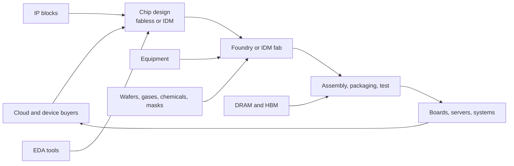

## Value chain as dependency graph

The semiconductor ecosystem is easiest to reason about as a dependency graph.
Each node converts one scarce capability into another.

This graph is not a neat assembly line because feedback loops are everywhere.
Foundry design rules affect chip architecture. Packaging limits affect memory
bandwidth. Hyperscaler demand affects how much capacity suppliers are willing
to add. Equipment availability affects process ramps years before revenue
arrives.

## Horizontal specialization

The modern industry moved toward horizontal specialization because each layer
became too complex and capital-intensive to master casually. A fabless company
can spend its energy on architecture and software. A foundry can amortize one
process platform across many customers. EDA and IP vendors can turn repeated
engineering problems into products.

The tradeoff is coordination. A schedule miss at one layer can strand work at
another. A chip design that is theoretically excellent may be commercially late
if packaging supply is unavailable or if a new process node takes longer than
expected to yield.

## Vertical integration

IDMs keep more of the chain inside one firm. This can make sense when process
technology and product design are tightly coupled, when a company needs control
over supply, or when the product category rewards manufacturing know-how more
than external foundry flexibility.

Vertical integration does not remove constraints. It moves them inside the
company. An IDM still needs lithography tools, masks, gases, wafers, spare
parts, and enough demand to justify the fab.

## Bottleneck thinking

For a product with many required inputs, the binding constraint is the scarce
input that prevents more finished output. In simplified form:

$$
\text{finished systems} = \min_i \left(\frac{\text{available input}_i}{\text{input needed per system}_i}\right)
$$

For an AI accelerator, the bottleneck might be logic wafers in one year and
advanced packaging in another. The right question is not "which company is
important?" but "which scarce capability controls the marginal unit?"
