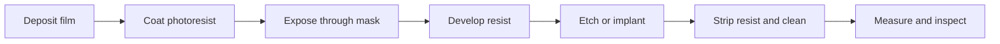

## Process flow as repeated state changes

At each step, the wafer has a state: films, topography, dopant profiles,
patterns, defects, and measurements. A simplified process step transforms that
state:

$$
\text{wafer}_{t+1} = f_t(\text{wafer}_t, \text{tool}, \text{recipe}, \text{mask}, \text{environment})
$$

The challenge is that $f_t$ must be repeatable across wafers, across lots, and
across time. A fab is valuable because it can run these transformations with
extreme precision at industrial scale.

## Pattern transfer

Lithography alone does not create a finished layer. It defines a temporary
pattern in photoresist. Etch, implant, deposition, or another process then uses
that pattern to change the actual wafer.

## Yield and defect density

One simple model treats random fatal defects as landing independently on the
wafer. If a die has area $A$ and the defect density is $D$, the expected number
of fatal defects per die is $AD$. Under a Poisson model, the probability of
zero fatal defects is:

$$
Y = e^{-AD}
$$

Real yield models are more complex. Defects cluster, edge dies behave
differently, design redundancy matters, and parametric failures can occur even
without a visible particle. Still, this model is useful because it makes two
facts obvious:

- Larger dies are harder to yield.
- Lower defect density has enormous economic value.

## Capacity

Capacity is usually stated in wafers per month, but every step has its own
throughput. A line can only produce as fast as its bottleneck:

$$
\text{line capacity} = \min(\text{lithography}, \text{etch}, \text{deposition}, \text{CMP}, \ldots)
$$

Adding one tool type may not increase output if another tool family is already
binding. This is why capacity expansion takes planning, qualification, and a
balanced tool set.
