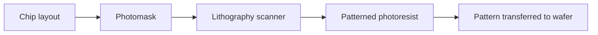

## Node names are labels, not rulers

Older process-node names were tied more directly to physical dimensions. A
"90 nm" or "45 nm" label gave a rough feel for gate length or half-pitch. At
advanced nodes, labels such as 7 nm, 5 nm, 3 nm, and 2 nm are marketing-ish
generation names. They are not literal statements that every important feature
is that many nanometers wide.

That does not make node names meaningless. They still tend to track generations
of density, performance, power, design rules, cost, and manufacturing
capability. The danger is treating the label as a caliper measurement.

## Lithography is the patterning bottleneck

Lithography transfers a circuit pattern from a mask to photoresist on the
wafer. The wafer then goes through etch, implant, or deposition steps that turn
the temporary resist pattern into real structures.

The basic idea is simple:

The execution is extraordinarily hard because features are tiny, layers must
align, and the same process must work across many wafers per hour.

*Lithography lives inside this broader cleanroom system. The scanner gets the
headlines, but it depends on wafer tracks, handlers, resist processing,
metrology, maintenance, and contamination control around it.*

Lithography is one tool family inside a larger cleanroom system. The scanner is
the celebrity, but it only works because wafer handling, contamination control,
resist processing, metrology, and maintenance keep feeding it stable lots.

## DUV and EUV

**DUV** (deep ultraviolet) lithography uses longer wavelengths than EUV. The
most important advanced DUV workhorse is 193 nm immersion lithography, where
water between the lens and wafer improves resolution. DUV remains widely used,
including on advanced chips, because many layers do not need EUV.

**EUV** (extreme ultraviolet) lithography uses 13.5 nm light. EUV enables
smaller features with fewer patterning steps for some critical layers. It is
also difficult: the light is absorbed by air and most materials, so EUV systems
use vacuum paths and reflective optics rather than ordinary lenses.

ASML is the sole supplier of leading EUV scanners. That makes scanner
availability, installation, uptime, service, and customer allocation central to
leading-edge capacity.

## Masks, reticles, and fields

A **mask** or **reticle** contains the pattern projected by the scanner. The
scanner exposes one field at a time, stepping across the wafer. Large chips can
approach the maximum reticle field size, which limits how large a single
monolithic die can be without stitching or moving to chiplets.

Masks are expensive and precise. A leading-edge product may require many masks,
and each mask must match a layer in the process flow. Mask errors, revisions,
or delays can ripple through the whole schedule.

## Multi-patterning

When one exposure cannot print a dense pattern cleanly, manufacturers can split
the pattern across multiple exposures and process steps. This is
**multi-patterning**. It lets DUV print features that would otherwise be too
dense, but it adds steps, cost, cycle time, and overlay risk.

EUV reduced the need for some multi-patterning, but did not remove all
complexity. Leading-edge manufacturing is a layered compromise among
resolution, cost, throughput, defectivity, and process margin.

## Overlay

**Overlay** is alignment between layers. A transistor or wire level is only
useful if it lands in the right place relative to previous levels. As features
shrink, overlay budgets get tighter.

Overlay is why metrology and scanner control matter so much. The fab must know
where patterns actually landed, correct for distortions, and keep layers
registered across the wafer.

## Why leading edge is constrained

Leading-edge capacity is constrained because many scarce systems have to work
together:

- EUV and advanced DUV scanners are expensive, complex, and slow to build.
- Process recipes need years of development and qualification.
- Masks and design rules are tightly coupled to the process.
- Yield ramps require defect reduction and measurement discipline.
- Advanced chips often also need scarce HBM, substrates, and packaging.

This is why "just build more fabs" is incomplete. Buildings matter, but a fab
also needs tools, recipes, materials, masks, trained teams, demand, and time.

## Recap

Process-node labels are not literal dimensions, but they still mark meaningful
technology generations. Lithography, especially EUV at critical layers, is one
of the central constraints that turns advanced-node manufacturing into a rare
capability.
