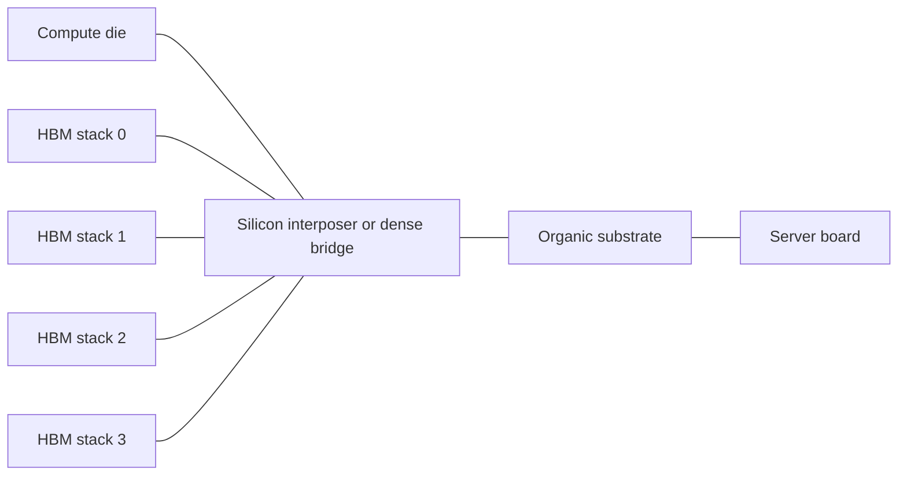

## The package is now part of the computer

For decades, many people treated packaging as the final step after the
"important" semiconductor work was done. A finished die came out of the fab,
was protected in a package, wired to the board, tested, and shipped.

That mental model breaks down for modern AI accelerators. A frontier training
chip is not just a large logic die. It is a small system assembled at package
scale: one or more compute dies, multiple high-bandwidth memory stacks, a dense
redistribution fabric, power delivery, thermal structures, and a substrate that
connects the package to the server board.

*A conceptual 2.5D accelerator package. The compute die and HBM stacks are
separate pieces of silicon, but the package places them close enough for a very
wide, short memory interface.*

The economic consequence is simple: the bottleneck may not be the wafer fab
that prints the compute die. It may be the packaging line that can attach HBM
stacks close enough to feed the die.

*A wafer bonder, one example of the precision tooling used around wafer-level
assembly. Advanced packaging capacity is not abstract; it is constrained by
qualified tools, recipes, operators, and inspection steps.*

Advanced packaging depends on physical tools like bonders, aligners, probe
stations, substrate handling, and metrology. The headline may say "HBM supply,"
but the factory constraint often lives in a specific qualified tool flow.

## Chip, die, and package

A **die** is the individual piece of silicon cut from a wafer. A **chip** is
often used casually to mean the die, the packaged product, or the whole device.
In operations work, be more precise:

- **Logic die:** the silicon containing compute, cache, interconnect, IO, and
  control logic.
- **HBM stack:** a vertical stack of DRAM dies connected by through-silicon vias
  and sitting next to the compute die.
- **Package:** the physical assembly that holds die, routes signals between
  them, delivers power, removes heat, and connects to the board.
- **Substrate:** the package's larger organic routing platform. It fans tiny
  package features out to board-scale solder balls.

For a phone SoC, the package mostly protects and connects one main die. For an
AI accelerator, the package is closer to a motherboard shrunk into a few square
centimeters.

*Real chip samples are physical objects, not just circuit diagrams. Packaging
turns delicate die into parts that can be handled, powered, cooled, tested, and
mounted into larger systems.*

Real semiconductor parts are physical artifacts with edges, labels, handling
damage, bond pads, substrates, and test history. Packaging is where fragile die
become components that a board and cooling system can actually use.

## Why 2.5D exists

HBM needs extremely wide connections. A single stack can expose thousands of
data wires at modest clock rates. That is how it gets high bandwidth without
the power cost of sending data across long, fast board traces.

But thousands of short wires cannot be routed through an ordinary circuit board
package with comfortable spacing. **2.5D packaging** solves this by placing the
logic die and HBM stacks side-by-side on an intermediate routing layer:

It is called 2.5D because the chips are not stacked directly on top of the logic
die like true 3D logic-on-logic integration. They sit beside each other, but on
a dense routing layer that behaves much more like silicon than a normal board.

## CoWoS as the canonical AI package

TSMC's **CoWoS** family is the most cited version of this idea. The name stands
for chip-on-wafer-on-substrate: die are attached to a wafer-level interposer or
redistribution structure, then the whole assembly is mounted onto an organic
substrate.

The important idea is not the acronym. It is the capability:

- Put a very large accelerator die close to several HBM stacks.
- Route thousands of short, low-energy memory connections.
- Build a package bigger than a single reticle-limited exposure field.
- Keep thermals and mechanical stress barely under control.

For AI, this can be as valuable as a process-node shrink. A faster matrix unit
does not help if it waits on memory.

## TSVs, microbumps, and hybrid bonding

HBM is a vertical object. DRAM dies are stacked on top of one another and joined
by **through-silicon vias** (TSVs), which are tiny vertical conductors etched
through the silicon. TSVs let signals and power move up and down the stack.

The HBM stack then connects to the package through a dense grid of bumps:

- **Microbumps** are small solder-based connections used for fine-pitch die
  attachment.
- **Hybrid bonding** directly bonds metal pads and dielectric surfaces at even
  finer pitch, reducing parasitics and improving density.

As bump pitch shrinks, assembly becomes less forgiving. Alignment, cleanliness,
warpage, thermal cycling, and inspection all become first-order yield problems.

## Reticle limits and package-scale systems

Photolithography exposes a maximum rectangle on the wafer called the **reticle
field**. A single monolithic die cannot grow forever; beyond the reticle limit,
the lithography tool cannot print it in one shot.

Advanced packaging lets designers build a larger system from multiple pieces:
large compute die, chiplets, HBM stacks, IO tiles, and dense bridges. The package
becomes the scale-out surface when a single die is too big, too expensive, or
too yield-limited.

This is why packaging capacity can become strategically scarce. Leading-edge
logic wafers are necessary, but not sufficient. You also need the advanced
package slots, qualified HBM supply, substrates, test capacity, thermal
hardware, and board-level integration.

## Recap

- A package is no longer just protection; in AI accelerators it is an active
  system-integration platform.
- HBM bandwidth requires thousands of short, dense connections.
- 2.5D packaging places compute and memory side-by-side on a dense routing
  layer.
- CoWoS-style capacity can bottleneck accelerator shipments even when logic die
  capacity exists.
- Packaging yield, lead time, and tool capacity now shape who can ship AI
  systems at scale.

Next: quantify why bandwidth and HBM capacity matter with a few small roofline
and memory-sizing functions.
