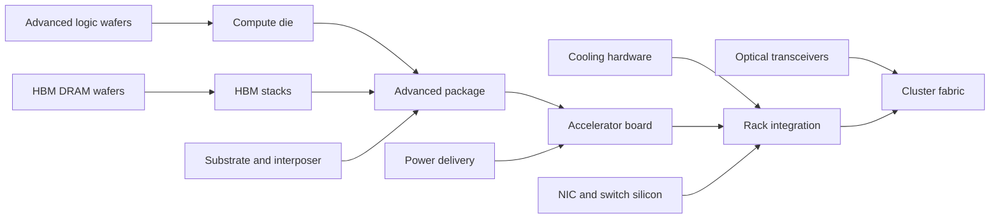

# Theory: Dependency Graphs in Accelerator Systems

Analysts often model an AI accelerator as a dependency graph rather than a single product. A simplified flow is:

## Constraint propagation

A finished accelerator system has a minimum operator hidden inside it. If each layer has a capacity, the final shipment rate is limited by the smallest effective capacity:

$$
\text{system output} \le \min_i(\text{capacity}_i \times \text{usable yield}_i)
$$

This is not exact accounting, but it is a useful mental model. The bottleneck may shift over time:

- In one quarter, advanced packaging may limit output.
- In another, HBM allocation may limit output.
- During a data-center buildout, power and cooling equipment may gate deployment.
- During a networking transition, switch silicon or optics may become the long pole.

## Performance dependencies

Accelerator performance depends on more than peak teraFLOPS. A simplified roofline model says usable throughput is bounded by compute and data movement:

$$
\text{throughput} \le \min(\text{peak compute}, \text{memory bandwidth} \times \text{arithmetic intensity})
$$

At cluster scale, another limit appears:

$$
\text{training step time} \approx \text{compute time} + \text{communication time} + \text{pipeline bubbles}
$$

This is why HBM, networking, and software collectives can change the economic value of the compute die.

## Strategic dependencies

Different accelerator strategies move the bottleneck, but do not remove the stack:

- A GPU platform can win with broad programmability and a mature software ecosystem.
- A TPU-like accelerator can win when hardware and workload are co-designed inside one operator.
- A custom ASIC can win on cost or power for a stable workload.

All three still need foundry access, memory, packaging, board assembly, networking, power, cooling, and deployment. The supply chain is the common denominator.
