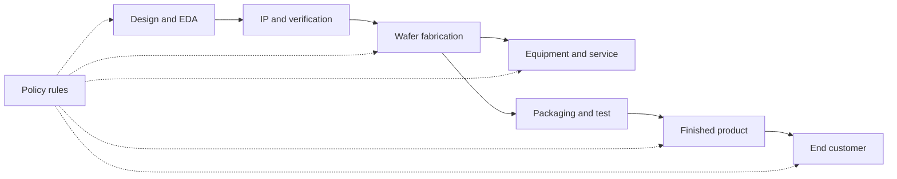

# Theory: Policy as a Constraint Layer

A semiconductor pipeline can be modeled as a sequence of technical and commercial constraints:

Policy is not a separate world from technology. It changes the feasible set of inputs, customers, services, and product configurations.

## Threshold behavior

Threshold-based rules create cliffs. A product just above a threshold may require a license or become unavailable to a market. A product just below a threshold may remain sellable, but with reduced performance or changed features.

That cliff can reshape product segmentation:

$$
\text{addressable revenue} = \sum_j \text{units}_j \times \text{ASP}_j \times \mathbf{1}[\text{product}_j \text{ is allowed}]
$$

The indicator function is a simplification, because licensing and redesign can create gray areas. Still, it captures the analyst habit: policy can turn technical capability into a market-access variable.

## Substitution cost

Substitution should be evaluated by total system cost, not only by whether a component exists.

$$
\text{substitution penalty} =
\text{extra capex} + \text{extra power} + \text{yield loss} + \text{software migration cost} + \text{time delay}
$$

This is why a domestic alternative can be strategically important even if it is not economically identical. The value may be resilience, learning, and bargaining power rather than immediate parity.

## Mature-node dynamics

Mature-node capacity can be strategically significant because many industrial systems need reliability, cost, and supply certainty more than transistor density. If capacity expands faster than demand, pricing pressure can spread globally. If demand is local and policy favors domestic sourcing, domestic mature-node fabs can gain utilization even without frontier-node parity.
