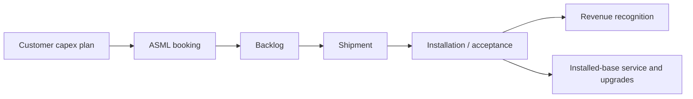

## Mini-model: lithography demand

Lithography demand rises when:

$$
\text{new wafer capacity} + \text{layer complexity} + \text{replacement and upgrades}
$$

increase faster than tool productivity.

More complex nodes may require more lithography steps. EUV can reduce some
multipatterning, but advanced nodes still require many layers and tight overlay.

## Separate unit demand from revenue demand

System units are only one part of the model:

$$
\text{system revenue} =
\sum(\text{units by tool class} \times \text{ASP by configuration})
$$

ASML revenue also includes installed-base management:

$$
\text{total sales} =
\text{new systems}
+ \text{used systems}
+ \text{service}
+ \text{field options}
$$

This matters because one EUV system can represent far more revenue than one
less advanced DUV system, and an installed scanner can keep generating service
and upgrade revenue for years.

## Bookings-to-revenue timing

A simplified order flow looks like this:

The gaps between these steps create both visibility and risk. A strong backlog
can protect near-term revenue, but a bookings slowdown can still matter if it
signals weaker future fab construction.

## Why High-NA EUV is an adoption question

High-NA EUV improves resolution, but customers must justify the cost, throughput
tradeoffs, process integration, masks, and design ecosystem. The first tool is
not the same as broad high-volume adoption.

Useful adoption milestones:

- Research and learning tool delivered.
- Customer publishes process or patterning progress.
- Pilot line integration begins.
- Product tape-out targets the process.
- High-volume manufacturing uses the tool economically.

Treat each milestone differently. Early ecosystem progress is bullish for
option value, but broad revenue impact requires customer economics to work.

## Why DUV remains strategic

Mature-node capacity matters for automotive, industrial, analog, power, RF,
display, memory peripheral circuits, and multipatterning. That is why "old"
tools can still be geopolitically sensitive.

DUV also matters inside advanced fabs. Many layers in an advanced process do
not need EUV. A leading-edge capacity plan can therefore require a basket of
EUV, DUV, metrology, inspection, deposition, etch, and process-control tools.

## Source-aware caveat

ASML gives useful facts on sales, bookings, backlog, system counts, and
installed-base management. The harder task is linking those facts to customer
roadmaps. Be careful when matching one customer's announced fab to a specific
number of ASML systems unless the customer or ASML has disclosed enough detail.
