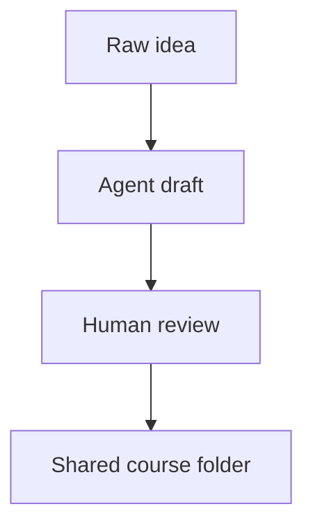

# Course Authoring

Courses are plain folders. That is the main contract.

An agent can generate a course, a person can review it, and anyone can copy the
folder into their own `courses/` directory. No app code is needed for ordinary
course creation.

## Track Structure

```text
courses/
  my-track/
    course.yaml
    01-first-module/
      module.yaml
      problem.md
      theory.md
      tips.md
    02-coding-exercise/
      module.yaml
      problem.md
      theory.md
      tips.md
      starter/
        python.py
      solution/
        python.py
      solution.md
```

The numeric prefix controls ordering. The URL uses the `slug` inside
`module.yaml`.

## Track Metadata

`courses/<track-slug>/course.yaml`

```yaml
title: "Introduction to Tensors"
slug: "tensors"
description: "Build tensor primitives from scratch."
tags: [machine-learning, linear-algebra]
difficulty: intermediate
order: 1
```

## Module Metadata

`courses/<track-slug>/<NN>-<module-slug>/module.yaml`

```yaml
title: "Tensor Basics: Shape and Strides"
slug: "intro-to-tensors"
description: "Create a minimal Tensor class."
order: 1
difficulty: beginner
estimatedMinutes: 25
tags: [tensors, numpy]
type: coding
languages: [python, cpp]
defaultLanguage: python
```

Supported `type` values:

| Type | Files |
|---|---|
| `reading` | `problem.md`, `theory.md`, `tips.md` |
| `coding` | Markdown files plus `starter/`; optional `solution/`, `solution.md`, `requirements.txt`, `expected_output/` |
| `quiz` | `problem.md` plus `quiz.yaml` |
| `test` | `problem.md` plus `quiz.yaml`; feedback is delayed until results |
| `drill` | `problem.md` plus `drill.yaml` |

Only coding modules should include `languages`, `defaultLanguage`, starter code,
or expected output.

## Markdown

`problem.md`, `theory.md`, and `tips.md` support Markdown, GitHub-flavored
tables, LaTeX, and Mermaid diagrams.

````markdown
Inline math: $C_{ij} = \sum_k A_{ik} B_{kj}$

Block math:
$$
\text{stride}_i = \prod_{j=i+1}^{k-1} d_j
$$


````

Course images should live in `static/courses/<track-slug>/` and be referenced as:

```markdown

```

## Coding Modules

Starter files:

```text
starter/
  python.py
  cpp.cpp
```

Optional reference files:

```text
solution/
  python.py
  cpp.cpp
solution.md
```

Optional grading files:

```text
expected_output/
  python.txt
  cpp.txt
```

If expected output is missing, submissions return a pending verdict instead of a
pass/fail grade. That is useful for non-deterministic, GPU-heavy, or exploratory
exercises.

Use `requirements.txt` for Python dependencies. The runner uses `uv`; if the
requirements include `torch`, the app chooses a CPU or CUDA PyTorch index based
on the machine unless `TORCH_INDEX_URL` is set.

## Quiz And Test Modules

`quiz.yaml`

```yaml
questions:
  - id: q1
    type: multiple_choice
    stem: "What does a tensor stride describe?"
    options:
      - "The number of bytes in the file"
      - "The jump in memory needed to move along an axis"
      - "The number of model layers"
      - "The learning rate"
    correct: 1
    explanation: "A stride tells you how far to move in storage when an index changes."

  - id: q2
    type: true_false
    stem: "Broadcasting can reuse values without physically copying them."
    correct: true
    explanation: "A broadcasted dimension can be represented with a stride of zero."
```

Quizzes show correctness during the attempt. Tests wait until the final review.
Passing a quiz or test marks the module complete.

## Drill Modules

`drill.yaml`

```yaml
title: "Shape Arithmetic Drill"
instructions: "Answer with the resulting dimension size."
roundSeconds: 120
targetAccuracy: 0.85
itemsPerRound: 20
items:
  - id: broadcast_dim
    prompt_template: "Broadcast dimensions {{a}} and {{b}}. What is the result?"
    params:
      a: { min: 1, max: 8, step: 1 }
      b: { min: 1, max: 8, step: 1 }
    correct_formula: "a === 1 ? b : (b === 1 || a === b ? a : -1)"
    answer_suffix: ""
    tolerance: 0
    explanation_template: "Equal dimensions match; dimension 1 expands; otherwise it is incompatible."
```

Drills use generated numeric prompts and record accuracy, speed, best streak,
and personal bests.

## Agent Workflow

For a substantial course, start with the spine:

- Audience and prerequisites
- Learning goals
- Module list and module types
- Shared vocabulary and notation
- Coding exercise contracts
- Figure and diagram needs
- Quiz, test, and drill checkpoints

Then generate module folders. Review for factual accuracy, runnable starter code,
clean progression, and answer leakage in tests.

## Sharing A Course

To share a course, share the whole `courses/<track-slug>/` folder. Include any
figures under `static/courses/<track-slug>/` if the course references local
images.

To install a shared course:

1. Copy the track folder into `courses/`.
2. Copy any matching static assets into `static/courses/`.
3. Restart the dev server or refresh the page.

For a separate course library, point the app at another directory:

```bash
COURSES_DIR=/path/to/course-library npm run dev
```
