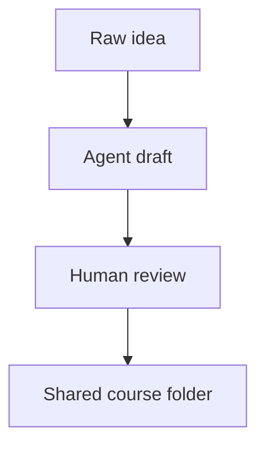

# Course Authoring

Courses are plain folders. That is the main contract.

An agent can generate a course, a person can review it, and anyone can copy the
folder into their own `courses/` directory. No app code is needed for ordinary
course creation.

## Track Structure

```text
courses/
  my-track/
    course.yaml
    01-first-module/
      module.yaml
      problem.md
      theory.md
      tips.md
    02-coding-exercise/
      module.yaml
      problem.md
      theory.md
      tips.md
      starter/
        python.py
      solution/
        python.py
      solution.md
```

The numeric prefix controls ordering. The URL uses the `slug` inside
`module.yaml`.

## Track Metadata

`courses/<track-slug>/course.yaml`

```yaml
title: "Introduction to Tensors"
slug: "tensors"
description: "Build tensor primitives from scratch."
tags: [machine-learning, linear-algebra]
difficulty: intermediate
order: 1
```

## Module Metadata

`courses/<track-slug>/<NN>-<module-slug>/module.yaml`

```yaml
title: "Tensor Basics: Shape and Strides"
slug: "intro-to-tensors"
description: "Create a minimal Tensor class."
order: 1
difficulty: beginner
estimatedMinutes: 25
tags: [tensors, numpy]
type: coding
languages: [python, cpp]
defaultLanguage: python
```

Supported `type` values:

| Type | Files |
|---|---|
| `reading` | `problem.md`, `theory.md`, `tips.md` |
| `coding` | Markdown files plus `starter/`; optional `solution/`, `solution.md`, `requirements.txt`, `expected_output/` |
| `quiz` | `problem.md` plus `quiz.yaml` |
| `test` | `problem.md` plus `quiz.yaml`; feedback is delayed until results |
| `drill` | `problem.md` plus `drill.yaml` |

Only coding modules should include `languages`, `defaultLanguage`, starter code,
or expected output.

## Markdown

`problem.md`, `theory.md`, and `tips.md` support Markdown, GitHub-flavored
tables, LaTeX, and Mermaid diagrams.

````markdown
Inline math: $C_{ij} = \sum_k A_{ik} B_{kj}$

Block math:
$$
\text{stride}_i = \prod_{j=i+1}^{k-1} d_j
$$


````

Course images should live in `static/courses/<track-slug>/` and be referenced as:

```markdown

```

## Coding Modules

Starter files:

```text
starter/
  python.py
  cpp.cpp
```

Optional reference files:

```text
solution/
  python.py
  cpp.cpp
solution.md
```

Optional grading files:

```text
expected_output/
  python.txt
  cpp.txt
```

If expected output is missing, submissions return a pending verdict instead of a
pass/fail grade. That is useful for non-deterministic, GPU-heavy, or exploratory
exercises.

Use `requirements.txt` for Python dependencies. The runner uses `uv`; if the
requirements include `torch`, the app chooses a CPU or CUDA PyTorch index based
on the machine unless `TORCH_INDEX_URL` is set.

## Quiz And Test Modules

`quiz.yaml`

```yaml
questions:
  - id: q1
    type: multiple_choice
    stem: "What does a tensor stride describe?"
    options:
      - "The number of bytes in the file"
      - "The jump in memory needed to move along an axis"
      - "The number of model layers"
      - "The learning rate"
    correct: 1
    explanation: "A stride tells you how far to move in storage when an index changes."

  - id: q2
    type: true_false
    stem: "Broadcasting can reuse values without physically copying them."
    correct: true
    explanation: "A broadcasted dimension can be represented with a stride of zero."
```

Quizzes show correctness during the attempt. Tests wait until the final review.
Passing a quiz or test marks the module complete.

## Drill Modules

`drill.yaml`

```yaml
title: "Shape Arithmetic Drill"
instructions: "Answer with the resulting dimension size."
roundSeconds: 120
targetAccuracy: 0.85
itemsPerRound: 20
items:
  - id: broadcast_dim
    prompt_template: "Broadcast dimensions {{a}} and {{b}}. What is the result?"
    params:
      a: { min: 1, max: 8, step: 1 }
      b: { min: 1, max: 8, step: 1 }
    correct_formula: "a === 1 ? b : (b === 1 || a === b ? a : -1)"
    answer_suffix: ""
    tolerance: 0
    explanation_template: "Equal dimensions match; dimension 1 expands; otherwise it is incompatible."
```

Drills use generated numeric prompts and record accuracy, speed, best streak,
and personal bests.

## Generate, Review, Validate, Preview, Share

Treat generation as the first draft, not the publication decision.

1. **Generate:** define the spine first: audience, outcomes, prerequisites,
   scope limits, module sequence and types, shared vocabulary, figures, coding
   contracts, assessments, device/runtime needs, and known high-risk claims.
   Then create the folders. For multi-agent work, give writers disjoint module
   ranges and keep one lead responsible for cross-course coherence.
2. **Review:** perform separate passes for factual accuracy and freshness,
   pedagogy and progression, assessment keys/formulas and answer leakage,
   accessibility, local assets/links, and the trust surfaces described below.
   Agent output must receive human review; an agent must not approve its own
   draft as publication-ready.
3. **Validate:** run `npm run course:validate` (or `npm.cmd run
   course:validate` on Windows when needed), then the relevant project checks.
   Fix every error and either fix or explicitly adjudicate each warning.
   Validation checks structure; it does not prove accuracy, safety, or quality.
4. **Preview:** use the course in the app as a learner. Check the course preview,
   every module type used, next/previous navigation, completion behavior,
   formulas and randomized edge cases, links and images, narrow layouts, and
   missing-runtime fallbacks. Run coding starter and solution paths in every
   declared language when deterministic execution is claimed.
5. **Share:** publish the complete track folder and matching static assets, or a
   pinned git-backed course pack. Include audience/scope, prerequisites, review
   date, generated-content involvement, known limitations, runtime needs, and
   the trust disclosure. Preserve stable track and module slugs across updates
   because changing them can disconnect existing progress.

Use the rubric and release criteria in
[Philosophy and Experience Plan](experience-plan.md) for substantial or shared
courses.

### Publication Checklist

- [ ] Audience, outcomes, prerequisites, scope, difficulty, and expected effort
  are explicit and mutually consistent.
- [ ] Every outcome maps to instruction plus observable practice or assessment;
  every scored item maps back to an outcome.
- [ ] Terminology, notation, examples, and difficulty progress coherently across
  module boundaries.
- [ ] Consequential facts, citations, assessment keys, parametric formulas,
  generated ranges, tolerances, and explanations were independently checked.
- [ ] Tests do not leak answers before results; hints and solutions preserve the
  intended amount of learner effort.
- [ ] Coding starters and reference solutions run in every declared language;
  deterministic expected outputs are stable, otherwise grading is intentionally
  left pending.
- [ ] Images are included, paths resolve from a clean checkout, alt text is
  meaningful, headings are structured, and content works with keyboard input
  and at a narrow browser width.
- [ ] External links/resources, raw or rendered Markdown behavior, Mermaid,
  quiz/drill expressions, dependencies, and executable code were reviewed.
- [ ] `npm run course:validate` passes and all warnings are resolved or recorded.
- [ ] Course preview, enrollment/start, all used module types, navigation,
  completion states, and missing-tool behavior were exercised in the app.
- [ ] Pack/folder includes provenance, review date, generated-content disclosure,
  runtime requirements, known limitations, and a maintainer or issue path.
- [ ] Stable slugs are preserved, and the shared artifact contains no learner
  progress, drafts, secrets, caches, or personal data.

## Sharing A Course

To share a course, share the whole `courses/<track-slug>/` folder. Include any
figures under `static/courses/<track-slug>/` if the course references local
images.

To install a shared course:

1. Copy the track folder into `courses/`.
2. Copy any matching static assets into `static/courses/`.
3. Restart the dev server or refresh the page.

For a separate course library, point the app at another directory:

```bash
COURSES_DIR=/path/to/course-library npm run dev
```

## Course Packs

For repeatable installs, publish the course as a git-backed course pack. A pack
repo can use either shape:

```text
my-course-pack/
  courses/
    my-track/
      course.yaml
      01-first-module/
        module.yaml
        problem.md
```

or, for a single-track pack:

```text
my-course-pack/
  course.yaml
  01-first-module/
    module.yaml
    problem.md
```

Install and update packs with:

```bash
npm run course:add -- https://github.com/someone/my-course-pack.git
npm run course:update
npm run course:validate
```

The default manifest is `data/course-packs.yaml`; cloned repos live under
`data/course-packs/repos/`. Both are local state and are ignored by git. Use
`course-packs.example.yaml` as a starting point when you want to curate a set of
packs by hand.

Validation checks track/module metadata, required files, duplicate slugs, and
some coding/dependency conditions. It is a structural check, not a security or
factual review.

### Trust Warning

Install and enable only course packs you trust after reviewing the full pack,
not just its coding folders. Authored content has several behavior surfaces:

- Markdown is rendered into the course page and may include raw HTML, links,
  images or other externally loaded resources, and Mermaid diagrams.
- Parametric questions in `quiz.yaml` and prompt/formula fields in `drill.yaml`
  are evaluated as JavaScript expressions in the learner's browser.
- Starter code, reference code, and learner-edited code can execute through the
  configured baremetal or Docker runtime. `requirements.txt` can cause third-
  party packages and their installation code to run.
- Expected outputs, answer keys, thresholds, explanations, and runtime hints can
  change grading, completion, resource use, and what the learner is told.

Review changes again before `npm run course:update`, especially when following a
moving branch. Docker can reduce host exposure but is not a guarantee that
untrusted content is safe. Structural validation does not sandbox Markdown or
browser expressions and does not establish that answers or explanations are
correct.

### Course Pack Metadata

Course packs do not need metadata beyond normal course files, but adding a small
README helps agents and people understand the intent. If you want a machine-
readable note, use `course-pack.yaml` at the repo root:

```yaml
id: someone/my-course-pack
title: "My Course Pack"
description: "A short description of the audience and scope."
version: 0.1.0
```

The current app does not require `course-pack.yaml`; the install manifest is the
source of truth for repo URL, enabled state, and pinned ref.
